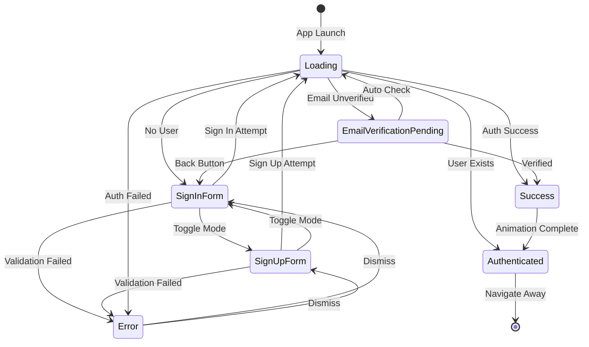
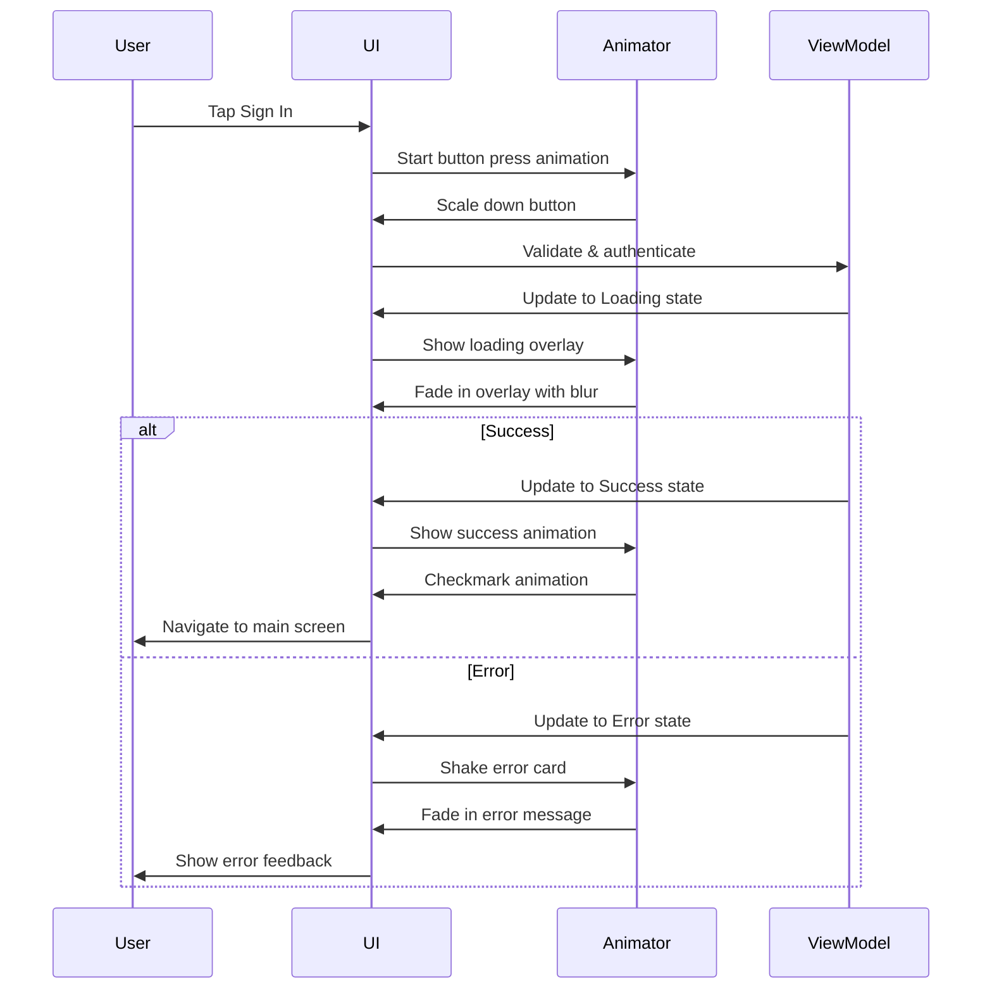

# Design Document

## Overview

This design document outlines the comprehensive UI/UX enhancement for the Synapse authentication screen. The redesign transforms the current functional interface into a visually stunning, modern, and professional experience that serves as an impressive first impression for users. The design leverages Material Design 3 principles, modern visual effects, and thoughtful micro-interactions to create an authentication flow that is both beautiful and highly usable.

The enhanced authentication screen will feature:
- Dynamic gradient backgrounds with smooth color transitions
- Glassmorphism effects for depth and modern aesthetics
- Fluid animations and micro-interactions throughout
- Enhanced visual feedback for all user actions
- Improved accessibility and responsive design
- Professional typography and spacing

## Architecture

### Component Structure

```
AuthActivity
├── Background Layer (Gradient + Animated Elements)
├── Hero Section (Logo + Branding)
├── Form Container (Glassmorphic Card)
│   ├── Input Fields (Email, Password, Username)
│   ├── Validation Feedback
│   ├── Action Button
│   └── Mode Toggle
├── Verification Section (Animated Card)
└── Loading Overlay (Blur + Progress)
```

### State Management

The authentication screen maintains the following UI states with smooth transitions:
- **SignInForm**: Default state showing email and password fields
- **SignUpForm**: Extended state with username field visible
- **Loading**: Overlay with blur effect and animated progress
- **EmailVerificationPending**: Dedicated verification card with auto-checking
- **Error**: Inline error display with shake animation
- **Success**: Brief success animation before navigation

### Animation System

All animations follow Material Design motion principles:
- **Duration**: 200-400ms for most transitions
- **Easing**: Standard easing curves (cubic-bezier)
- **Choreography**: Staggered animations for multiple elements
- **Reduced Motion**: Respects system accessibility settings

## Components and Interfaces

### 1. Background Layer

**Purpose**: Provide visual depth and modern aesthetic

**Implementation**:
```xml
<!-- Gradient Background Drawable -->
<shape xmlns:android="http://schemas.android.com/apk/res/android">
    <gradient
        android:type="linear"
        android:angle="135"
        android:startColor="#F9FAEF"
        android:centerColor="#E8F5E9"
        android:endColor="#C8E6C9" />
</shape>
```

**Features**:
- Subtle gradient from surface color to primary tint
- Optional animated gradient shift (using ValueAnimator)
- Floating particle effect (optional, using custom View)
- Parallax scrolling effect on scroll

**Accessibility**: Maintains sufficient contrast for overlaid content

### 2. Hero Section

**Purpose**: Brand identity and welcoming message

**Components**:
- **Logo Container**: MaterialCardView with elevated design
  - Size: 96dp x 96dp (increased from 80dp)
  - Corner radius: 24dp (increased from 20dp)
  - Elevation: 4dp with soft shadow
  - Background: colorPrimaryContainer with subtle gradient
  - Content: "S" letter or app icon with scale animation on load

- **App Name**: Large, bold typography
  - Font: Product Sans Bold
  - Size: 36sp (increased from 32sp)
  - Color: colorOnSurface
  - Animation: Fade in with slight upward slide

- **Welcome Message**: Contextual subtitle
  - Font: Product Sans Regular
  - Size: 18sp (increased from 16sp)
  - Color: colorOnSurfaceVariant
  - Animation: Fade in after app name

**Animations**:
```kotlin
// Logo entrance animation
cardLogo.apply {
    scaleX = 0f
    scaleY = 0f
    alpha = 0f
    animate()
        .scaleX(1f)
        .scaleY(1f)
        .alpha(1f)
        .setDuration(400)
        .setInterpolator(OvershootInterpolator())
        .start()
}
```

### 3. Form Container

**Purpose**: Primary interaction area for authentication

**Design**: Glassmorphic card with elevated appearance

**Layout Structure**:
```xml
<com.google.android.material.card.MaterialCardView
    android:layout_width="match_parent"
    android:layout_height="wrap_content"
    app:cardCornerRadius="24dp"
    app:cardElevation="8dp"
    app:strokeWidth="1dp"
    app:strokeColor="@color/md_theme_outlineVariant"
    app:cardBackgroundColor="@color/md_theme_surfaceContainerLowest">
    
    <!-- Form content with padding -->
    <LinearLayout
        android:padding="24dp"
        android:orientation="vertical">
        <!-- Input fields -->
    </LinearLayout>
</com.google.android.material.card.MaterialCardView>
```

**Visual Effects**:
- Semi-transparent background (if glassmorphism is implemented)
- Subtle backdrop blur (requires RenderScript or custom implementation)
- Soft shadow with 8dp elevation
- 1dp stroke for definition

**Responsive Behavior**:
- Max width: 480dp on tablets
- Horizontal margins: 24dp on phones, 48dp on tablets
- Adapts padding based on screen size

### 4. Input Fields

**Enhanced Design Features**:

**Email Field**:
```xml
<com.google.android.material.textfield.TextInputLayout
    style="@style/Widget.Material3.TextInputLayout.OutlinedBox"
    android:layout_width="match_parent"
    android:layout_height="wrap_content"
    android:hint="Email address"
    app:startIconDrawable="@drawable/ic_email_enhanced"
    app:startIconTint="?attr/colorPrimary"
    app:endIconMode="clear_text"
    app:boxStrokeColor="?attr/colorPrimary"
    app:boxStrokeWidth="2dp"
    app:boxCornerRadiusTopStart="16dp"
    app:boxCornerRadiusTopEnd="16dp"
    app:boxCornerRadiusBottomStart="16dp"
    app:boxCornerRadiusBottomEnd="16dp"
    app:hintTextColor="?attr/colorPrimary"
    app:errorEnabled="true"
    app:errorIconDrawable="@drawable/ic_error_enhanced"
    app:helperTextEnabled="true">
    
    <com.google.android.material.textfield.TextInputEditText
        android:id="@+id/etEmail"
        android:layout_width="match_parent"
        android:layout_height="wrap_content"
        android:inputType="textEmailAddress"
        android:textSize="16sp"
        android:paddingVertical="16dp" />
</com.google.android.material.textfield.TextInputLayout>
```

**Enhancements**:
- Increased corner radius: 16dp (from 12dp)
- Thicker stroke on focus: 2dp
- Clear text button for better UX
- Helper text support for hints
- Custom icons with better visual design
- Increased vertical padding for touch targets

**Password Field**:
- All email field enhancements
- Password toggle with custom icons
- Optional password strength indicator
- Animated visibility toggle

**Username Field** (Sign Up):
- Smooth slide-down animation when appearing
- Character counter (optional)
- Real-time availability check indicator (future enhancement)

**Focus Animations**:
```kotlin
editText.setOnFocusChangeListener { view, hasFocus ->
    if (hasFocus) {
        view.animate()
            .scaleX(1.02f)
            .scaleY(1.02f)
            .setDuration(200)
            .start()
        
        // Add subtle glow effect
        textInputLayout.boxStrokeWidth = 2
    } else {
        view.animate()
            .scaleX(1f)
            .scaleY(1f)
            .setDuration(200)
            .start()
    }
}
```

### 5. Validation Feedback

**Real-time Validation**:

**Email Validation**:
- Instant format checking using Patterns.EMAIL_ADDRESS
- Green checkmark icon when valid
- Red error icon with message when invalid
- Debounced validation (300ms delay)

**Password Strength Indicator**:
```kotlin
// Password strength visual feedback
sealed class PasswordStrength(val color: Int, val message: String) {
    object Weak : PasswordStrength(R.color.error_red, "Weak password")
    object Fair : PasswordStrength(R.color.md_theme_tertiary, "Fair password")
    object Strong : PasswordStrength(R.color.success_green, "Strong password")
}

fun evaluatePasswordStrength(password: String): PasswordStrength {
    return when {
        password.length < 6 -> PasswordStrength.Weak
        password.length < 10 -> PasswordStrength.Fair
        else -> PasswordStrength.Strong
    }
}
```

**Visual Indicator**:
- Linear progress bar below password field
- Color-coded: Red (weak), Orange (fair), Green (strong)
- Animated progress changes
- Helper text with strength description

**Error Display**:
```xml
<com.google.android.material.card.MaterialCardView
    android:id="@+id/cardError"
    android:layout_width="match_parent"
    android:layout_height="wrap_content"
    android:layout_marginBottom="16dp"
    android:visibility="gone"
    app:cardBackgroundColor="?attr/colorErrorContainer"
    app:cardCornerRadius="16dp"
    app:cardElevation="2dp"
    app:strokeWidth="0dp">
    
    <LinearLayout
        android:layout_width="match_parent"
        android:layout_height="wrap_content"
        android:orientation="horizontal"
        android:padding="16dp"
        android:gravity="center_vertical">
        
        <ImageView
            android:layout_width="24dp"
            android:layout_height="24dp"
            android:src="@drawable/ic_error_enhanced"
            android:tint="?attr/colorError"
            android:layout_marginEnd="12dp" />
        
        <TextView
            android:id="@+id/tvErrorMessage"
            android:layout_width="0dp"
            android:layout_height="wrap_content"
            android:layout_weight="1"
            android:textColor="?attr/colorOnErrorContainer"
            android:textSize="14sp"
            android:lineSpacing="4dp" />
    </LinearLayout>
</com.google.android.material.card.MaterialCardView>
```

**Error Animation**:
```kotlin
fun showError(message: String) {
    binding.apply {
        tvErrorMessage.text = message
        cardError.visibility = View.VISIBLE
        
        // Shake animation
        val shake = AnimationUtils.loadAnimation(context, R.anim.shake)
        cardError.startAnimation(shake)
        
        // Fade in
        cardError.alpha = 0f
        cardError.animate()
            .alpha(1f)
            .setDuration(200)
            .start()
        
        // Haptic feedback
        performHapticFeedback(HapticFeedbackConstants.REJECT)
    }
}
```

### 6. Action Button

**Enhanced Design**:
```xml
<com.google.android.material.button.MaterialButton
    android:id="@+id/btnSignIn"
    android:layout_width="match_parent"
    android:layout_height="64dp"
    android:text="Sign In"
    android:textSize="18sp"
    android:textStyle="bold"
    app:cornerRadius="16dp"
    app:elevation="4dp"
    app:icon="@drawable/ic_arrow_forward"
    app:iconGravity="end"
    app:iconSize="24dp"
    app:iconPadding="8dp"
    android:stateListAnimator="@animator/button_state_animator" />
```

**Features**:
- Increased height: 64dp (from 56dp)
- Larger text: 18sp (from 16sp)
- Icon on the right side (arrow forward)
- Animated icon on press
- Ripple effect with custom color
- State-based elevation changes

**Button States**:
```kotlin
// Disabled state
button.isEnabled = false
button.alpha = 0.6f

// Loading state
button.text = ""
button.icon = null
progressBar.visibility = View.VISIBLE

// Success state (brief)
button.icon = ContextCompat.getDrawable(context, R.drawable.ic_check_circle)
button.iconTint = ColorStateList.valueOf(getColor(R.color.success_green))
```

**Press Animation**:
```kotlin
button.setOnTouchListener { view, event ->
    when (event.action) {
        MotionEvent.ACTION_DOWN -> {
            view.animate()
                .scaleX(0.95f)
                .scaleY(0.95f)
                .setDuration(100)
                .start()
        }
        MotionEvent.ACTION_UP, MotionEvent.ACTION_CANCEL -> {
            view.animate()
                .scaleX(1f)
                .scaleY(1f)
                .setDuration(100)
                .start()
        }
    }
    false
}
```

### 7. Mode Toggle

**Enhanced Design**:
```xml
<TextView
    android:id="@+id/tvToggleMode"
    android:layout_width="wrap_content"
    android:layout_height="wrap_content"
    android:layout_gravity="center"
    android:padding="16dp"
    android:text="Don't have an account? Sign Up"
    android:textColor="?attr/colorPrimary"
    android:textSize="15sp"
    android:textStyle="bold"
    android:background="@drawable/ripple_rounded"
    android:clickable="true"
    android:focusable="true" />
```

**Interaction**:
- Ripple effect on tap
- Haptic feedback
- Text crossfade animation when toggling
- Underline animation on hover (for large screens)

### 8. Email Verification Section

**Enhanced Card Design**:
```xml
<com.google.android.material.card.MaterialCardView
    android:id="@+id/layoutEmailVerification"
    android:layout_width="match_parent"
    android:layout_height="wrap_content"
    app:cardBackgroundColor="?attr/colorSurfaceContainerLowest"
    app:cardCornerRadius="24dp"
    app:cardElevation="8dp"
    app:strokeWidth="1dp"
    app:strokeColor="?attr/colorOutlineVariant">
    
    <LinearLayout
        android:layout_width="match_parent"
        android:layout_height="wrap_content"
        android:orientation="vertical"
        android:padding="32dp"
        android:gravity="center">
        
        <!-- Animated email icon -->
        <com.airbnb.lottie.LottieAnimationView
            android:id="@+id/animationEmail"
            android:layout_width="120dp"
            android:layout_height="120dp"
            app:lottie_rawRes="@raw/email_sent_animation"
            app:lottie_autoPlay="true"
            app:lottie_loop="false" />
        
        <!-- Rest of verification content -->
    </LinearLayout>
</com.google.android.material.card.MaterialCardView>
```

**Features**:
- Lottie animation for email icon (if available, otherwise use animated drawable)
- Larger padding: 32dp (from 24dp)
- Pulsing animation on resend button when available
- Countdown timer with circular progress indicator
- Auto-refresh indicator when checking verification status

**Transition Animation**:
```kotlin
fun showVerificationScreen(email: String) {
    binding.apply {
        // Fade out form
        layoutMainForm.animate()
            .alpha(0f)
            .translationY(-50f)
            .setDuration(300)
            .withEndAction {
                layoutMainForm.visibility = View.GONE
                
                // Prepare verification layout
                layoutEmailVerification.apply {
                    visibility = View.VISIBLE
                    alpha = 0f
                    translationY = 50f
                    
                    // Fade in verification
                    animate()
                        .alpha(1f)
                        .translationY(0f)
                        .setDuration(300)
                        .setStartDelay(100)
                        .start()
                }
            }
            .start()
    }
}
```

### 9. Loading Overlay

**Enhanced Design**:
```xml
<FrameLayout
    android:id="@+id/loadingOverlay"
    android:layout_width="match_parent"
    android:layout_height="match_parent"
    android:background="#CC000000"
    android:clickable="true"
    android:focusable="true"
    android:visibility="gone">
    
    <com.google.android.material.card.MaterialCardView
        android:layout_width="wrap_content"
        android:layout_height="wrap_content"
        android:layout_gravity="center"
        app:cardBackgroundColor="?attr/colorSurface"
        app:cardCornerRadius="24dp"
        app:cardElevation="16dp">
        
        <LinearLayout
            android:layout_width="wrap_content"
            android:layout_height="wrap_content"
            android:gravity="center"
            android:orientation="vertical"
            android:padding="40dp">
            
            <com.google.android.material.progressindicator.CircularProgressIndicator
                android:id="@+id/progressBar"
                android:layout_width="64dp"
                android:layout_height="64dp"
                android:layout_marginBottom="24dp"
                app:indicatorSize="64dp"
                app:trackThickness="6dp"
                app:indicatorColor="?attr/colorPrimary" />
            
            <TextView
                android:id="@+id/tvLoadingMessage"
                android:layout_width="wrap_content"
                android:layout_height="wrap_content"
                android:text="Signing you in..."
                android:textColor="?attr/colorOnSurface"
                android:textSize="16sp"
                android:textStyle="bold" />
        </LinearLayout>
    </com.google.android.material.card.MaterialCardView>
</FrameLayout>
```

**Features**:
- Darker overlay: #CC000000 (80% opacity)
- Larger progress indicator: 64dp
- Contextual loading messages
- Smooth fade in/out transitions
- Optional blur effect on background (using RenderEffect on API 31+)

**Blur Effect (API 31+)**:
```kotlin
@RequiresApi(Build.VERSION_CODES.S)
fun applyBlurEffect() {
    if (Build.VERSION.SDK_INT >= Build.VERSION_CODES.S) {
        val blurEffect = RenderEffect.createBlurEffect(
            25f, 25f,
            Shader.TileMode.CLAMP
        )
        binding.layoutMainForm.setRenderEffect(blurEffect)
    }
}
```

## Data Models

### AuthUIState (Enhanced)

```kotlin
sealed class AuthUIState {
    object Loading : AuthUIState() {
        var message: String = "Please wait..."
    }
    
    object SignInForm : AuthUIState()
    
    object SignUpForm : AuthUIState()
    
    data class EmailVerificationPending(
        val email: String,
        val isAutoChecking: Boolean = true
    ) : AuthUIState()
    
    data class Authenticated(
        val user: UserInfo,
        val showSuccessAnimation: Boolean = true
    ) : AuthUIState()
    
    data class Error(
        val message: String,
        val field: ErrorField? = null
    ) : AuthUIState()
    
    object Success : AuthUIState()
}

enum class ErrorField {
    EMAIL, PASSWORD, USERNAME, GENERAL
}
```

### ValidationResult

```kotlin
data class ValidationResult(
    val isValid: Boolean,
    val errorMessage: String? = null,
    val field: ErrorField
)

data class PasswordStrengthResult(
    val strength: PasswordStrength,
    val score: Int, // 0-100
    val suggestions: List<String>
)
```

## Error Handling

### Error Categories

1. **Network Errors**
   - Message: "Connection error. Please check your internet and try again."
   - Icon: Network error icon
   - Action: Retry button

2. **Validation Errors**
   - Inline field errors with specific messages
   - Shake animation on field
   - Focus on first invalid field

3. **Authentication Errors**
   - Invalid credentials: "Invalid email or password"
   - Email not verified: Navigate to verification screen
   - Account exists: "Account already exists. Please sign in."

4. **Server Errors**
   - Generic message with error code
   - Support contact option

### Error Display Strategy

```kotlin
fun handleError(error: Exception, context: AuthContext) {
    val errorState = when {
        error is NetworkException -> AuthUIState.Error(
            message = "Connection error. Please check your internet.",
            field = ErrorField.GENERAL
        )
        error.message?.contains("invalid credentials") == true -> AuthUIState.Error(
            message = "Invalid email or password. Please try again.",
            field = ErrorField.GENERAL
        )
        error.message?.contains("email not confirmed") == true -> {
            // Navigate to verification instead of showing error
            navigateToVerification(context.email)
            return
        }
        else -> AuthUIState.Error(
            message = error.message ?: "An error occurred. Please try again.",
            field = ErrorField.GENERAL
        )
    }
    
    updateUIState(errorState)
}
```

## Testing Strategy

### Unit Tests

1. **Validation Logic**
   - Email format validation
   - Password strength calculation
   - Username format validation
   - Edge cases (empty, special characters, etc.)

2. **State Management**
   - State transitions
   - Error state handling
   - Loading state management

### UI Tests

1. **User Flows**
   - Sign in flow
   - Sign up flow
   - Mode toggle
   - Error recovery
   - Verification flow

2. **Animations**
   - Verify animations complete
   - Check for animation jank
   - Test reduced motion mode

3. **Accessibility**
   - Screen reader navigation
   - Keyboard navigation
   - Color contrast
   - Touch target sizes

### Visual Regression Tests

1. **Screenshots**
   - All UI states
   - Different screen sizes
   - Light/dark themes (if applicable)
   - Error states

### Performance Tests

1. **Animation Performance**
   - Frame rate during animations
   - Memory usage
   - CPU usage

2. **Input Responsiveness**
   - Typing lag
   - Button press response time
   - Validation debouncing

## Design Assets Required

### New Drawables

1. **Icons** (24dp, vector format):
   - `ic_email_enhanced.xml` - Modern email icon
   - `ic_lock_enhanced.xml` - Modern lock icon
   - `ic_person_enhanced.xml` - Modern person icon
   - `ic_error_enhanced.xml` - Enhanced error icon
   - `ic_success_enhanced.xml` - Success checkmark icon
   - `ic_arrow_forward.xml` - Forward arrow for button

2. **Backgrounds**:
   - `bg_auth_gradient.xml` - Gradient background
   - `bg_glassmorphic_card.xml` - Semi-transparent card background
   - `ripple_rounded_16dp.xml` - Rounded ripple effect

3. **Animations** (optional):
   - `email_sent_animation.json` - Lottie animation for email sent
   - `success_animation.json` - Success checkmark animation
   - `loading_dots.json` - Loading animation

### Animation Resources

1. **Shake Animation** (`res/anim/shake.xml`):
```xml
<translate xmlns:android="http://schemas.android.com/apk/res/android"
    android:duration="500"
    android:fromXDelta="0"
    android:interpolator="@android:anim/cycle_interpolator"
    android:toXDelta="10" />
```

2. **Fade In** (`res/anim/fade_in.xml`):
```xml
<alpha xmlns:android="http://schemas.android.com/apk/res/android"
    android:duration="300"
    android:fromAlpha="0.0"
    android:toAlpha="1.0" />
```

3. **Slide Up** (`res/anim/slide_up.xml`):
```xml
<set xmlns:android="http://schemas.android.com/apk/res/android">
    <translate
        android:duration="300"
        android:fromYDelta="50%"
        android:toYDelta="0%" />
    <alpha
        android:duration="300"
        android:fromAlpha="0.0"
        android:toAlpha="1.0" />
</set>
```

### Color Additions

```xml
<!-- Add to colors.xml -->
<color name="auth_gradient_start">#F9FAEF</color>
<color name="auth_gradient_center">#E8F5E9</color>
<color name="auth_gradient_end">#C8E6C9</color>
<color name="glassmorphic_overlay">#F0FFFFFF</color>
<color name="password_weak">#F44336</color>
<color name="password_fair">#FF9800</color>
<color name="password_strong">#4CAF50</color>
```

## Implementation Notes

### Performance Considerations

1. **Animation Optimization**
   - Use hardware acceleration for all animations
   - Avoid overdraw with proper view hierarchy
   - Use ViewPropertyAnimator for better performance

2. **Memory Management**
   - Properly cancel coroutines on lifecycle events
   - Release animation resources when not needed
   - Use weak references for callbacks

3. **Rendering**
   - Minimize layout passes
   - Use ConstraintLayout for flat hierarchy
   - Avoid nested ScrollViews

### Accessibility Implementation

1. **Content Descriptions**
```kotlin
binding.apply {
    etEmail.contentDescription = "Email address input field"
    etPassword.contentDescription = "Password input field"
    btnSignIn.contentDescription = "Sign in button"
    tvToggleMode.contentDescription = "Switch to sign up mode"
}
```

2. **Announce for Accessibility**
```kotlin
fun announceError(message: String) {
    binding.cardError.announceForAccessibility(message)
}
```

3. **Focus Management**
```kotlin
fun focusFirstError() {
    binding.apply {
        when {
            tilEmail.error != null -> etEmail.requestFocus()
            tilPassword.error != null -> etPassword.requestFocus()
            tilUsername.error != null -> etUsername.requestFocus()
        }
    }
}
```

### Responsive Design

1. **Tablet Layout** (`layout-sw600dp/activity_auth.xml`):
   - Center content with max width 480dp
   - Increase padding and margins
   - Larger typography

2. **Landscape Layout** (`layout-land/activity_auth.xml`):
   - Horizontal layout for form and hero section
   - Reduced vertical spacing
   - Scrollable content

### Dark Theme Support (Future)

While the current app uses light theme, the design should be prepared for dark theme:

```xml
<!-- colors-night.xml -->
<color name="auth_gradient_start">#1A1C16</color>
<color name="auth_gradient_center">#2C3E1F</color>
<color name="auth_gradient_end">#354E16</color>
```

## Mermaid Diagrams

### UI State Flow



### Animation Sequence



## Summary

This design creates a modern, professional, and delightful authentication experience that:
- Makes a strong first impression with beautiful visuals
- Provides clear feedback through animations and micro-interactions
- Maintains excellent usability and accessibility
- Follows Material Design 3 principles
- Scales gracefully across different devices
- Sets the quality bar for the rest of the application

The implementation will transform the functional authentication screen into a polished, premium experience that users will appreciate and remember.
