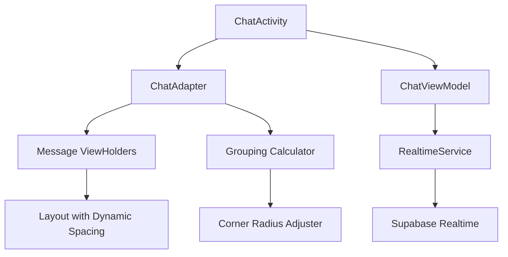
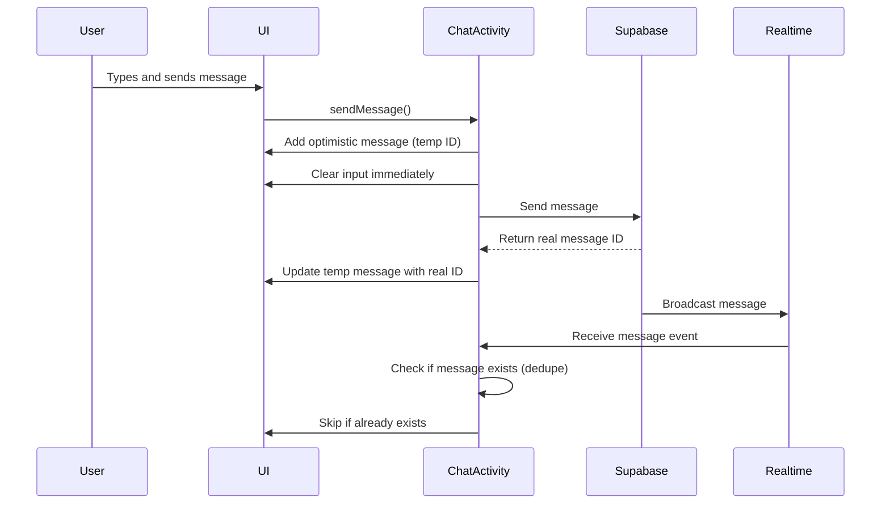

# Design Document

## Overview

This design addresses three interconnected issues in the chat system:
1. Excessive spacing between grouped messages (currently 8dp for all messages)
2. Broken message grouping when new messages arrive via realtime sync
3. 1-second delay when sending messages

The solution involves implementing dynamic spacing based on message grouping, proper corner radius adjustments, and optimistic UI updates with deduplication.

## Architecture

### Component Interaction



### Key Components

1. **ChatAdapter**: Enhanced with grouping logic and dynamic spacing
2. **Message ViewHolders**: Updated to apply corner radii based on position
3. **ChatActivity**: Modified for optimistic UI updates
4. **Dimension Resources**: New spacing values for grouped vs ungrouped messages

## Components and Interfaces

### 1. Message Grouping Calculator

**Location**: `ChatAdapter.kt`

**Responsibilities**:
- Determine if consecutive messages should be grouped
- Calculate message position within a group (SINGLE, FIRST, MIDDLE, LAST)
- Handle edge cases (deleted messages, different message types)

**Interface**:
```kotlin
enum class MessagePosition {
    SINGLE,    // Not part of a group
    FIRST,     // First in group
    MIDDLE,    // Middle of group
    LAST       // Last in group
}

private fun shouldGroupWithPrevious(position: Int): Boolean
private fun shouldGroupWithNext(position: Int): Boolean
private fun calculateMessagePosition(position: Int): MessagePosition
```

### 2. Dynamic Spacing System

**Location**: Layout XML files and ViewHolders

**Approach**:
- Remove fixed `layout_marginTop` from XML
- Apply spacing programmatically in `onBindViewHolder`
- Use different spacing values based on grouping

**Spacing Values** (in `dimens.xml`):
```xml
<dimen name="message_spacing_grouped">2dp</dimen>
<dimen name="message_spacing_ungrouped">12dp</dimen>
```

### 3. Corner Radius Adjustment

**Location**: ViewHolder bind methods

**Implementation**:
- Create rounded corner drawables programmatically
- Apply different corner configurations based on MessagePosition
- Support both sent and received message styles

**Corner Configurations**:
- SINGLE: All corners rounded (16dp)
- FIRST: Top corners rounded, bottom square
- MIDDLE: All corners square
- LAST: Bottom corners rounded, top square

### 4. Optimistic UI Updates

**Location**: `ChatActivity.sendMessage()`

**Flow**:


**Key Changes**:
1. Generate temporary message ID (e.g., `temp_${System.currentTimeMillis()}`)
2. Add message to adapter immediately
3. Clear input field immediately
4. When server responds, update the temporary message with real ID
5. When realtime event arrives, check if message already exists before adding

### 5. Realtime Message Deduplication

**Location**: `ChatActivity` realtime subscription handler

**Logic**:
```kotlin
// Check if message already exists
val existingIndex = messagesList.indexOfFirst { 
    it["id"] == newMessageId 
}

if (existingIndex != -1) {
    // Message already exists, just update it
    messagesList[existingIndex] = newMessage
    chatAdapter?.notifyItemChanged(existingIndex)
} else {
    // New message, add it
    messagesList.add(newMessage)
    chatAdapter?.notifyItemInserted(messagesList.size - 1)
}

// Recalculate grouping for affected messages
recalculateGrouping(affectedRange)
```

## Data Models

### Enhanced Message Map

```kotlin
val messageMap = HashMap<String, Any?>().apply {
    put("id", messageId)  // Can be temp ID or real ID
    put("chat_id", chatId)
    put("sender_id", senderId)
    put("content", content)
    put("message_type", "text")
    put("created_at", timestamp)
    put("is_deleted", false)
    put("is_edited", false)
    put("delivery_status", "sending" | "sent" | "delivered" | "read" | "failed")
    put("is_optimistic", true | false)  // NEW: Track optimistic messages
    put("temp_id", tempId)  // NEW: Store temp ID for matching
}
```

## Error Handling

### Optimistic Update Failures

**Scenario**: Message fails to send after optimistic UI update

**Handling**:
1. Keep message in UI with "failed" status
2. Show retry button
3. Allow user to retry or delete
4. Don't remove from UI automatically

### Realtime Connection Issues

**Scenario**: Realtime disconnects during conversation

**Handling**:
1. Continue allowing message sending
2. Messages will sync when connection restored
3. Show connection status banner
4. Reload messages on reconnection

### Grouping Calculation Errors

**Scenario**: Edge case causes grouping miscalculation

**Handling**:
1. Default to SINGLE position (safe fallback)
2. Log error for debugging
3. Don't crash the adapter

## Testing Strategy

### Unit Tests

1. **Grouping Logic Tests**
   - Test `shouldGroupWithPrevious()` with various scenarios
   - Test `shouldGroupWithNext()` with edge cases
   - Test `calculateMessagePosition()` for all positions
   - Test deleted message handling

2. **Spacing Calculation Tests**
   - Verify correct spacing for grouped messages
   - Verify correct spacing for ungrouped messages
   - Test first/last message spacing

### Integration Tests

1. **Realtime Sync Tests**
   - Send message and verify no duplicate when realtime event arrives
   - Verify grouping updates when new message arrives
   - Test rapid message sending

2. **UI Tests**
   - Verify corner radii applied correctly
   - Verify spacing applied correctly
   - Test scroll position maintained during updates

### Manual Testing Checklist

- [ ] Send multiple messages quickly - verify no duplicates
- [ ] Send message - verify appears instantly (< 100ms)
- [ ] Send messages from same sender - verify 2dp spacing
- [ ] Switch senders - verify 12dp spacing
- [ ] Close and reopen chat - verify grouping persists
- [ ] Test with images, videos, and text messages
- [ ] Test with deleted messages in groups
- [ ] Test with slow network connection
- [ ] Test with realtime disconnection/reconnection

## Implementation Notes

### Performance Considerations

1. **Grouping Calculation**: O(1) per message (only checks adjacent messages)
2. **Partial Updates**: Use `notifyItemChanged()` with payloads for grouping updates
3. **Avoid Full Refresh**: Never call `notifyDataSetChanged()` for single message updates

### Backward Compatibility

- Existing messages will work with new grouping logic
- No database schema changes required
- Gradual rollout possible (feature flag)

### Accessibility

- Maintain touch target sizes (min 48dp)
- Ensure sufficient contrast for all message states
- Support TalkBack for message grouping context

## Message Bubble Width Fix

### Problem

Currently, message bubbles span the entire width of the screen due to:
1. Parent LinearLayout using `match_parent` width
2. Static `maxWidth="280dp"` doesn't scale for different screen sizes (phones, tablets, foldables)

This differs from modern chat apps where bubbles wrap to content width and scale responsively.

### Solution

**Responsive Width Approach**:

Use a percentage-based maximum width that adapts to screen size:
- **Small phones**: 75% of screen width
- **Large phones**: 75% of screen width (more readable)
- **Tablets**: 75% of screen width (prevents excessive stretching)
- **Foldables**: Adapts to current screen configuration

**Implementation Strategy**:

1. **Calculate max width dynamically in ViewHolder**:
```kotlin
private fun getMaxBubbleWidth(): Int {
    val displayMetrics = itemView.context.resources.displayMetrics
    val screenWidth = displayMetrics.widthPixels
    return (screenWidth * 0.75).toInt()  // 75% of screen width
}
```

2. **Apply in onBindViewHolder**:
```kotlin
fun bind(message: Message) {
    val maxWidth = getMaxBubbleWidth()
    messageBG.maxWidth = maxWidth
    // ... rest of binding logic
}
```

**Layout Structure Changes**:

1. **Outer Container**: Keep `match_parent` for full-width touch area
2. **Message Layout FrameLayout**: Keep `match_parent` to allow alignment
3. **Inner LinearLayout**: Change to `wrap_content` to wrap bubble
4. **Message Bubble (messageBG)**: Keep `wrap_content`, remove static `maxWidth` from XML

**Key Changes in XML**:
```xml
<!-- Current (WRONG) -->
<FrameLayout
    android:id="@+id/message_layout"
    android:layout_width="match_parent"
    android:layout_height="wrap_content">
    <LinearLayout
        android:layout_width="match_parent"  <!-- PROBLEM -->
        android:layout_height="wrap_content"
        android:layout_gravity="start">
        <LinearLayout
            android:id="@+id/messageBG"
            android:maxWidth="280dp"  <!-- STATIC, NOT RESPONSIVE -->

<!-- Fixed (CORRECT) -->
<FrameLayout
    android:id="@+id/message_layout"
    android:layout_width="match_parent"
    android:layout_height="wrap_content">
    <LinearLayout
        android:layout_width="wrap_content"  <!-- FIXED -->
        android:layout_height="wrap_content"
        android:layout_gravity="start">
        <LinearLayout
            android:id="@+id/messageBG"
            <!-- maxWidth set programmatically in ViewHolder -->
```

**Alignment Logic**:
- Received messages: `android:layout_gravity="start"` (left-aligned)
- Sent messages: `android:layout_gravity="end"` (right-aligned)

**Screen Size Examples**:
- Phone (360dp width): Max bubble = 270dp (75%)
- Tablet (768dp width): Max bubble = 576dp (75%)
- Foldable unfolded (840dp width): Max bubble = 630dp (75%)

This ensures bubbles are readable on all devices without spanning excessively.

## Design Decisions

### Why Dynamic Spacing Instead of ItemDecoration?

**Decision**: Apply spacing programmatically in ViewHolder

**Rationale**:
- More control over spacing logic
- Easier to debug and maintain
- Can access message data directly
- Simpler than ItemDecoration for this use case

### Why Optimistic UI with Temp IDs?

**Decision**: Use temporary IDs for optimistic messages

**Rationale**:
- Allows immediate UI update
- Enables deduplication when realtime event arrives
- Provides clear mapping between optimistic and real messages
- Supports retry logic for failed messages

### Why Recalculate Grouping on Every Update?

**Decision**: Recalculate affected message grouping when list changes

**Rationale**:
- Ensures consistency
- Handles edge cases automatically
- Performance impact minimal (only affects adjacent messages)
- Simpler than maintaining grouping state separately
