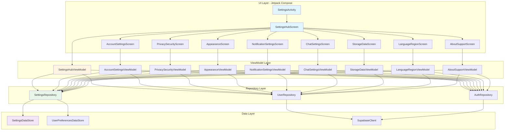

# Design Document: Comprehensive Settings Feature

## Overview

This design document outlines the architecture and implementation approach for transforming the Synapse social media app's minimal settings into a comprehensive, production-ready multi-screen settings hub. The feature follows Material Design 3 guidelines and the existing MVVM architecture with Repository pattern.

**Implementation Approach:** This feature is implemented entirely using Jetpack Compose with Material 3 components. All UI screens are Composable functions, navigation uses Compose Navigation, and state management follows Compose best practices with StateFlow and remember/rememberSaveable.

The settings system will be organized into a hub-and-spoke navigation model where the main Settings Hub provides categorized access to dedicated sub-screens. Each sub-screen handles a specific domain (Account, Privacy, Appearance, etc.) with both functional settings and placeholder UI for future features.

## Architecture



## Material 3 Expressive Design System

### Design Principles

The settings feature follows Material 3 Expressive guidelines for a cohesive, modern, and delightful user experience:

1. **Expressive Surfaces** - Use `surfaceContainer`, `surfaceContainerHigh`, and `surfaceContainerHighest` for layered depth
2. **Rounded Corners** - Consistent corner radii: 28dp for cards, 16dp for buttons, 12dp for inputs
3. **Dynamic Color** - Support Android 12+ wallpaper-based theming via `dynamicColorScheme`
4. **Motion** - Smooth transitions with `AnimatedVisibility`, shared element transitions
5. **Typography** - Material 3 type scale with expressive headlines

### Color Usage

```kotlin
// Settings-specific color mapping
object SettingsColors {
    // Category icons use primary with container backgrounds
    val categoryIconTint = MaterialTheme.colorScheme.primary
    val categoryBackground = MaterialTheme.colorScheme.primaryContainer
    
    // Section headers
    val sectionTitle = MaterialTheme.colorScheme.primary
    
    // Cards and containers
    val cardBackground = MaterialTheme.colorScheme.surfaceContainer
    val cardBackgroundElevated = MaterialTheme.colorScheme.surfaceContainerHigh
    
    // Destructive actions
    val destructiveButton = MaterialTheme.colorScheme.errorContainer
    val destructiveText = MaterialTheme.colorScheme.onErrorContainer
    
    // Toggles and selections
    val toggleActive = MaterialTheme.colorScheme.primary
    val toggleTrack = MaterialTheme.colorScheme.surfaceVariant
}
```

### Shape System

```kotlin
object SettingsShapes {
    val cardShape = RoundedCornerShape(28.dp)      // Large cards, profile header
    val sectionShape = RoundedCornerShape(24.dp)   // Settings sections
    val itemShape = RoundedCornerShape(16.dp)      // Individual items, buttons
    val inputShape = RoundedCornerShape(12.dp)     // Text fields, dropdowns
    val chipShape = RoundedCornerShape(8.dp)       // Small chips, badges
}
```

### Typography Mapping

```kotlin
// Settings screen typography usage
object SettingsTypography {
    // Screen titles - LargeTopAppBar
    val screenTitle = MaterialTheme.typography.headlineMedium
    
    // Section headers
    val sectionHeader = MaterialTheme.typography.titleMedium
    
    // Setting item title
    val itemTitle = MaterialTheme.typography.bodyLarge  // fontWeight = Medium
    
    // Setting item subtitle/description
    val itemSubtitle = MaterialTheme.typography.bodyMedium
    
    // Profile name in header
    val profileName = MaterialTheme.typography.titleLarge
    
    // Profile email
    val profileEmail = MaterialTheme.typography.bodyMedium
    
    // Button text
    val buttonText = MaterialTheme.typography.labelLarge
}
```

### Spacing and Layout

```kotlin
object SettingsSpacing {
    val screenPadding = 16.dp
    val sectionSpacing = 24.dp
    val itemSpacing = 0.dp  // Items within a card have no gap (dividers instead)
    val itemPadding = PaddingValues(horizontal = 16.dp, vertical = 16.dp)
    val iconSize = 24.dp
    val avatarSize = 64.dp
    val profileHeaderPadding = 24.dp
}
```

### Component Specifications

#### Profile Header Card
```
┌─────────────────────────────────────────┐
│  ┌────┐                                 │
│  │ 🖼 │  Display Name                   │
│  │    │  email@example.com              │
│  └────┘                                 │
│         [Edit Profile Button]           │
└─────────────────────────────────────────┘
- Background: surfaceContainerHigh
- Corner radius: 28dp
- Avatar: 64dp circular with border
- Padding: 24dp all sides
```

#### Settings Category Card
```
┌─────────────────────────────────────────┐
│  🔒  Privacy & Security            ›    │
│       Control who can see your content  │
├─────────────────────────────────────────┤
│  🎨  Appearance                    ›    │
│       Theme, colors, and display        │
└─────────────────────────────────────────┘
- Background: surfaceContainer
- Corner radius: 24dp
- Divider: outlineVariant at 0.5 alpha
- Icon tint: onSurfaceVariant
- Chevron: onSurfaceVariant at 0.5 alpha
```

#### Toggle Setting Item
```
┌─────────────────────────────────────────┐
│  🔔  Push Notifications      [═══●]     │
│       Receive alerts for activity       │
└─────────────────────────────────────────┘
- Switch: Material 3 Switch component
- Active thumb: primary
- Active track: primaryContainer
```

#### Selection Setting Item
```
┌─────────────────────────────────────────┐
│  🌙  Theme                              │
│       System Default              ▼     │
└─────────────────────────────────────────┘
- Dropdown: ExposedDropdownMenuBox
- Selected value: bodyMedium, onSurfaceVariant
```

### Animation Specifications

```kotlin
object SettingsAnimations {
    // Screen transitions
    val enterTransition = fadeIn(tween(300)) + slideInHorizontally(tween(300)) { it / 4 }
    val exitTransition = fadeOut(tween(300)) + slideOutHorizontally(tween(300)) { -it / 4 }
    
    // Content animations
    val expandAnimation = expandVertically(tween(200))
    val collapseAnimation = shrinkVertically(tween(200))
    
    // Toggle animations - use default Material 3 Switch animations
    
    // Card press feedback
    val pressScale = 0.98f
    val pressDuration = 100
}
```

## Components and Interfaces

### Navigation Component

```kotlin
// SettingsNavigation.kt
sealed class SettingsDestination(val route: String) {
    object Hub : SettingsDestination("settings_hub")
    object Account : SettingsDestination("settings_account")
    object Privacy : SettingsDestination("settings_privacy")
    object Appearance : SettingsDestination("settings_appearance")
    object Notifications : SettingsDestination("settings_notifications")
    object Chat : SettingsDestination("settings_chat")
    object Storage : SettingsDestination("settings_storage")
    object Language : SettingsDestination("settings_language")
    object About : SettingsDestination("settings_about")
}
```

### Settings Category Model

```kotlin
// SettingsCategory.kt
data class SettingsCategory(
    val id: String,
    val title: String,
    val subtitle: String,
    @DrawableRes val icon: Int,
    val destination: SettingsDestination
)
```

### Settings Item Components

```kotlin
// SettingsItem.kt
sealed class SettingsItem {
    data class Toggle(
        val key: String,
        val title: String,
        val subtitle: String? = null,
        @DrawableRes val icon: Int? = null,
        val enabled: Boolean,
        val onToggle: (Boolean) -> Unit
    ) : SettingsItem()

    data class Navigation(
        val key: String,
        val title: String,
        val subtitle: String? = null,
        @DrawableRes val icon: Int? = null,
        val onClick: () -> Unit
    ) : SettingsItem()

    data class Selection(
        val key: String,
        val title: String,
        val subtitle: String? = null,
        @DrawableRes val icon: Int? = null,
        val options: List<String>,
        val selectedOption: String,
        val onSelect: (String) -> Unit
    ) : SettingsItem()

    data class Slider(
        val key: String,
        val title: String,
        val subtitle: String? = null,
        val value: Float,
        val range: ClosedFloatingPointRange<Float>,
        val steps: Int = 0,
        val onValueChange: (Float) -> Unit
    ) : SettingsItem()

    data class Header(val title: String) : SettingsItem()
    
    data class Button(
        val key: String,
        val title: String,
        val isDestructive: Boolean = false,
        val onClick: () -> Unit
    ) : SettingsItem()
}
```

### Repository Interface

```kotlin
// SettingsRepository.kt
interface SettingsRepository {
    // Theme Settings
    val themeMode: Flow<ThemeMode>
    val dynamicColorEnabled: Flow<Boolean>
    val fontScale: Flow<FontScale>
    
    suspend fun setThemeMode(mode: ThemeMode)
    suspend fun setDynamicColorEnabled(enabled: Boolean)
    suspend fun setFontScale(scale: FontScale)
    
    // Privacy Settings
    val profileVisibility: Flow<ProfileVisibility>
    val biometricLockEnabled: Flow<Boolean>
    
    suspend fun setProfileVisibility(visibility: ProfileVisibility)
    suspend fun setBiometricLockEnabled(enabled: Boolean)
    
    // Notification Settings
    val notificationPreferences: Flow<NotificationPreferences>
    suspend fun updateNotificationPreference(category: NotificationCategory, enabled: Boolean)
    
    // Chat Settings
    val chatSettings: Flow<ChatSettings>
    suspend fun setReadReceiptsEnabled(enabled: Boolean)
    suspend fun setTypingIndicatorsEnabled(enabled: Boolean)
    suspend fun setMediaAutoDownload(setting: MediaAutoDownload)
    
    // Storage
    val cacheSize: Flow<Long>
    suspend fun clearCache(): Long
    
    // General
    suspend fun clearAllSettings()
}
```

## Data Models

### Theme and Appearance

```kotlin
enum class ThemeMode { LIGHT, DARK, SYSTEM }
enum class FontScale { SMALL, MEDIUM, LARGE, EXTRA_LARGE }

data class AppearanceSettings(
    val themeMode: ThemeMode = ThemeMode.SYSTEM,
    val dynamicColorEnabled: Boolean = true,
    val fontScale: FontScale = FontScale.MEDIUM
)
```

### Privacy Settings

```kotlin
enum class ProfileVisibility { PUBLIC, FOLLOWERS_ONLY, PRIVATE }

data class PrivacySettings(
    val profileVisibility: ProfileVisibility = ProfileVisibility.PUBLIC,
    val twoFactorEnabled: Boolean = false,
    val biometricLockEnabled: Boolean = false,
    val contentVisibility: ContentVisibility = ContentVisibility.EVERYONE
)

enum class ContentVisibility { EVERYONE, FOLLOWERS, ONLY_ME }
```

### Notification Settings

```kotlin
data class NotificationPreferences(
    val likesEnabled: Boolean = true,
    val commentsEnabled: Boolean = true,
    val followsEnabled: Boolean = true,
    val messagesEnabled: Boolean = true,
    val mentionsEnabled: Boolean = true,
    val inAppNotificationsEnabled: Boolean = true
)

enum class NotificationCategory { LIKES, COMMENTS, FOLLOWS, MESSAGES, MENTIONS }
```

### Chat Settings

```kotlin
data class ChatSettings(
    val readReceiptsEnabled: Boolean = true,
    val typingIndicatorsEnabled: Boolean = true,
    val mediaAutoDownload: MediaAutoDownload = MediaAutoDownload.WIFI_ONLY
)

enum class MediaAutoDownload { ALWAYS, WIFI_ONLY, NEVER }
```

### User Profile Summary

```kotlin
data class UserProfileSummary(
    val id: String,
    val displayName: String,
    val email: String,
    val avatarUrl: String?
)
```


## Correctness Properties

*A property is a characteristic or behavior that should hold true across all valid executions of a system-essentially, a formal statement about what the system should do. Properties serve as the bridge between human-readable specifications and machine-verifiable correctness guarantees.*

Based on the prework analysis, the following consolidated correctness properties have been identified:

### Property 1: Settings Persistence Round Trip

*For any* settings value (theme mode, dynamic color, font scale, notification preferences, chat settings, privacy settings), saving the value to DataStore and immediately reading it back SHALL return an equivalent value.

**Validates: Requirements 4.2, 4.3, 4.7, 5.2, 5.6, 6.2, 6.3, 7.3, 10.1**

### Property 2: Enum Options Completeness

*For any* settings screen displaying selection options (profile visibility, content visibility, font scale, notification categories, media auto-download), the UI SHALL present all defined enum values as selectable options.

**Validates: Requirements 3.2, 3.8, 4.5, 5.3, 6.4**

### Property 3: Settings Category Display Completeness

*For any* Settings Hub render, the displayed categories SHALL include all required categories (Account, Privacy & Security, Appearance, Notifications, Chat, Storage & Data, About) with their corresponding icons and descriptions.

**Validates: Requirements 1.1, 1.4**

### Property 4: Settings Restoration on Launch

*For any* previously saved settings state, when the app launches and DataStore is accessible, the restored settings SHALL match the previously saved values. When DataStore read fails, the system SHALL return default values without throwing exceptions.

**Validates: Requirements 10.2, 10.4**

### Property 5: Navigation Route Consistency

*For any* settings category tap action, the navigation system SHALL route to the corresponding destination screen matching the category's defined route.

**Validates: Requirements 1.2**

### Property 6: Cache Clear Size Reduction

*For any* cache clear operation, the reported cache size after clearing SHALL be less than or equal to the cache size before clearing, and the freed space amount SHALL equal the difference.

**Validates: Requirements 7.2**

### Property 7: Logout Settings Segregation

*For any* logout operation, user-specific settings (profile visibility, notification preferences, linked accounts) SHALL be cleared while device-level settings (theme mode, font scale, dynamic color) SHALL be preserved.

**Validates: Requirements 10.3**

### Property 8: StateFlow Emission on Change

*For any* settings modification, the corresponding StateFlow SHALL emit a new state value that reflects the change to all active collectors.

**Validates: Requirements 10.5**

### Property 9: Dynamic Color Visibility by SDK

*For any* device with Android SDK version, the Dynamic Color option SHALL be visible only when SDK >= 31 (Android 12+).

**Validates: Requirements 4.4**

### Property 10: Language Native Script Display

*For any* language in the available languages list, the displayed language name SHALL be in its native script (e.g., "日本語" for Japanese, "Español" for Spanish).

**Validates: Requirements 8.4**

## Error Handling

### DataStore Errors

```kotlin
sealed class SettingsError {
    object DataStoreReadError : SettingsError()
    object DataStoreWriteError : SettingsError()
    object NetworkError : SettingsError()
    object AuthenticationError : SettingsError()
    data class ValidationError(val message: String) : SettingsError()
}

// Error handling in Repository
suspend fun <T> safeDataStoreRead(
    default: T,
    read: suspend () -> T
): T = try {
    read()
} catch (e: IOException) {
    Log.e("Settings", "DataStore read failed", e)
    default
}
```

### UI Error States

```kotlin
data class SettingsUiState(
    val isLoading: Boolean = false,
    val error: SettingsError? = null,
    val settings: Settings = Settings()
)
```

### Validation Rules

- Email change requires valid email format and re-authentication
- Password change requires minimum 8 characters, current password verification
- Delete account requires exact phrase confirmation ("DELETE MY ACCOUNT")
- Cache clear shows confirmation before proceeding

## Testing Strategy

### Property-Based Testing Library

The project will use **Kotest** with its property-based testing module for Kotlin. Kotest provides:
- Generators for primitive types and custom data classes
- Shrinking for minimal failing examples
- Integration with JUnit5 for Android testing

```kotlin
// build.gradle dependency
testImplementation("io.kotest:kotest-runner-junit5:5.8.0")
testImplementation("io.kotest:kotest-property:5.8.0")
```

### Unit Testing Approach

Unit tests will cover:
- ViewModel state transformations
- Repository method behavior with mocked DataStore
- Navigation route mapping
- Settings validation logic

### Property-Based Testing Approach

Each correctness property will be implemented as a property-based test with:
- Minimum 100 iterations per property
- Custom generators for settings data classes
- Explicit property tags referencing design document

Example structure:
```kotlin
class SettingsPersistencePropertyTest : FunSpec({
    // **Feature: comprehensive-settings, Property 1: Settings Persistence Round Trip**
    test("settings round trip preserves values").config(invocations = 100) {
        checkAll(Arb.enum<ThemeMode>()) { themeMode ->
            // Save and read back
            repository.setThemeMode(themeMode)
            repository.themeMode.first() shouldBe themeMode
        }
    }
})
```

### Test Categories

1. **Settings Persistence Tests** - Verify DataStore round-trip for all setting types
2. **UI State Tests** - Verify ViewModel produces correct UI states
3. **Navigation Tests** - Verify correct routing between screens
4. **Validation Tests** - Verify input validation rules
5. **Error Handling Tests** - Verify graceful degradation on failures

### Integration Testing

- End-to-end settings flow using Compose UI testing
- DataStore integration with actual preferences
- Navigation graph verification

