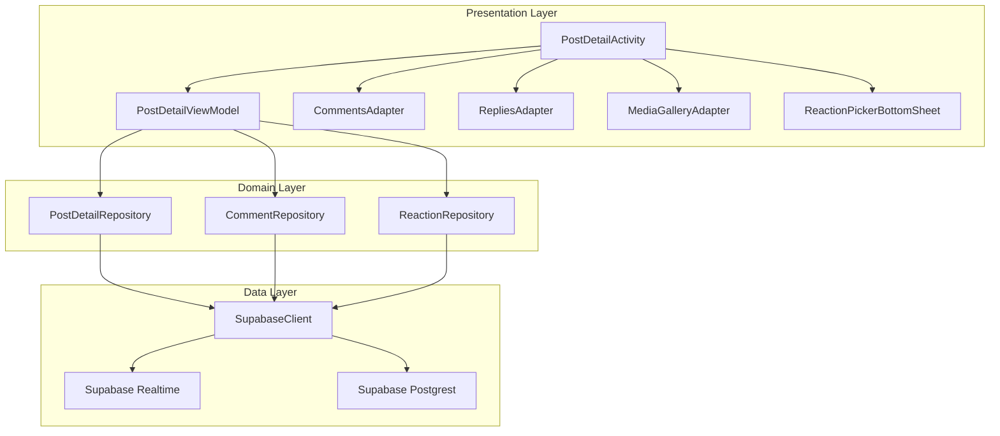

# Design Document: Detailed Post View

## Overview

The Detailed Post View feature provides a comprehensive screen for viewing individual posts with full content, author information, reactions, comments with nested replies, polls, and real-time engagement updates. The implementation follows MVVM architecture with Repository pattern, using Supabase as the backend with Realtime subscriptions for live updates. The UI follows Material 3 expressive design principles.

## Architecture



## Components and Interfaces

### 1. PostDetailActivity
Main activity displaying the detailed post view with Material 3 expressive components.

```kotlin
class PostDetailActivity : AppCompatActivity() {
    private lateinit var binding: ActivityPostDetailBinding
    private val viewModel: PostDetailViewModel by viewModels()
    
    // Handles post display, comments, reactions, polls
    // Subscribes to real-time updates
    // Manages bottom sheets for reactions and comments
}
```

### 2. PostDetailViewModel
Manages UI state and business logic for the post detail screen.

```kotlin
class PostDetailViewModel : ViewModel() {
    // State flows
    val postState: StateFlow<PostDetailState>
    val commentsState: StateFlow<CommentsState>
    val realtimeState: StateFlow<RealtimeConnectionState>
    
    // Actions
    fun loadPost(postId: String)
    fun loadComments(postId: String)
    fun toggleReaction(reactionType: ReactionType)
    fun addComment(content: String, parentCommentId: String?)
    fun toggleCommentReaction(commentId: String, reactionType: ReactionType)
    fun votePoll(optionIndex: Int)
    fun toggleBookmark()
    fun createReshare(commentary: String?)
    fun reportPost(reason: String)
}
```

### 3. PostDetailRepository
Handles post data fetching with author information and media.

```kotlin
class PostDetailRepository {
    suspend fun getPostWithDetails(postId: String): Result<PostDetail>
    suspend fun incrementViewCount(postId: String): Result<Unit>
    fun observePostChanges(postId: String): Flow<PostDetail>
}
```

### 4. CommentRepository
Manages comments and replies with real-time subscriptions.

```kotlin
class CommentRepository {
    suspend fun getComments(postId: String, limit: Int, offset: Int): Result<List<CommentWithUser>>
    suspend fun getReplies(commentId: String): Result<List<CommentWithUser>>
    suspend fun createComment(postId: String, content: String, mediaUrl: String?, parentCommentId: String?): Result<Comment>
    suspend fun deleteComment(commentId: String): Result<Unit>
    suspend fun editComment(commentId: String, content: String): Result<Unit>
    fun observeComments(postId: String): Flow<CommentEvent>
}
```

### 5. ReactionRepository
Handles post and comment reactions.

```kotlin
class ReactionRepository {
    suspend fun togglePostReaction(postId: String, reactionType: ReactionType): Result<Unit>
    suspend fun getPostReactionSummary(postId: String): Result<Map<ReactionType, Int>>
    suspend fun getUserPostReaction(postId: String): Result<ReactionType?>
    suspend fun toggleCommentReaction(commentId: String, reactionType: ReactionType): Result<Unit>
    suspend fun getCommentReactionSummary(commentId: String): Result<Map<ReactionType, Int>>
}
```

### 6. PollRepository
Manages poll voting and results.

```kotlin
class PollRepository {
    suspend fun getUserVote(postId: String): Result<Int?>
    suspend fun submitVote(postId: String, optionIndex: Int): Result<Unit>
    suspend fun getPollResults(postId: String): Result<List<PollOptionResult>>
}
```

### 7. BookmarkRepository
Handles post bookmarking/favorites.

```kotlin
class BookmarkRepository {
    suspend fun isBookmarked(postId: String): Result<Boolean>
    suspend fun toggleBookmark(postId: String, collectionId: String?): Result<Boolean>
}
```

### 8. ReshareRepository
Manages post resharing.

```kotlin
class ReshareRepository {
    suspend fun createReshare(postId: String, commentary: String?): Result<Unit>
    suspend fun hasReshared(postId: String): Result<Boolean>
}
```

## Data Models

### PostDetail
```kotlin
data class PostDetail(
    val post: Post,
    val author: UserProfile,
    val reactionSummary: Map<ReactionType, Int>,
    val userReaction: ReactionType?,
    val isBookmarked: Boolean,
    val hasReshared: Boolean,
    val pollResults: List<PollOptionResult>?,
    val userPollVote: Int?
)
```

### CommentWithUser
```kotlin
data class CommentWithUser(
    val id: String,
    val postId: String,
    val userId: String,
    val parentCommentId: String?,
    val content: String,
    val mediaUrl: String?,
    val createdAt: String,
    val updatedAt: String,
    val likesCount: Int,
    val repliesCount: Int,
    val isDeleted: Boolean,
    val isEdited: Boolean,
    val user: UserProfile,
    val userReaction: ReactionType?,
    val reactionSummary: Map<ReactionType, Int>
)
```

### CommentReaction (aligned with comment_reactions table)
```kotlin
@Serializable
data class CommentReaction(
    val id: String? = null,
    @SerialName("comment_id") val commentId: String,
    @SerialName("user_id") val userId: String,
    @SerialName("reaction_type") val reactionType: String,
    @SerialName("created_at") val createdAt: String? = null,
    @SerialName("updated_at") val updatedAt: String? = null
)
```

### PollOptionResult
```kotlin
data class PollOptionResult(
    val index: Int,
    val text: String,
    val voteCount: Int,
    val percentage: Float
)
```

### PostDetailState
```kotlin
sealed class PostDetailState {
    object Loading : PostDetailState()
    data class Success(val postDetail: PostDetail) : PostDetailState()
    data class Error(val message: String) : PostDetailState()
}
```

### CommentsState
```kotlin
sealed class CommentsState {
    object Loading : CommentsState()
    data class Success(
        val comments: List<CommentWithUser>,
        val hasMore: Boolean
    ) : CommentsState()
    data class Error(val message: String) : CommentsState()
}
```

### CommentEvent (for real-time updates)
```kotlin
sealed class CommentEvent {
    data class Added(val comment: CommentWithUser) : CommentEvent()
    data class Updated(val comment: CommentWithUser) : CommentEvent()
    data class Deleted(val commentId: String) : CommentEvent()
}
```

## Correctness Properties

*A property is a characteristic or behavior that should hold true across all valid executions of a system-essentially, a formal statement about what the system should do. Properties serve as the bridge between human-readable specifications and machine-verifiable correctness guarantees.*

### Property 1: Post loading returns complete data
*For any* valid post ID, loading the post detail SHALL return the post with all required fields (text, author info, timestamp, media items if present, location if present, poll data if present).
**Validates: Requirements 1.1, 1.2, 1.4, 2.1**

### Property 2: YouTube URL detection
*For any* post containing a YouTube URL in the youtube_url field, the PostDetail SHALL include the YouTube URL for embedding.
**Validates: Requirements 1.3**

### Property 3: Encryption round-trip
*For any* encrypted post content, decrypting with the correct key SHALL produce the original plaintext content.
**Validates: Requirements 1.5**

### Property 4: Edited post detection
*For any* post where is_edited is true, the PostDetail SHALL include the edited_at timestamp.
**Validates: Requirements 1.6**

### Property 5: Author badge display logic
*For any* post author, the badge displayed SHALL match the author's verification status (verify=true) or premium status (account_premium=true).
**Validates: Requirements 2.2, 2.3**

### Property 6: Reaction toggle consistency
*For any* user and post, toggling a reaction SHALL either add the reaction (if none exists or different type) or remove it (if same type exists), and the reaction count SHALL reflect the change.
**Validates: Requirements 3.2, 3.3, 3.4**

### Property 7: Reaction aggregation accuracy
*For any* post with reactions, the reaction summary SHALL correctly count reactions grouped by type.
**Validates: Requirements 3.5**

### Property 8: Comment loading completeness
*For any* post with comments, loading comments SHALL return comments sorted by creation date with all required fields (user info, content, timestamp, reaction count, replies count).
**Validates: Requirements 4.1, 4.2**

### Property 9: Comment creation persistence
*For any* valid comment submission, the comment SHALL be persisted and appear in subsequent comment loads for that post.
**Validates: Requirements 4.3**

### Property 10: Comment media inclusion
*For any* comment with a media_url, the loaded comment SHALL include the media URL.
**Validates: Requirements 4.4**

### Property 11: Comment edit and delete status
*For any* comment, the is_edited and is_deleted flags SHALL accurately reflect the comment's state.
**Validates: Requirements 4.5, 4.6**

### Property 12: Reply count accuracy
*For any* comment, the replies_count SHALL equal the number of comments with that comment's ID as parent_comment_id.
**Validates: Requirements 5.1**

### Property 13: Reply parent reference
*For any* reply submission with a parent comment ID, the created comment SHALL have the correct parent_comment_id reference.
**Validates: Requirements 5.4**

### Property 14: Comment reaction toggle
*For any* user and comment, toggling a comment reaction SHALL either add or remove the reaction, updating the comment_reactions table accordingly.
**Validates: Requirements 6.2, 6.3, 6.4**

### Property 15: Poll data completeness
*For any* post with has_poll=true, the PostDetail SHALL include poll_question and poll_options.
**Validates: Requirements 7.1**

### Property 16: Poll vote status detection
*For any* user and poll, querying vote status SHALL correctly identify whether the user has voted and which option.
**Validates: Requirements 7.2, 7.4**

### Property 17: Poll vote persistence
*For any* valid poll vote submission, the vote SHALL be persisted in poll_votes and reflected in poll results.
**Validates: Requirements 7.3**

### Property 18: Poll end time enforcement
*For any* poll where poll_end_time is in the past, vote submissions SHALL be rejected.
**Validates: Requirements 7.5**

### Property 19: Bookmark toggle consistency
*For any* user and post, toggling bookmark SHALL either add to favorites (if not bookmarked) or remove (if bookmarked).
**Validates: Requirements 8.1, 8.2**

### Property 20: Reshare creation
*For any* valid reshare submission, a reshare record SHALL be created and the post's reshares_count SHALL increment.
**Validates: Requirements 8.5**

### Property 21: Hashtag extraction
*For any* text containing hashtags (words starting with #), the hashtag parser SHALL extract all hashtags correctly.
**Validates: Requirements 9.1**

### Property 22: Mention extraction
*For any* text containing mentions (words starting with @), the mention parser SHALL extract all mentions correctly.
**Validates: Requirements 9.3**

### Property 23: Report creation
*For any* valid report submission, a post_reports record SHALL be created with the correct post_id, reporter_id, and reason.
**Validates: Requirements 10.3**

### Property 24: Real-time comment subscription
*For any* active subscription to a post's comments, new comments inserted by other users SHALL trigger a CommentEvent.Added.
**Validates: Requirements 11.1**

### Property 25: Real-time cleanup
*For any* PostDetailActivity lifecycle, leaving the screen SHALL unsubscribe from all Realtime channels.
**Validates: Requirements 11.4**

## Error Handling

### Network Errors
- Display retry option with exponential backoff
- Cache last successful data for offline viewing
- Show connection status indicator

### Authentication Errors
- Redirect to login for 401 errors
- Show permission denied message for RLS violations

### Data Validation Errors
- Validate comment content length (max 2000 characters)
- Validate media file types and sizes
- Show inline validation errors

### Real-time Connection Errors
- Auto-reconnect with exponential backoff
- Fall back to polling if Realtime unavailable
- Show connection status in UI

## Testing Strategy

### Unit Testing
- Test ViewModel state transitions
- Test Repository data mapping
- Test hashtag/mention parsing utilities
- Test poll result calculations
- Test reaction aggregation logic

### Property-Based Testing
The implementation SHALL use **Kotest** with the **kotest-property** module for property-based testing.

Each property test SHALL:
- Run a minimum of 100 iterations
- Be tagged with a comment referencing the correctness property: `// **Feature: detailed-post-view, Property {number}: {property_text}**`
- Use smart generators that constrain inputs to valid domain values

Property tests SHALL cover:
- Data model serialization/deserialization round-trips
- Reaction toggle state machine
- Comment hierarchy integrity
- Poll vote constraints
- Hashtag/mention parsing edge cases

### Integration Testing
- Test Supabase queries with test database
- Test Realtime subscription lifecycle
- Test RLS policy enforcement

### UI Testing
- Test Material 3 component interactions
- Test accessibility compliance
- Test responsive layouts
