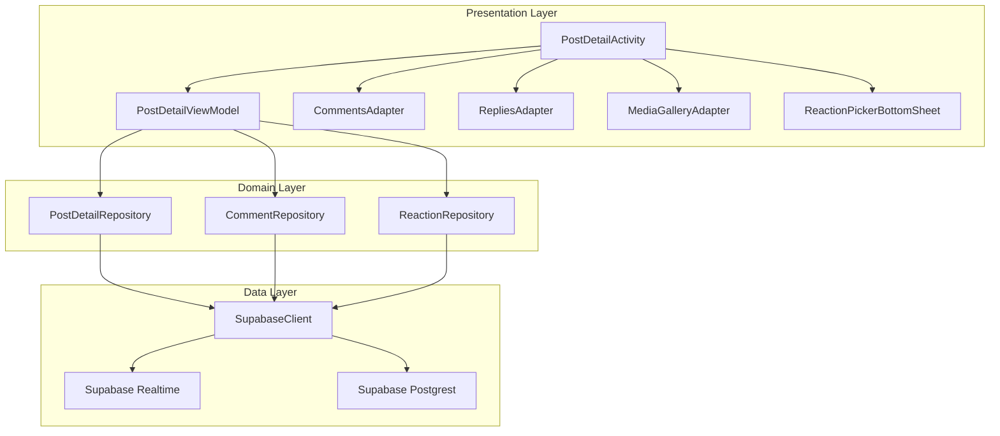

# Design Document: Detailed Post View

## Overview

The Detailed Post View feature provides a comprehensive screen for viewing individual posts with full content, author information, reactions, comments with nested replies, polls, and real-time engagement updates. The implementation follows MVVM architecture with Repository pattern, using Supabase as the backend with Realtime subscriptions for live updates. The UI follows Material 3 expressive design principles.

## Architecture



## Components and Interfaces

### 1. PostDetailActivity
Main activity displaying the detailed post view with Material 3 expressive components.

```kotlin
class PostDetailActivity : AppCompatActivity() {
    private lateinit var binding: ActivityPostDetailBinding
    private val viewModel: PostDetailViewModel by viewModels()
    
    // Handles post display, comments, reactions, polls
    // Subscribes to real-time updates
    // Manages bottom sheets for reactions and comments
}
```

### 2. PostDetailViewModel
Manages UI state and business logic for the post detail screen.

```kotlin
class PostDetailViewModel : ViewModel() {
    // State flows
    val postState: StateFlow<PostDetailState>
    val commentsState: StateFlow<CommentsState>
    val realtimeState: StateFlow<RealtimeConnectionState>
    
    // Actions
    fun loadPost(postId: String)
    fun loadComments(postId: String)
    fun toggleReaction(reactionType: ReactionType)
    fun addComment(content: String, parentCommentId: String?)
    fun toggleCommentReaction(commentId: String, reactionType: ReactionType)
    fun votePoll(optionIndex: Int)
    fun toggleBookmark()
    fun createReshare(commentary: String?)
    fun reportPost(reason: String)
}
```

### 3. PostDetailRepository
Handles post data fetching with author information and media.

```kotlin
class PostDetailRepository {
    suspend fun getPostWithDetails(postId: String): Result<PostDetail>
    suspend fun incrementViewCount(postId: String): Result<Unit>
    fun observePostChanges(postId: String): Flow<PostDetail>
}
```

### 4. CommentRepository
Manages comments and replies with real-time subscriptions.

```kotlin
class CommentRepository {
    suspend fun getComments(postId: String, limit: Int, offset: Int): Result<List<CommentWithUser>>
    suspend fun getReplies(commentId: String): Result<List<CommentWithUser>>
    suspend fun createComment(postId: String, content: String, mediaUrl: String?, parentCommentId: String?): Result<Comment>
    suspend fun deleteComment(commentId: String): Result<Unit>
    suspend fun editComment(commentId: String, content: String): Result<Unit>
    fun observeComments(postId: String): Flow<CommentEvent>
}
```

### 5. ReactionRepository
Handles post and comment reactions.

```kotlin
class ReactionRepository {
    suspend fun togglePostReaction(postId: String, reactionType: ReactionType): Result<Unit>
    suspend fun getPostReactionSummary(postId: String): Result<Map<ReactionType, Int>>
    suspend fun getUserPostReaction(postId: String): Result<ReactionType?>
    suspend fun toggleCommentReaction(commentId: String, reactionType: ReactionType): Result<Unit>
    suspend fun getCommentReactionSummary(commentId: String): Result<Map<ReactionType, Int>>
}
```

### 6. PollRepository
Manages poll voting and results.

```kotlin
class PollRepository {
    suspend fun getUserVote(postId: String): Result<Int?>
    suspend fun submitVote(postId: String, optionIndex: Int): Result<Unit>
    suspend fun getPollResults(postId: String): Result<List<PollOptionResult>>
}
```

### 7. BookmarkRepository
Handles post bookmarking/favorites.

```kotlin
class BookmarkRepository {
    suspend fun isBookmarked(postId: String): Result<Boolean>
    suspend fun toggleBookmark(postId: String, collectionId: String?): Result<Boolean>
}
```

### 8. ReshareRepository
Manages post resharing.

```kotlin
class ReshareRepository {
    suspend fun createReshare(postId: String, commentary: String?): Result<Unit>
    suspend fun hasReshared(postId: String): Result<Boolean>
}
```

## Data Models

### PostDetail
```kotlin
data class PostDetail(
    val post: Post,
    val author: UserProfile,
    val reactionSummary: Map<ReactionType, Int>,
    val userReaction: ReactionType?,
    val isBookmarked: Boolean,
    val hasReshared: Boolean,
    val pollResults: List<PollOptionResult>?,
    val userPollVote: Int?
)
```

### CommentWithUser
```kotlin
data class CommentWithUser(
    val id: String,
    val postId: String,
    val userId: String,
    val parentCommentId: String?,
    val content: String,
    val mediaUrl: String?,
    val createdAt: String,
    val updatedAt: String,
    val likesCount: Int,
    val repliesCount: Int,
    val isDeleted: Boolean,
    val isEdited: Boolean,
    val user: UserProfile,
    val userReaction: ReactionType?,
    val reactionSummary: Map<ReactionType, Int>
)
```

### CommentReaction (aligned with comment_reactions table)
```kotlin
@Serializable
data class CommentReaction(
    val id: String? = null,
    @SerialName("comment_id") val commentId: String,
    @SerialName("user_id") val userId: String,
    @SerialName("reaction_type") val reactionType: String,
    @SerialName("created_at") val createdAt: String? = null,
    @SerialName("updated_at") val updatedAt: String? = null
)
```

### PollOptionResult
```kotlin
data class PollOptionResult(
    val index: Int,
    val text: String,
    val voteCount: Int,
    val percentage: Float
)
```

### PostDetailState
```kotlin
sealed class PostDetailState {
    object Loading : PostDetailState()
    data class Success(val postDetail: PostDetail) : PostDetailState()
    data class Error(val message: String) : PostDetailState()
}
```

### CommentsState
```kotlin
sealed class CommentsState {
    object Loading : CommentsState()
    data class Success(
        val comments: List<CommentWithUser>,
        val hasMore: Boolean
    ) : CommentsState()
    data class Error(val message: String) : CommentsState()
}
```

### CommentEvent (for real-time updates)
```kotlin
sealed class CommentEvent {
    data class Added(val comment: CommentWithUser) : CommentEvent()
    data class Updated(val comment: CommentWithUser) : CommentEvent()
    data class Deleted(val commentId: String) : CommentEvent()
}
```

## Correctness Properties

*A property is a characteristic or behavior that should hold true across all valid executions of a system-essentially, a formal statement about what the system should do. Properties serve as the bridge between human-readable specifications and machine-verifiable correctness guarantees.*

### Property 1: Post loading returns complete data
*For any* valid post ID, loading the post detail SHALL return the post with all required fields (text, author info, timestamp, media items if present, location if present, poll data if present).
**Validates: Requirements 1.1, 1.2, 1.4, 2.1**

### Property 2: YouTube URL detection
*For any* post containing a YouTube URL in the youtube_url field, the PostDetail SHALL include the YouTube URL for embedding.
**Validates: Requirements 1.3**

### Property 3: Encryption round-trip
*For any* encrypted post content, decrypting with the correct key SHALL produce the original plaintext content.
**Validates: Requirements 1.5**

### Property 4: Edited post detection
*For any* post where is_edited is true, the PostDetail SHALL include the edited_at timestamp.
**Validates: Requirements 1.6**

### Property 5: Author badge display logic
*For any* post author, the badge displayed SHALL match the author's verification status (verify=true) or premium status (account_premium=true).
**Validates: Requirements 2.2, 2.3**

### Property 6: Reaction toggle consistency
*For any* user and post, toggling a reaction SHALL either add the reaction (if none exists or different type) or remove it (if same type exists), and the reaction count SHALL reflect the change.
**Validates: Requirements 3.2, 3.3, 3.4**

### Property 7: Reaction aggregation accuracy
*For any* post with reactions, the reaction summary SHALL correctly count reactions grouped by type.
**Validates: Requirements 3.5**

### Property 8: Comment loading completeness
*For any* post with comments, loading comments SHALL return comments sorted by creation date with all required fields (user info, content, timestamp, reaction count, replies count).
**Validates: Requirements 4.1, 4.2**

### Property 9: Comment creation persistence
*For any* valid comment submission, the comment SHALL be persisted and appear in subsequent comment loads for that post.
**Validates: Requirements 4.3**

### Property 10: Comment media inclusion
*For any* comment with a media_url, the loaded comment SHALL include the media URL.
**Validates: Requirements 4.4**

### Property 11: Comment edit and delete status
*For any* comment, the is_edited and is_deleted flags SHALL accurately reflect the comment's state.
**Validates: Requirements 4.5, 4.6**

### Property 12: Reply count accuracy
*For any* comment, the replies_count SHALL equal the number of comments with that comment's ID as parent_comment_id.
**Validates: Requirements 5.1**

### Property 13: Reply parent reference
*For any* reply submission with a parent comment ID, the created comment SHALL have the correct parent_comment_id reference.
**Validates: Requirements 5.4**

### Property 14: Comment reaction toggle
*For any* user and comment, toggling a comment reaction SHALL either add or remove the reaction, updating the comment_reactions table accordingly.
**Validates: Requirements 6.2, 6.3, 6.4**

### Property 15: Poll data completeness
*For any* post with has_poll=true, the PostDetail SHALL include poll_question and poll_options.
**Validates: Requirements 7.1**

### Property 16: Poll vote status detection
*For any* user and poll, querying vote status SHALL correctly identify whether the user has voted and which option.
**Validates: Requirements 7.2, 7.4**

### Property 17: Poll vote persistence
*For any* valid poll vote submission, the vote SHALL be persisted in poll_votes and reflected in poll results.
**Validates: Requirements 7.3**

### Property 18: Poll end time enforcement
*For any* poll where poll_end_time is in the past, vote submissions SHALL be rejected.
**Validates: Requirements 7.5**

### Property 19: Bookmark toggle consistency
*For any* user and post, toggling bookmark SHALL either add to favorites (if not bookmarked) or remove (if bookmarked).
**Validates: Requirements 8.1, 8.2**

### Property 20: Reshare creation
*For any* valid reshare submission, a reshare record SHALL be created and the post's reshares_count SHALL increment.
**Validates: Requirements 8.5**

### Property 21: Hashtag extraction
*For any* text containing hashtags (words starting with #), the hashtag parser SHALL extract all hashtags correctly.
**Validates: Requirements 9.1**

### Property 22: Mention extraction
*For any* text containing mentions (words starting with @), the mention parser SHALL extract all mentions correctly.
**Validates: Requirements 9.3**

### Property 23: Report creation
*For any* valid report submission, a post_reports record SHALL be created with the correct post_id, reporter_id, and reason.
**Validates: Requirements 10.3**

### Property 24: Real-time comment subscription
*For any* active subscription to a post's comments, new comments inserted by other users SHALL trigger a CommentEvent.Added.
**Validates: Requirements 11.1**

### Property 25: Real-time cleanup
*For any* PostDetailActivity lifecycle, leaving the screen SHALL unsubscribe from all Realtime channels.
**Validates: Requirements 11.4**

## Error Handling

### Network Errors
- Display retry option with exponential backoff
- Cache last successful data for offline viewing
- Show connection status indicator

### Authentication Errors
- Redirect to login for 401 errors
- Show permission denied message for RLS violations

### Data Validation Errors
- Validate comment content length (max 2000 characters)
- Validate media file types and sizes
- Show inline validation errors

### Real-time Connection Errors
- Auto-reconnect with exponential backoff
- Fall back to polling if Realtime unavailable
- Show connection status in UI

---

## XML Layout Specifications

### activity_post_detail.xml Structure
```xml
<?xml version="1.0" encoding="utf-8"?>
<androidx.coordinatorlayout.widget.CoordinatorLayout>
    
    <!-- AppBar with toolbar -->
    <com.google.android.material.appbar.AppBarLayout>
        <com.google.android.material.appbar.MaterialToolbar
            android:id="@+id/toolbar"
            app:navigationIcon="@drawable/ic_close" />
    </com.google.android.material.appbar.AppBarLayout>
    
    <!-- Main content -->
    <androidx.core.widget.NestedScrollView
        app:layout_behavior="@string/appbar_scrolling_view_behavior">
        
        <LinearLayout android:orientation="vertical">
            
            <!-- Post Author Section -->
            <include layout="@layout/layout_post_author" />
            
            <!-- Post Content -->
            <TextView android:id="@+id/tvPostContent" />
            
            <!-- Media Grid/Carousel -->
            <com.synapse.social.studioasinc.components.MediaGridView
                android:id="@+id/mediaGridView" />
            
            <!-- Poll Section (if has_poll) -->
            <include layout="@layout/layout_poll" />
            
            <!-- Location Section (if has_location) -->
            <include layout="@layout/layout_location" />
            
            <!-- Engagement Bar -->
            <include layout="@layout/layout_engagement_bar" />
            
            <!-- Comments Section -->
            <LinearLayout android:id="@+id/commentsSection">
                <!-- Sort Dropdown -->
                <Spinner android:id="@+id/spinnerSort" />
                
                <!-- Comments RecyclerView -->
                <androidx.recyclerview.widget.RecyclerView
                    android:id="@+id/rvComments" />
            </LinearLayout>
            
        </LinearLayout>
    </androidx.core.widget.NestedScrollView>
    
    <!-- Fixed Bottom Comment Input -->
    <include layout="@layout/layout_comment_input_bar"
        android:layout_gravity="bottom" />
    
</androidx.coordinatorlayout.widget.CoordinatorLayout>
```

### item_comment_detail.xml Structure
```xml
<?xml version="1.0" encoding="utf-8"?>
<com.google.android.material.card.MaterialCardView
    app:cardCornerRadius="12dp"
    app:cardBackgroundColor="?attr/colorSurfaceContainerLow">
    
    <LinearLayout android:orientation="horizontal">
        
        <!-- Avatar -->
        <de.hdodenhof.circleimageview.CircleImageView
            android:id="@+id/ivAvatar"
            android:layout_width="36dp"
            android:layout_height="36dp" />
        
        <LinearLayout android:orientation="vertical">
            
            <!-- Header: Username · Time · Author Badge -->
            <LinearLayout android:orientation="horizontal">
                <TextView android:id="@+id/tvUsername" />
                <TextView android:id="@+id/tvTime" />
                <com.google.android.material.chip.Chip
                    android:id="@+id/chipAuthor"
                    android:text="@string/author_badge"
                    android:visibility="gone" />
            </LinearLayout>
            
            <!-- Comment Content -->
            <TextView android:id="@+id/tvContent" />
            
            <!-- Comment Media (if present) -->
            <ImageView android:id="@+id/ivMedia" />
            
            <!-- Actions: Reply · Like -->
            <LinearLayout android:orientation="horizontal">
                <TextView android:id="@+id/tvReply" />
                <ImageView android:id="@+id/ivLike" />
                <TextView android:id="@+id/tvLikeCount" />
            </LinearLayout>
            
            <!-- Replies Container -->
            <LinearLayout android:id="@+id/repliesContainer">
                <TextView android:id="@+id/tvViewReplies" />
                <androidx.recyclerview.widget.RecyclerView
                    android:id="@+id/rvReplies" />
            </LinearLayout>
            
        </LinearLayout>
    </LinearLayout>
</com.google.android.material.card.MaterialCardView>
```

### layout_comment_input_bar.xml Structure
```xml
<?xml version="1.0" encoding="utf-8"?>
<LinearLayout
    android:orientation="vertical"
    android:background="?attr/colorSurface"
    android:elevation="8dp">
    
    <!-- Reply Indicator (shown when replying) -->
    <LinearLayout android:id="@+id/replyIndicator"
        android:visibility="gone">
        <TextView android:id="@+id/tvReplyingTo" />
        <ImageView android:id="@+id/ivCancelReply" />
    </LinearLayout>
    
    <!-- Input Row -->
    <LinearLayout android:orientation="horizontal">
        
        <!-- User Avatar -->
        <de.hdodenhof.circleimageview.CircleImageView
            android:id="@+id/ivUserAvatar"
            android:layout_width="32dp"
            android:layout_height="32dp" />
        
        <!-- Input Field -->
        <com.google.android.material.textfield.TextInputLayout
            style="@style/Widget.Material3.TextInputLayout.OutlinedBox"
            app:shapeAppearanceOverlay="@style/ShapeAppearance.Rounded16">
            
            <com.google.android.material.textfield.TextInputEditText
                android:id="@+id/etComment"
                android:hint="@string/comment_hint"
                android:maxLength="2000"
                android:inputType="textMultiLine" />
        </com.google.android.material.textfield.TextInputLayout>
        
        <!-- Send Button -->
        <ImageView android:id="@+id/ivSend"
            android:src="@drawable/ic_send"
            android:alpha="0.38" />
    </LinearLayout>
    
    <!-- Attachment Options -->
    <LinearLayout android:orientation="horizontal">
        <ImageView android:id="@+id/ivCamera" />
        <ImageView android:id="@+id/ivGif" />
        <ImageView android:id="@+id/ivEmoji" />
        <ImageView android:id="@+id/ivSticker" />
    </LinearLayout>
    
</LinearLayout>
```

### layout_poll.xml Structure
```xml
<?xml version="1.0" encoding="utf-8"?>
<com.google.android.material.card.MaterialCardView
    xmlns:android="http://schemas.android.com/apk/res/android"
    xmlns:app="http://schemas.android.com/apk/res-auto"
    android:layout_width="match_parent"
    android:layout_height="wrap_content"
    android:layout_margin="16dp"
    app:cardCornerRadius="12dp"
    app:cardBackgroundColor="?attr/colorSurfaceContainerLow"
    app:cardElevation="2dp">
    
    <LinearLayout
        android:layout_width="match_parent"
        android:layout_height="wrap_content"
        android:orientation="vertical"
        android:padding="16dp">
        
        <!-- Poll Question -->
        <TextView
            android:id="@+id/tvPollQuestion"
            android:layout_width="match_parent"
            android:layout_height="wrap_content"
            android:textAppearance="?attr/textAppearanceTitleMedium"
            android:textStyle="bold"
            android:layout_marginBottom="12dp" />
        
        <!-- Poll Options (RecyclerView) -->
        <androidx.recyclerview.widget.RecyclerView
            android:id="@+id/rvPollOptions"
            android:layout_width="match_parent"
            android:layout_height="wrap_content"
            android:nestedScrollingEnabled="false" />
        
        <!-- Poll Footer: Vote count · End time -->
        <LinearLayout
            android:layout_width="match_parent"
            android:layout_height="wrap_content"
            android:orientation="horizontal"
            android:layout_marginTop="12dp">
            
            <TextView
                android:id="@+id/tvVoteCount"
                android:layout_width="0dp"
                android:layout_height="wrap_content"
                android:layout_weight="1"
                android:textAppearance="?attr/textAppearanceBodySmall"
                android:textColor="?attr/colorOnSurfaceVariant" />
            
            <TextView
                android:id="@+id/tvPollEndTime"
                android:layout_width="wrap_content"
                android:layout_height="wrap_content"
                android:textAppearance="?attr/textAppearanceBodySmall"
                android:textColor="?attr/colorOnSurfaceVariant" />
        </LinearLayout>
        
    </LinearLayout>
</com.google.android.material.card.MaterialCardView>
```

### item_poll_option.xml Structure
```xml
<?xml version="1.0" encoding="utf-8"?>
<FrameLayout
    xmlns:android="http://schemas.android.com/apk/res/android"
    xmlns:app="http://schemas.android.com/apk/res-auto"
    android:layout_width="match_parent"
    android:layout_height="wrap_content"
    android:layout_marginBottom="8dp">
    
    <!-- Progress Background -->
    <View
        android:id="@+id/vProgress"
        android:layout_width="0dp"
        android:layout_height="match_parent"
        android:background="?attr/colorPrimaryContainer"
        android:alpha="0.3" />
    
    <!-- Option Content -->
    <com.google.android.material.card.MaterialCardView
        android:layout_width="match_parent"
        android:layout_height="wrap_content"
        app:cardCornerRadius="8dp"
        app:cardBackgroundColor="@android:color/transparent"
        app:cardElevation="0dp"
        app:strokeWidth="1dp"
        app:strokeColor="?attr/colorOutline">
        
        <LinearLayout
            android:layout_width="match_parent"
            android:layout_height="wrap_content"
            android:orientation="horizontal"
            android:padding="12dp"
            android:gravity="center_vertical">
            
            <RadioButton
                android:id="@+id/rbOption"
                android:layout_width="wrap_content"
                android:layout_height="wrap_content"
                android:clickable="false"
                android:focusable="false" />
            
            <TextView
                android:id="@+id/tvOptionText"
                android:layout_width="0dp"
                android:layout_height="wrap_content"
                android:layout_weight="1"
                android:layout_marginStart="8dp"
                android:textAppearance="?attr/textAppearanceBodyMedium" />
            
            <TextView
                android:id="@+id/tvPercentage"
                android:layout_width="wrap_content"
                android:layout_height="wrap_content"
                android:layout_marginStart="8dp"
                android:textAppearance="?attr/textAppearanceBodyMedium"
                android:textStyle="bold"
                android:visibility="gone" />
        </LinearLayout>
    </com.google.android.material.card.MaterialCardView>
    
</FrameLayout>
```

### dialog_reshare.xml Structure
```xml
<?xml version="1.0" encoding="utf-8"?>
<LinearLayout
    xmlns:android="http://schemas.android.com/apk/res/android"
    xmlns:app="http://schemas.android.com/apk/res-auto"
    android:layout_width="match_parent"
    android:layout_height="wrap_content"
    android:orientation="vertical"
    android:padding="16dp">
    
    <com.google.android.material.textfield.TextInputLayout
        android:layout_width="match_parent"
        android:layout_height="wrap_content"
        style="@style/Widget.Material3.TextInputLayout.OutlinedBox"
        app:shapeAppearanceOverlay="@style/ShapeAppearance.Rounded16">
        
        <com.google.android.material.textfield.TextInputEditText
            android:id="@+id/etCommentary"
            android:layout_width="match_parent"
            android:layout_height="wrap_content"
            android:hint="@string/reshare_hint"
            android:inputType="textMultiLine"
            android:maxLength="500"
            android:minLines="3" />
    </com.google.android.material.textfield.TextInputLayout>
    
</LinearLayout>
```

### dialog_report.xml Structure
```xml
<?xml version="1.0" encoding="utf-8"?>
<LinearLayout
    xmlns:android="http://schemas.android.com/apk/res/android"
    xmlns:app="http://schemas.android.com/apk/res-auto"
    android:layout_width="match_parent"
    android:layout_height="wrap_content"
    android:orientation="vertical"
    android:padding="16dp">
    
    <TextView
        android:layout_width="match_parent"
        android:layout_height="wrap_content"
        android:text="@string/report_reason_label"
        android:textAppearance="?attr/textAppearanceBodyMedium"
        android:layout_marginBottom="8dp" />
    
    <Spinner
        android:id="@+id/spinnerReason"
        android:layout_width="match_parent"
        android:layout_height="wrap_content"
        android:layout_marginBottom="16dp" />
    
    <com.google.android.material.textfield.TextInputLayout
        android:layout_width="match_parent"
        android:layout_height="wrap_content"
        style="@style/Widget.Material3.TextInputLayout.OutlinedBox"
        app:shapeAppearanceOverlay="@style/ShapeAppearance.Rounded16">
        
        <com.google.android.material.textfield.TextInputEditText
            android:id="@+id/etDescription"
            android:layout_width="match_parent"
            android:layout_height="wrap_content"
            android:hint="@string/report_description_hint"
            android:inputType="textMultiLine"
            android:maxLength="1000"
            android:minLines="3" />
    </com.google.android.material.textfield.TextInputLayout>
    
</LinearLayout>
```

### layout_poll.xml Structure
```xml
<?xml version="1.0" encoding="utf-8"?>
<LinearLayout android:orientation="vertical">
    
    <!-- Poll Question -->
    <TextView android:id="@+id/tvPollQuestion"
        android:textStyle="bold" />
    
    <!-- Poll Options (RecyclerView) -->
    <androidx.recyclerview.widget.RecyclerView
        android:id="@+id/rvPollOptions" />
    
    <!-- Poll Footer: Vote count · End time -->
    <LinearLayout android:orientation="horizontal">
        <TextView android:id="@+id/tvVoteCount" />
        <TextView android:id="@+id/tvPollEndTime" />
    </LinearLayout>
    
</LinearLayout>
```

### item_poll_option.xml Structure
```xml
<?xml version="1.0" encoding="utf-8"?>
<FrameLayout>
    
    <!-- Progress Background -->
    <View android:id="@+id/vProgress"
        android:background="?attr/colorPrimaryContainer" />
    
    <!-- Option Content -->
    <LinearLayout android:orientation="horizontal">
        <RadioButton android:id="@+id/rbOption" />
        <TextView android:id="@+id/tvOptionText" />
        <TextView android:id="@+id/tvPercentage" />
    </LinearLayout>
    
</FrameLayout>
```

### bottom_sheet_reaction_picker.xml Structure
```xml
<?xml version="1.0" encoding="utf-8"?>
<com.google.android.material.card.MaterialCardView
    app:cardCornerRadius="24dp">
    
    <LinearLayout android:orientation="horizontal"
        android:gravity="center">
        
        <TextView android:id="@+id/tvLike" android:text="👍" />
        <TextView android:id="@+id/tvLove" android:text="❤️" />
        <TextView android:id="@+id/tvHaha" android:text="😂" />
        <TextView android:id="@+id/tvWow" android:text="😮" />
        <TextView android:id="@+id/tvSad" android:text="😢" />
        <TextView android:id="@+id/tvAngry" android:text="😠" />
        
    </LinearLayout>
</com.google.android.material.card.MaterialCardView>
```

## Realtime Subscriptions Implementation

### CommentRepository Realtime
```kotlin
fun observeComments(postId: String): Flow<CommentEvent> = callbackFlow {
    val channel = SupabaseClient.client.realtime.channel("comments:$postId")
    
    channel.on(
        action = PostgresAction.INSERT,
        filter = SupabaseFilterBuilder().eq("post_id", postId)
    ) { payload ->
        val comment = payload.decodeRecord<Comment>()
        // Fetch user info
        val user = getUserProfile(comment.userId)
        trySend(CommentEvent.Added(CommentWithUser(comment, user)))
    }
    
    channel.on(
        action = PostgresAction.UPDATE,
        filter = SupabaseFilterBuilder().eq("post_id", postId)
    ) { payload ->
        val comment = payload.decodeRecord<Comment>()
        val user = getUserProfile(comment.userId)
        trySend(CommentEvent.Updated(CommentWithUser(comment, user)))
    }
    
    channel.on(
        action = PostgresAction.DELETE,
        filter = SupabaseFilterBuilder().eq("post_id", postId)
    ) { payload ->
        val commentId = payload.oldRecord["id"] as String
        trySend(CommentEvent.Deleted(commentId))
    }
    
    channel.subscribe()
    
    awaitClose { channel.unsubscribe() }
}
```

### ReactionRepository Realtime
```kotlin
fun observePostReactions(postId: String): Flow<Map<ReactionType, Int>> = callbackFlow {
    val channel = SupabaseClient.client.realtime.channel("reactions:$postId")
    
    channel.on(
        action = PostgresAction.INSERT,
        filter = SupabaseFilterBuilder().eq("post_id", postId)
    ) {
        val summary = getPostReactionSummary(postId).getOrNull()
        summary?.let { trySend(it) }
    }
    
    channel.on(
        action = PostgresAction.DELETE,
        filter = SupabaseFilterBuilder().eq("post_id", postId)
    ) {
        val summary = getPostReactionSummary(postId).getOrNull()
        summary?.let { trySend(it) }
    }
    
    channel.subscribe()
    
    awaitClose { channel.unsubscribe() }
}
```

### ViewModel Realtime Integration
```kotlin
class PostDetailViewModel : ViewModel() {
    private val realtimeJobs = mutableListOf<Job>()
    
    fun subscribeToRealtimeUpdates(postId: String) {
        // Comments subscription
        realtimeJobs += viewModelScope.launch {
            commentRepository.observeComments(postId).collect { event ->
                when (event) {
                    is CommentEvent.Added -> {
                        _commentsState.update { state ->
                            if (state is CommentsState.Success) {
                                state.copy(comments = state.comments + event.comment)
                            } else state
                        }
                    }
                    is CommentEvent.Updated -> {
                        _commentsState.update { state ->
                            if (state is CommentsState.Success) {
                                val updated = state.comments.map { 
                                    if (it.id == event.comment.id) event.comment else it 
                                }
                                state.copy(comments = updated)
                            } else state
                        }
                    }
                    is CommentEvent.Deleted -> {
                        _commentsState.update { state ->
                            if (state is CommentsState.Success) {
                                state.copy(comments = state.comments.filter { it.id != event.commentId })
                            } else state
                        }
                    }
                }
            }
        }
        
        // Reactions subscription
        realtimeJobs += viewModelScope.launch {
            reactionRepository.observePostReactions(postId).collect { summary ->
                _postState.update { state ->
                    if (state is PostDetailState.Success) {
                        state.copy(postDetail = state.postDetail.copy(reactionSummary = summary))
                    } else state
                }
            }
        }
    }
    
    override fun onCleared() {
        super.onCleared()
        realtimeJobs.forEach { it.cancel() }
    }
}
```

---

## Bottom Sheets and Dialogs

### ReactionPickerBottomSheet
```kotlin
class ReactionPickerBottomSheet : BottomSheetDialogFragment() {
    private lateinit var binding: BottomSheetReactionPickerBinding
    var onReactionSelected: ((ReactionType) -> Unit)? = null
    
    override fun onCreateView(inflater: LayoutInflater, container: ViewGroup?, savedInstanceState: Bundle?): View {
        binding = BottomSheetReactionPickerBinding.inflate(inflater, container, false)
        return binding.root
    }
    
    override fun onViewCreated(view: View, savedInstanceState: Bundle?) {
        super.onViewCreated(view, savedInstanceState)
        
        // Animate entry
        view.scaleX = 0f
        view.scaleY = 0f
        view.animate()
            .scaleX(1f)
            .scaleY(1f)
            .setDuration(200)
            .setInterpolator(OvershootInterpolator(1.5f))
            .start()
        
        binding.tvLike.setOnClickListener { selectReaction(ReactionType.LIKE) }
        binding.tvLove.setOnClickListener { selectReaction(ReactionType.LOVE) }
        binding.tvHaha.setOnClickListener { selectReaction(ReactionType.HAHA) }
        binding.tvWow.setOnClickListener { selectReaction(ReactionType.WOW) }
        binding.tvSad.setOnClickListener { selectReaction(ReactionType.SAD) }
        binding.tvAngry.setOnClickListener { selectReaction(ReactionType.ANGRY) }
    }
    
    private fun selectReaction(type: ReactionType) {
        onReactionSelected?.invoke(type)
        dismiss()
    }
}
```

### ReshareDialog
```kotlin
class ReshareDialog : DialogFragment() {
    private lateinit var binding: DialogReshareBinding
    var onReshareConfirmed: ((String?) -> Unit)? = null
    
    override fun onCreateDialog(savedInstanceState: Bundle?): Dialog {
        binding = DialogReshareBinding.inflate(layoutInflater)
        
        return MaterialAlertDialogBuilder(requireContext())
            .setTitle(R.string.reshare_title)
            .setView(binding.root)
            .setPositiveButton(R.string.reshare) { _, _ ->
                val commentary = binding.etCommentary.text?.toString()?.takeIf { it.isNotBlank() }
                onReshareConfirmed?.invoke(commentary)
            }
            .setNegativeButton(R.string.cancel, null)
            .create()
    }
}
```

### ReportDialog
```kotlin
class ReportDialog : DialogFragment() {
    private lateinit var binding: DialogReportBinding
    var onReportSubmitted: ((String, String?) -> Unit)? = null
    
    private val reasons = listOf(
        "spam",
        "harassment",
        "hate_speech",
        "violence",
        "misinformation",
        "inappropriate_content",
        "other"
    )
    
    override fun onCreateDialog(savedInstanceState: Bundle?): Dialog {
        binding = DialogReportBinding.inflate(layoutInflater)
        
        // Set up reason spinner
        val adapter = ArrayAdapter(requireContext(), android.R.layout.simple_spinner_item, reasons)
        adapter.setDropDownViewResource(android.R.layout.simple_spinner_dropdown_item)
        binding.spinnerReason.adapter = adapter
        
        return MaterialAlertDialogBuilder(requireContext())
            .setTitle(R.string.report_title)
            .setView(binding.root)
            .setPositiveButton(R.string.submit) { _, _ ->
                val reason = binding.spinnerReason.selectedItem as String
                val description = binding.etDescription.text?.toString()
                onReportSubmitted?.invoke(reason, description)
            }
            .setNegativeButton(R.string.cancel, null)
            .create()
    }
}
```

---

## Hashtag and Mention Navigation

### TextLinkifier Utility
```kotlin
object TextLinkifier {
    private val HASHTAG_PATTERN = "#(\\w+)".toRegex()
    private val MENTION_PATTERN = "@(\\w+)".toRegex()
    
    fun linkify(textView: TextView, text: String, onHashtagClick: (String) -> Unit, onMentionClick: (String) -> Unit) {
        val spannableString = SpannableString(text)
        
        // Linkify hashtags
        HASHTAG_PATTERN.findAll(text).forEach { match ->
            val hashtag = match.groupValues[1]
            val clickableSpan = object : ClickableSpan() {
                override fun onClick(widget: View) {
                    onHashtagClick(hashtag)
                }
                override fun updateDrawState(ds: TextPaint) {
                    super.updateDrawState(ds)
                    ds.color = textView.context.getColor(R.color.primary)
                    ds.isUnderlineText = false
                }
            }
            spannableString.setSpan(
                clickableSpan,
                match.range.first,
                match.range.last + 1,
                Spanned.SPAN_EXCLUSIVE_EXCLUSIVE
            )
        }
        
        // Linkify mentions
        MENTION_PATTERN.findAll(text).forEach { match ->
            val username = match.groupValues[1]
            val clickableSpan = object : ClickableSpan() {
                override fun onClick(widget: View) {
                    onMentionClick(username)
                }
                override fun updateDrawState(ds: TextPaint) {
                    super.updateDrawState(ds)
                    ds.color = textView.context.getColor(R.color.primary)
                    ds.isUnderlineText = false
                }
            }
            spannableString.setSpan(
                clickableSpan,
                match.range.first,
                match.range.last + 1,
                Spanned.SPAN_EXCLUSIVE_EXCLUSIVE
            )
        }
        
        textView.text = spannableString
        textView.movementMethod = LinkMovementMethod.getInstance()
    }
}
```

### Navigation Implementation in PostDetailActivity
```kotlin
private fun setupTextLinks() {
    TextLinkifier.linkify(
        binding.tvPostContent,
        postDetail.post.text,
        onHashtagClick = { hashtag ->
            val intent = Intent(this, SearchActivity::class.java).apply {
                putExtra(SearchActivity.EXTRA_QUERY, "#$hashtag")
                putExtra(SearchActivity.EXTRA_FILTER, "posts")
            }
            startActivity(intent)
        },
        onMentionClick = { username ->
            val intent = Intent(this, ProfileActivity::class.java).apply {
                putExtra(ProfileActivity.EXTRA_USERNAME, username)
            }
            startActivity(intent)
        }
    )
}
```

---

## Testing Strategy

### Unit Testing (SKIPPED per user request)
Property-based tests and unit tests are excluded from this implementation.

### Integration Testing
- Manual testing of Supabase queries
- Manual testing of Realtime subscriptions
- Manual testing of RLS policy enforcement

### UI Testing
- Manual testing of Material 3 component interactions
- Manual testing of accessibility compliance
- Manual testing of responsive layouts

---

## Navigation & Intent Extras

### Opening PostDetailActivity
```kotlin
// From feed or profile
fun openPostDetail(context: Context, postId: String, authorUid: String? = null) {
    val intent = Intent(context, PostDetailActivity::class.java).apply {
        putExtra(EXTRA_POST_ID, postId)
        putExtra(EXTRA_AUTHOR_UID, authorUid)
    }
    context.startActivity(intent)
}

companion object {
    const val EXTRA_POST_ID = "post_id"
    const val EXTRA_AUTHOR_UID = "author_uid"
    const val EXTRA_FOCUS_COMMENT_ID = "focus_comment_id"  // For deep linking
    const val EXTRA_SHOW_KEYBOARD = "show_keyboard"  // Auto-focus comment input
}
```

### Deep Linking
- URL pattern: `synapse://post/{postId}`
- URL pattern with comment: `synapse://post/{postId}/comment/{commentId}`

---

## String Resources

```xml
<!-- strings.xml additions -->
<string name="post_detail_title">Post</string>
<string name="comments_title">Comments</string>
<string name="comments_count">%d comments</string>
<string name="no_comments">No comments yet</string>
<string name="be_first_to_comment">Be the first to comment</string>
<string name="comment_hint">Write a comment…</string>
<string name="reply_hint">Reply to %s…</string>
<string name="author_badge">Author</string>
<string name="edited_indicator">Edited</string>
<string name="deleted_comment">[Deleted]</string>
<string name="view_replies">View %d replies</string>
<string name="hide_replies">Hide replies</string>
<string name="sort_most_relevant">Most relevant</string>
<string name="sort_newest">Newest first</string>
<string name="sort_all">All comments</string>
<string name="reaction_like">Like</string>
<string name="reaction_love">Love</string>
<string name="reaction_haha">Haha</string>
<string name="reaction_wow">Wow</string>
<string name="reaction_sad">Sad</string>
<string name="reaction_angry">Angry</string>
<string name="poll_ended">Poll ended</string>
<string name="poll_ends_in">Ends in %s</string>
<string name="vote_count">%d votes</string>
<string name="bookmark_added">Post saved</string>
<string name="bookmark_removed">Post removed from saved</string>
<string name="reshare_title">Reshare post</string>
<string name="reshare_hint">Add a comment (optional)</string>
<string name="reshare">Reshare</string>
<string name="cancel">Cancel</string>
<string name="report_title">Report post</string>
<string name="report_reason_label">Why are you reporting this?</string>
<string name="report_description_hint">Additional details (optional)</string>
<string name="report_submitted">Report submitted</string>
<string name="submit">Submit</string>
<string name="error_loading_post">Failed to load post</string>
<string name="error_loading_comments">Failed to load comments</string>
<string name="error_adding_comment">Failed to add comment</string>
<string name="error_voting_poll">Failed to submit vote</string>
<string name="poll_ended_cannot_vote">This poll has ended</string>
</string>
```

---

## Poll UI Implementation

### PollAdapter
```kotlin
class PollAdapter(
    private val hasVoted: Boolean,
    private val userVote: Int?,
    private val onOptionClick: (Int) -> Unit
) : RecyclerView.Adapter<PollAdapter.PollOptionViewHolder>() {
    
    private var options: List<PollOptionResult> = emptyList()
    
    fun submitList(newOptions: List<PollOptionResult>) {
        options = newOptions
        notifyDataSetChanged()
    }
    
    override fun onCreateViewHolder(parent: ViewGroup, viewType: Int): PollOptionViewHolder {
        val binding = ItemPollOptionBinding.inflate(LayoutInflater.from(parent.context), parent, false)
        return PollOptionViewHolder(binding)
    }
    
    override fun onBindViewHolder(holder: PollOptionViewHolder, position: Int) {
        holder.bind(options[position], position)
    }
    
    override fun getItemCount() = options.size
    
    inner class PollOptionViewHolder(private val binding: ItemPollOptionBinding) : RecyclerView.ViewHolder(binding.root) {
        
        fun bind(option: PollOptionResult, index: Int) {
            binding.tvOptionText.text = option.text
            binding.rbOption.isChecked = userVote == index
            
            if (hasVoted) {
                // Show results
                binding.tvPercentage.visibility = View.VISIBLE
                binding.tvPercentage.text = "${option.percentage.toInt()}%"
                
                // Animate progress bar
                val layoutParams = binding.vProgress.layoutParams
                layoutParams.width = (binding.root.width * option.percentage / 100).toInt()
                binding.vProgress.layoutParams = layoutParams
                
                binding.rbOption.isEnabled = false
                binding.root.isClickable = false
            } else {
                // Allow voting
                binding.tvPercentage.visibility = View.GONE
                binding.vProgress.layoutParams.width = 0
                
                binding.root.setOnClickListener {
                    onOptionClick(index)
                }
            }
        }
    }
}
```

### Poll Display in PostDetailActivity
```kotlin
private fun displayPoll(postDetail: PostDetail) {
    if (!postDetail.post.hasPoll) {
        binding.layoutPoll.root.visibility = View.GONE
        return
    }
    
    binding.layoutPoll.root.visibility = View.VISIBLE
    binding.layoutPoll.tvPollQuestion.text = postDetail.post.pollQuestion
    
    val hasVoted = postDetail.userPollVote != null
    val pollEnded = postDetail.post.pollEndTime?.let { 
        Instant.parse(it).isBefore(Instant.now()) 
    } ?: false
    
    // Set up adapter
    val adapter = PollAdapter(
        hasVoted = hasVoted || pollEnded,
        userVote = postDetail.userPollVote,
        onOptionClick = { index ->
            if (!pollEnded) {
                viewModel.votePoll(index)
            } else {
                Toast.makeText(this, R.string.poll_ended_cannot_vote, Toast.LENGTH_SHORT).show()
            }
        }
    )
    binding.layoutPoll.rvPollOptions.adapter = adapter
    binding.layoutPoll.rvPollOptions.layoutManager = LinearLayoutManager(this)
    
    // Display results
    postDetail.pollResults?.let { adapter.submitList(it) }
    
    // Display vote count
    val totalVotes = postDetail.pollResults?.sumOf { it.voteCount } ?: 0
    binding.layoutPoll.tvVoteCount.text = getString(R.string.vote_count, totalVotes)
    
    // Display end time
    postDetail.post.pollEndTime?.let { endTime ->
        if (pollEnded) {
            binding.layoutPoll.tvPollEndTime.text = getString(R.string.poll_ended)
        } else {
            val duration = Duration.between(Instant.now(), Instant.parse(endTime))
            val timeLeft = formatDuration(duration)
            binding.layoutPoll.tvPollEndTime.text = getString(R.string.poll_ends_in, timeLeft)
        }
    }
}

private fun formatDuration(duration: Duration): String {
    return when {
        duration.toDays() > 0 -> "${duration.toDays()}d"
        duration.toHours() > 0 -> "${duration.toHours()}h"
        duration.toMinutes() > 0 -> "${duration.toMinutes()}m"
        else -> "${duration.seconds}s"
    }
}
```

---

## String Resources

```xml
<!-- strings.xml additions -->
<string name="post_detail_title">Post</string>
<string name="comments_title">Comments</string>
<string name="comments_count">%d comments</string>
<string name="no_comments">No comments yet</string>
<string name="be_first_to_comment">Be the first to comment</string>
<string name="comment_hint">Write a comment…</string>
<string name="reply_hint">Reply to %s…</string>
<string name="author_badge">Author</string>
<string name="edited_indicator">Edited</string>
<string name="deleted_comment">[Deleted]</string>
<string name="view_replies">View %d replies</string>
<string name="hide_replies">Hide replies</string>
<string name="sort_most_relevant">Most relevant</string>
<string name="sort_newest">Newest first</string>
<string name="sort_all">All comments</string>
<string name="reaction_like">Like</string>
<string name="reaction_love">Love</string>
<string name="reaction_haha">Haha</string>
<string name="reaction_wow">Wow</string>
<string name="reaction_sad">Sad</string>
<string name="reaction_angry">Angry</string>
<string name="poll_ended">Poll ended</string>
<string name="poll_ends_in">Ends in %s</string>
<string name="vote_count">%d votes</string>
<string name="bookmark_added">Post saved</string>
<string name="bookmark_removed">Post removed from saved</string>
<string name="reshare_title">Reshare post</string>
<string name="reshare_hint">Add a comment (optional)</string>
<string name="report_title">Report post</string>
<string name="report_submitted">Report submitted</string>
```

---

## Dimension Resources

```xml
<!-- dimens.xml additions -->
<dimen name="post_detail_avatar_size">40dp</dimen>
<dimen name="comment_avatar_size">36dp</dimen>
<dimen name="reply_avatar_size">28dp</dimen>
<dimen name="reply_indent">40dp</dimen>
<dimen name="comment_card_corner_radius">12dp</dimen>
<dimen name="reaction_picker_corner_radius">24dp</dimen>
<dimen name="comment_input_corner_radius">16dp</dimen>
<dimen name="media_grid_spacing">2dp</dimen>
<dimen name="poll_option_corner_radius">8dp</dimen>
<dimen name="author_badge_corner_radius">4dp</dimen>
```

---

## Animation Specs

### Comment Entry Animation
```kotlin
// Slide up + fade in for new comments
val slideUp = ObjectAnimator.ofFloat(view, "translationY", 100f, 0f)
val fadeIn = ObjectAnimator.ofFloat(view, "alpha", 0f, 1f)
AnimatorSet().apply {
    playTogether(slideUp, fadeIn)
    duration = 300
    interpolator = FastOutSlowInInterpolator()
}.start()
```

### Reaction Picker Animation
```kotlin
// Scale up with overshoot
val scaleX = ObjectAnimator.ofFloat(view, "scaleX", 0f, 1f)
val scaleY = ObjectAnimator.ofFloat(view, "scaleY", 0f, 1f)
AnimatorSet().apply {
    playTogether(scaleX, scaleY)
    duration = 200
    interpolator = OvershootInterpolator(1.5f)
}.start()
```

### Reply Expansion Animation
```kotlin
// Smooth height transition
TransitionManager.beginDelayedTransition(
    parent,
    AutoTransition().apply {
        duration = 250
        interpolator = FastOutSlowInInterpolator()
    }
)
repliesContainer.visibility = View.VISIBLE
```

### Send Button Pulse
```kotlin
// Scale pulse on send
val pulse = ObjectAnimator.ofPropertyValuesHolder(
    sendButton,
    PropertyValuesHolder.ofFloat("scaleX", 1f, 1.2f, 1f),
    PropertyValuesHolder.ofFloat("scaleY", 1f, 1.2f, 1f)
).apply {
    duration = 200
    interpolator = FastOutSlowInInterpolator()
}
```

---

## Accessibility

### Content Descriptions
- Post author avatar: "Profile picture of {username}"
- Verified badge: "Verified account"
- Reaction button: "React to post, currently {count} reactions"
- Comment button: "View comments, {count} comments"
- Share button: "Share post"
- Bookmark button: "Save post" / "Remove from saved"
- Comment avatar: "Profile picture of {username}"
- Reply button: "Reply to {username}"
- Author badge: "Post author"

### Focus Order
1. Back button
2. Post author info
3. Post content
4. Media gallery
5. Reaction bar
6. Comments list
7. Comment input

### Reduced Motion
When `Settings.Global.ANIMATOR_DURATION_SCALE == 0`:
- Skip all animations
- Use instant visibility changes
- Disable shimmer effects
