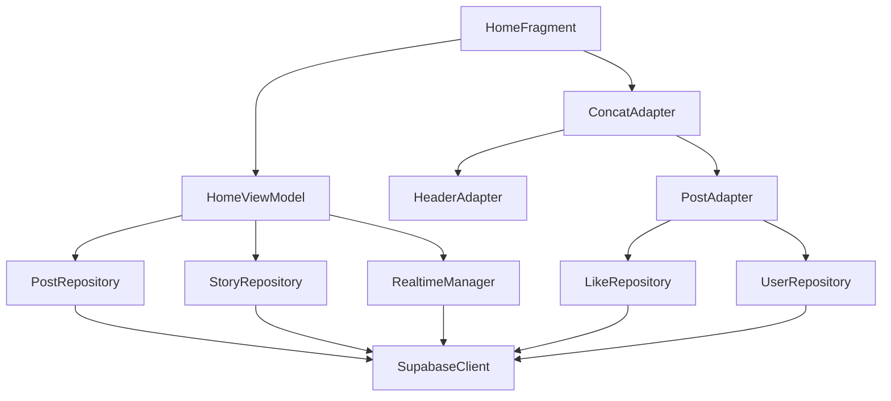

# Design Document: Enhanced Home Feed UI/UX

## Overview

This design document outlines the technical approach for enhancing the Home Feed UI/UX in Synapse. The enhancement will improve visual appeal, user engagement, and overall experience while maintaining the app's MVVM architecture, lightweight performance, and privacy-first principles. The design builds upon the existing HomeFragment, HomeViewModel, and PostAdapter implementation, introducing modern Material Design 3 components, smooth animations, real-time updates, and improved interaction patterns.

### Design Goals

1. **Visual Excellence**: Implement Material Design 3 principles with consistent spacing, elevation, and color schemes
2. **Performance**: Maintain 30+ FPS scrolling with efficient ViewHolder recycling and image caching
3. **Responsiveness**: Provide immediate visual feedback for all user interactions
4. **Real-time Updates**: Integrate Supabase Realtime for live feed updates
5. **Scalability**: Support pagination and infinite scroll for large datasets
6. **Maintainability**: Follow existing MVVM patterns and Kotlin best practices

## Architecture

### Component Hierarchy



### Layer Responsibilities

**Presentation Layer (HomeFragment)**
- Manages UI lifecycle and view initialization
- Observes StateFlow from ViewModel
- Handles user interactions (pull-to-refresh, scroll events)
- Displays loading states (shimmer, empty states, errors)
- Manages bottom sheets and dialogs

**ViewModel Layer (HomeViewModel)**
- Exposes StateFlow for posts, stories, loading states, and errors
- Coordinates data fetching from repositories
- Manages pagination state and infinite scroll logic
- Handles real-time update subscriptions
- Implements business logic for feed filtering and sorting

**Data Layer (Repositories)**
- PostRepository: CRUD operations for posts
- StoryRepository: Fetch and manage stories
- LikeRepository: Handle like/unlike operations
- UserRepository: Fetch user profile data
- RealtimeManager: Manage Supabase Realtime subscriptions

## Components and Interfaces

### 1. Enhanced HomeViewModel

```kotlin
class HomeViewModel(
    private val postRepository: PostRepository,
    private val storyRepository: StoryRepository,
    private val realtimeManager: RealtimeManager
) : ViewModel() {
    
    // State management
    private val _uiState = MutableStateFlow<FeedUiState>(FeedUiState.Loading)
    val uiState: StateFlow<FeedUiState> = _uiState.asStateFlow()
    
    private val _posts = MutableStateFlow<List<Post>>(emptyList())
    val posts: StateFlow<List<Post>> = _posts.asStateFlow()
    
    private val _stories = MutableStateFlow<List<Story>>(emptyList())
    val stories: StateFlow<List<Story>> = _stories.asStateFlow()
    
    private val _newPostsAvailable = MutableStateFlow(0)
    val newPostsAvailable: StateFlow<Int> = _newPostsAvailable.asStateFlow()
    
    // Pagination state
    private var currentPage = 0
    private var isLoadingMore = false
    private var hasMorePages = true
    
    // Real-time subscription
    private var realtimeJob: Job? = null
    
    fun loadInitialContent()
    fun refreshFeed()
    fun loadMorePosts()
    fun loadNewPosts()
    fun subscribeToRealtime()
    fun unsubscribeFromRealtime()
}

sealed class FeedUiState {
    object Loading : FeedUiState()
    object Success : FeedUiState()
    data class Error(val message: String) : FeedUiState()
    object Empty : FeedUiState()
}
```

### 2. Enhanced PostAdapter with Animations

```kotlin
class PostAdapter(
    private val context: Context,
    private val lifecycleOwner: LifecycleOwner,
    private val onPostInteraction: PostInteractionListener
) : RecyclerView.Adapter<PostAdapter.PostViewHolder>() {
    
    private val posts = mutableListOf<Post>()
    private val animatedPositions = mutableSetOf<Int>()
    
    // Animation configuration
    private val fadeInDuration = 300L
    private val slideUpDuration = 250L
    private val scaleAnimationDuration = 200L
    
    fun updatePosts(newPosts: List<Post>, animated: Boolean = true)
    fun addPosts(newPosts: List<Post>)
    
    inner class PostViewHolder(private val binding: ItemPostBinding) : 
        RecyclerView.ViewHolder(binding.root) {
        
        fun bind(post: Post, animate: Boolean)
        private fun animateEntry()
        private fun setupInteractions(post: Post)
        private fun animateLike()
        private fun loadUserData(userId: String)
        private fun loadLikeStatus(postId: String)
    }
}

interface PostInteractionListener {
    fun onLikeClicked(post: Post)
    fun onCommentClicked(post: Post)
    fun onShareClicked(post: Post)
    fun onMoreOptionsClicked(post: Post)
    fun onUserClicked(userId: String)
}
```

### 3. RealtimeManager for Live Updates

```kotlin
class RealtimeManager(private val client: SupabaseClient) {
    
    private val _newPostsFlow = MutableSharedFlow<Post>()
    val newPostsFlow: SharedFlow<Post> = _newPostsFlow.asSharedFlow()
    
    private var channel: RealtimeChannel? = null
    
    suspend fun subscribeToFeedUpdates(userId: String) {
        channel = client.realtime.createChannel("feed_updates") {
            // Subscribe to posts from followed users
        }
        
        channel?.subscribe()
    }
    
    fun unsubscribe() {
        channel?.unsubscribe()
        channel = null
    }
}
```

### 4. StoryRepository

```kotlin
class StoryRepository {
    
    private val client = SupabaseClient.client
    
    suspend fun getStories(userId: String): Result<List<Story>> {
        return try {
            // Fetch stories from followed users
            // Filter out expired stories (>24 hours)
            // Sort by timestamp
            Result.success(stories)
        } catch (e: Exception) {
            Result.failure(e)
        }
    }
    
    suspend fun markStoryAsViewed(storyId: String, userId: String): Result<Unit>
}
```

### 5. Enhanced UI Components

**NewPostsBanner**
```kotlin
class NewPostsBanner(context: Context) : MaterialCardView(context) {
    
    fun show(count: Int, onClickListener: () -> Unit)
    fun hide()
    private fun animateIn()
    private fun animateOut()
}
```

**PostCardView** (Custom ViewGroup)
```kotlin
class PostCardView(context: Context, attrs: AttributeSet) : MaterialCardView(context, attrs) {
    
    // Styling constants
    private val cardElevation = 4.dp
    private val cardCornerRadius = 16.dp
    private val cardMargin = 12.dp
    
    fun setPost(post: Post)
    fun animateEntry()
    fun animateLike()
}
```

## Data Models

### Enhanced Post Model

The existing Post model will be extended with additional fields for UI state:

```kotlin
@Serializable
data class Post(
    // Existing fields...
    val id: String,
    val authorUid: String,
    val postText: String?,
    val postImage: String?,
    val timestamp: Long,
    val likesCount: Int,
    val commentsCount: Int,
    
    // New fields for enhanced UI
    @SerialName("location")
    val location: String? = null,
    
    @SerialName("is_edited")
    val isEdited: Boolean = false,
    
    @SerialName("edited_at")
    val editedAt: Long? = null,
    
    // Transient UI state (not persisted)
    @kotlinx.serialization.Transient
    var isLiked: Boolean = false,
    
    @kotlinx.serialization.Transient
    var isBookmarked: Boolean = false,
    
    @kotlinx.serialization.Transient
    var authorName: String? = null,
    
    @kotlinx.serialization.Transient
    var authorAvatar: String? = null
)
```

### Story Model

```kotlin
@Serializable
data class Story(
    val id: String,
    @SerialName("user_id")
    val userId: String,
    @SerialName("media_url")
    val mediaUrl: String,
    @SerialName("media_type")
    val mediaType: String, // "image" or "video"
    val timestamp: Long,
    @SerialName("expires_at")
    val expiresAt: Long,
    
    // Transient UI state
    @kotlinx.serialization.Transient
    var isViewed: Boolean = false,
    
    @kotlinx.serialization.Transient
    var userName: String? = null,
    
    @kotlinx.serialization.Transient
    var userAvatar: String? = null
)
```

### FeedItem (Sealed Class for Mixed Content)

```kotlin
sealed class FeedItem {
    data class PostItem(val post: Post) : FeedItem()
    data class AdItem(val ad: Advertisement) : FeedItem() // Future use
    data class SuggestionItem(val suggestion: UserSuggestion) : FeedItem() // Future use
}
```

## UI Design Specifications

### Layout Structure

```xml
<!-- fragment_home.xml -->
<androidx.coordinatorlayout.widget.CoordinatorLayout>
    
    <!-- New Posts Banner -->
    <com.synapse.social.studioasinc.widget.NewPostsBanner
        android:id="@+id/newPostsBanner"
        android:layout_width="match_parent"
        android:layout_height="wrap_content"
        android:visibility="gone" />
    
    <!-- Main Content -->
    <androidx.swiperefreshlayout.widget.SwipeRefreshLayout
        android:id="@+id/swipeLayout">
        
        <androidx.recyclerview.widget.RecyclerView
            android:id="@+id/PublicPostsList"
            android:layout_width="match_parent"
            android:layout_height="match_parent"
            android:clipToPadding="false"
            android:paddingTop="8dp"
            android:paddingBottom="80dp" />
    
    </androidx.swiperefreshlayout.widget.SwipeRefreshLayout>
    
    <!-- Loading Shimmer -->
    <LinearLayout
        android:id="@+id/shimmer_container"
        android:layout_width="match_parent"
        android:layout_height="match_parent"
        android:orientation="vertical"
        android:visibility="gone" />
    
    <!-- Empty State -->
    <include
        android:id="@+id/emptyState"
        layout="@layout/empty_state_feed"
        android:visibility="gone" />
    
    <!-- Error State -->
    <include
        android:id="@+id/errorState"
        layout="@layout/error_state_feed"
        android:visibility="gone" />

</androidx.coordinatorlayout.widget.CoordinatorLayout>
```

### Post Card Layout

```xml
<!-- item_post.xml -->
<com.google.android.material.card.MaterialCardView
    android:layout_width="match_parent"
    android:layout_height="wrap_content"
    android:layout_marginHorizontal="12dp"
    android:layout_marginVertical="6dp"
    app:cardElevation="4dp"
    app:cardCornerRadius="16dp"
    app:cardBackgroundColor="?attr/colorSurface">
    
    <androidx.constraintlayout.widget.ConstraintLayout
        android:layout_width="match_parent"
        android:layout_height="wrap_content"
        android:padding="16dp">
        
        <!-- Header: Avatar, Name, Time, Options -->
        <com.google.android.material.imageview.ShapeableImageView
            android:id="@+id/authorAvatar"
            android:layout_width="40dp"
            android:layout_height="40dp"
            app:shapeAppearanceOverlay="@style/CircleImageView"
            app:strokeWidth="2dp"
            app:strokeColor="?attr/colorPrimary" />
        
        <TextView
            android:id="@+id/authorName"
            android:layout_width="0dp"
            android:layout_height="wrap_content"
            android:textSize="16sp"
            android:textStyle="bold"
            android:textColor="?attr/colorOnSurface" />
        
        <TextView
            android:id="@+id/postTime"
            android:layout_width="wrap_content"
            android:layout_height="wrap_content"
            android:textSize="12sp"
            android:textColor="?attr/colorOnSurfaceVariant" />
        
        <ImageView
            android:id="@+id/postOptions"
            android:layout_width="24dp"
            android:layout_height="24dp"
            android:src="@drawable/ic_more_vert"
            android:contentDescription="@string/more_options" />
        
        <!-- Location (optional) -->
        <TextView
            android:id="@+id/postLocation"
            android:layout_width="wrap_content"
            android:layout_height="wrap_content"
            android:textSize="12sp"
            android:drawableStart="@drawable/ic_location"
            android:drawablePadding="4dp"
            android:visibility="gone" />
        
        <!-- Content -->
        <TextView
            android:id="@+id/postContent"
            android:layout_width="match_parent"
            android:layout_height="wrap_content"
            android:textSize="14sp"
            android:lineSpacingMultiplier="1.2"
            android:maxLines="3"
            android:ellipsize="end" />
        
        <TextView
            android:id="@+id/seeMore"
            android:layout_width="wrap_content"
            android:layout_height="wrap_content"
            android:text="@string/see_more"
            android:textColor="?attr/colorPrimary"
            android:visibility="gone" />
        
        <!-- Media -->
        <com.google.android.material.imageview.ShapeableImageView
            android:id="@+id/postImage"
            android:layout_width="match_parent"
            android:layout_height="wrap_content"
            android:maxHeight="400dp"
            android:scaleType="centerCrop"
            android:adjustViewBounds="true"
            app:shapeAppearanceOverlay="@style/RoundedImageView"
            android:visibility="gone" />
        
        <!-- Interaction Bar -->
        <LinearLayout
            android:id="@+id/interactionBar"
            android:layout_width="match_parent"
            android:layout_height="wrap_content"
            android:orientation="horizontal"
            android:gravity="center_vertical">
            
            <!-- Like Button -->
            <LinearLayout
                android:id="@+id/likeButton"
                android:layout_width="wrap_content"
                android:layout_height="wrap_content"
                android:orientation="horizontal"
                android:padding="8dp"
                android:background="?attr/selectableItemBackgroundBorderless">
                
                <ImageView
                    android:id="@+id/likeIcon"
                    android:layout_width="24dp"
                    android:layout_height="24dp"
                    android:src="@drawable/ic_heart_outline" />
                
                <TextView
                    android:id="@+id/likeCount"
                    android:layout_width="wrap_content"
                    android:layout_height="wrap_content"
                    android:layout_marginStart="4dp"
                    android:textSize="14sp" />
            </LinearLayout>
            
            <!-- Comment Button -->
            <LinearLayout
                android:id="@+id/commentButton"
                android:layout_width="wrap_content"
                android:layout_height="wrap_content"
                android:orientation="horizontal"
                android:padding="8dp"
                android:layout_marginStart="16dp"
                android:background="?attr/selectableItemBackgroundBorderless">
                
                <ImageView
                    android:id="@+id/commentIcon"
                    android:layout_width="24dp"
                    android:layout_height="24dp"
                    android:src="@drawable/ic_comment" />
                
                <TextView
                    android:id="@+id/commentCount"
                    android:layout_width="wrap_content"
                    android:layout_height="wrap_content"
                    android:layout_marginStart="4dp"
                    android:textSize="14sp" />
            </LinearLayout>
            
            <View
                android:layout_width="0dp"
                android:layout_height="1dp"
                android:layout_weight="1" />
            
            <!-- Share Button -->
            <ImageView
                android:id="@+id/shareButton"
                android:layout_width="24dp"
                android:layout_height="24dp"
                android:src="@drawable/ic_share"
                android:padding="8dp"
                android:background="?attr/selectableItemBackgroundBorderless" />
            
            <!-- Bookmark Button -->
            <ImageView
                android:id="@+id/bookmarkButton"
                android:layout_width="24dp"
                android:layout_height="24dp"
                android:src="@drawable/ic_bookmark_outline"
                android:padding="8dp"
                android:layout_marginStart="8dp"
                android:background="?attr/selectableItemBackgroundBorderless" />
        </LinearLayout>
        
    </androidx.constraintlayout.widget.ConstraintLayout>
    
</com.google.android.material.card.MaterialCardView>
```

### Story Bar Layout

```xml
<!-- header_stories.xml -->
<androidx.recyclerview.widget.RecyclerView
    android:id="@+id/storiesRecyclerView"
    android:layout_width="match_parent"
    android:layout_height="wrap_content"
    android:orientation="horizontal"
    android:paddingHorizontal="12dp"
    android:paddingVertical="8dp"
    android:clipToPadding="false" />
```

### Story Item Layout

```xml
<!-- item_story.xml -->
<LinearLayout
    android:layout_width="wrap_content"
    android:layout_height="wrap_content"
    android:orientation="vertical"
    android:gravity="center"
    android:padding="8dp">
    
    <com.google.android.material.card.MaterialCardView
        android:id="@+id/storyContainer"
        android:layout_width="64dp"
        android:layout_height="64dp"
        app:cardCornerRadius="32dp"
        app:cardElevation="0dp"
        app:strokeWidth="3dp"
        app:strokeColor="@color/story_gradient">
        
        <ImageView
            android:id="@+id/storyAvatar"
            android:layout_width="match_parent"
            android:layout_height="match_parent"
            android:scaleType="centerCrop" />
    
    </com.google.android.material.card.MaterialCardView>
    
    <TextView
        android:id="@+id/storyUserName"
        android:layout_width="wrap_content"
        android:layout_height="wrap_content"
        android:layout_marginTop="4dp"
        android:textSize="12sp"
        android:maxLines="1"
        android:ellipsize="end" />

</LinearLayout>
```

## Animation Specifications

### 1. Post Entry Animation

```kotlin
fun animatePostEntry(view: View) {
    view.alpha = 0f
    view.translationY = 50f
    
    view.animate()
        .alpha(1f)
        .translationY(0f)
        .setDuration(300)
        .setInterpolator(DecelerateInterpolator())
        .start()
}
```

### 2. Like Button Animation

```kotlin
fun animateLikeButton(view: View) {
    val scaleX = PropertyValuesHolder.ofFloat(View.SCALE_X, 1f, 1.3f, 1f)
    val scaleY = PropertyValuesHolder.ofFloat(View.SCALE_Y, 1f, 1.3f, 1f)
    
    ObjectAnimator.ofPropertyValuesHolder(view, scaleX, scaleY).apply {
        duration = 200
        interpolator = OvershootInterpolator()
        start()
    }
    
    // Haptic feedback
    view.performHapticFeedback(HapticFeedbackConstants.CONTEXT_CLICK)
}
```

### 3. Pull-to-Refresh Animation

```kotlin
swipeLayout.setColorSchemeColors(
    ContextCompat.getColor(context, R.color.primary),
    ContextCompat.getColor(context, R.color.secondary),
    ContextCompat.getColor(context, R.color.tertiary)
)
swipeLayout.setProgressBackgroundColorSchemeColor(
    ContextCompat.getColor(context, R.color.surface)
)
```

### 4. New Posts Banner Animation

```kotlin
fun animateBannerIn(banner: View) {
    banner.translationY = -banner.height.toFloat()
    banner.visibility = View.VISIBLE
    
    banner.animate()
        .translationY(0f)
        .setDuration(250)
        .setInterpolator(DecelerateInterpolator())
        .start()
}

fun animateBannerOut(banner: View) {
    banner.animate()
        .translationY(-banner.height.toFloat())
        .setDuration(200)
        .setInterpolator(AccelerateInterpolator())
        .withEndAction { banner.visibility = View.GONE }
        .start()
}
```

## Error Handling

### Error States

1. **Network Error**: Display retry button with error message
2. **Empty Feed**: Show empty state with "Discover Users" CTA
3. **Load More Error**: Show toast and retry automatically
4. **Real-time Connection Error**: Silently retry with exponential backoff

### Error Handling Strategy

```kotlin
sealed class FeedError {
    data class NetworkError(val message: String) : FeedError()
    data class DatabaseError(val message: String) : FeedError()
    object EmptyFeed : FeedError()
    data class LoadMoreError(val message: String) : FeedError()
}

fun handleError(error: FeedError) {
    when (error) {
        is FeedError.NetworkError -> showErrorState(error.message, retryable = true)
        is FeedError.DatabaseError -> showErrorState(error.message, retryable = true)
        is FeedError.EmptyFeed -> showEmptyState()
        is FeedError.LoadMoreError -> showToast(error.message)
    }
}
```

## Testing Strategy

### Unit Tests

1. **HomeViewModel Tests**
   - Test initial load
   - Test refresh functionality
   - Test pagination logic
   - Test real-time update handling
   - Test error scenarios

2. **Repository Tests**
   - Test data fetching
   - Test pagination
   - Test error handling
   - Mock Supabase client

### UI Tests

1. **HomeFragment Tests**
   - Test pull-to-refresh
   - Test infinite scroll
   - Test post interactions (like, comment, share)
   - Test empty state display
   - Test error state display
   - Test shimmer loading

2. **PostAdapter Tests**
   - Test ViewHolder binding
   - Test animation triggers
   - Test interaction callbacks

### Integration Tests

1. **End-to-End Feed Flow**
   - Load feed → Display posts → Interact with posts
   - Pull-to-refresh → Load new posts
   - Scroll to bottom → Load more posts
   - Real-time update → Show banner → Load new posts

### Performance Tests

1. **Scroll Performance**
   - Measure FPS during scroll with 50+ posts
   - Test memory usage with image loading
   - Test RecyclerView recycling efficiency

2. **Load Time Tests**
   - Measure initial load time
   - Measure refresh time
   - Measure pagination load time

## Performance Optimizations

### 1. Image Loading

```kotlin
Glide.with(context)
    .load(imageUrl)
    .placeholder(R.drawable.placeholder_post)
    .error(R.drawable.error_image)
    .diskCacheStrategy(DiskCacheStrategy.AUTOMATIC)
    .override(Target.SIZE_ORIGINAL)
    .into(imageView)
```

### 2. ViewHolder Recycling

- Implement proper ViewHolder pattern
- Cancel ongoing operations in `onViewRecycled()`
- Clear image loading requests when recycling

### 3. Pagination

- Load 20 posts per page
- Trigger load when 3 items from bottom
- Implement debouncing to prevent multiple loads

### 4. Memory Management

- Set maximum image cache size (50MB)
- Clear cache on low memory
- Use appropriate image sizes

## Implementation Phases

### Phase 1: Visual Enhancements (Requirements 1, 8)
- Update post card layout with Material Design 3
- Implement consistent spacing and elevation
- Add rounded corners and shadows
- Display user avatars and metadata

### Phase 2: Animations (Requirement 2)
- Implement post entry animations
- Add like button animation with haptic feedback
- Enhance pull-to-refresh animation
- Add slide-up animation for new posts

### Phase 3: Loading & Pagination (Requirements 3, 9)
- Implement pull-to-refresh
- Add infinite scroll with pagination
- Optimize image loading with Glide
- Implement shimmer loading state

### Phase 4: Interactions (Requirements 4, 10)
- Enhance interaction controls with visual feedback
- Implement bottom sheet for post options
- Add bookmark functionality
- Format like/comment counts

### Phase 5: Empty & Error States (Requirement 5)
- Design and implement empty state
- Create error state with retry
- Add "Discover Users" CTA

### Phase 6: Stories (Requirement 6)
- Implement StoryRepository
- Create story bar UI
- Add story viewer
- Implement viewed/unviewed states

### Phase 7: Real-time Updates (Requirement 7)
- Implement RealtimeManager
- Add new posts banner
- Subscribe/unsubscribe lifecycle management
- Handle real-time post updates

## Dependencies

### New Dependencies Required

```gradle
// Material Design 3 (already included)
implementation "com.google.android.material:material:1.14.0-alpha06"

// Glide for image loading (already included)
implementation "com.github.bumptech.glide:glide:5.0.0-rc01"

// Shimmer effect (if not already included)
implementation "com.facebook.shimmer:shimmer:0.5.0"

// Lottie for animations (already included)
implementation "com.airbnb.android:lottie:6.6.0"
```

### Supabase Configuration

Ensure the following Supabase features are configured:
- Postgrest for database queries
- Realtime for live updates
- Storage for media files
- RLS policies for security

## Security Considerations

1. **RLS Policies**: Ensure Row Level Security policies are in place for posts table
2. **User Authentication**: Verify user authentication before allowing interactions
3. **Input Validation**: Validate all user inputs before sending to backend
4. **Rate Limiting**: Implement client-side rate limiting for API calls
5. **Content Moderation**: Implement reporting and hiding mechanisms

## Accessibility

1. **Content Descriptions**: Add content descriptions to all interactive elements
2. **Touch Targets**: Ensure minimum 48dp touch target size
3. **Color Contrast**: Maintain WCAG AA contrast ratios
4. **Screen Reader Support**: Test with TalkBack
5. **Keyboard Navigation**: Support for external keyboards

## Conclusion

This design provides a comprehensive approach to enhancing the Home Feed UI/UX while maintaining Synapse's architectural principles and performance standards. The phased implementation allows for incremental development and testing, ensuring each feature is stable before moving to the next. The design leverages existing components and patterns, minimizing refactoring while maximizing user experience improvements.
