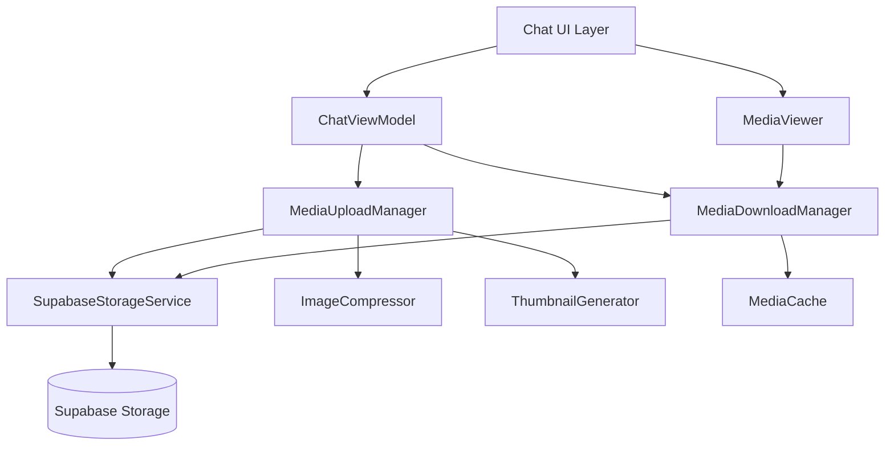
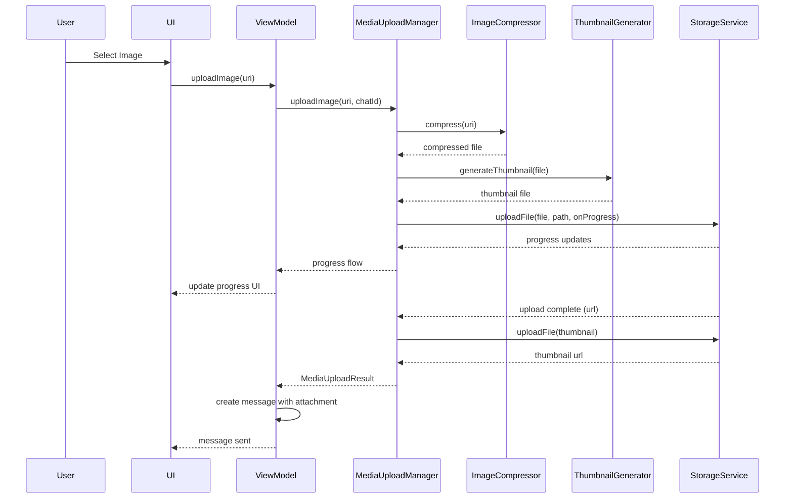
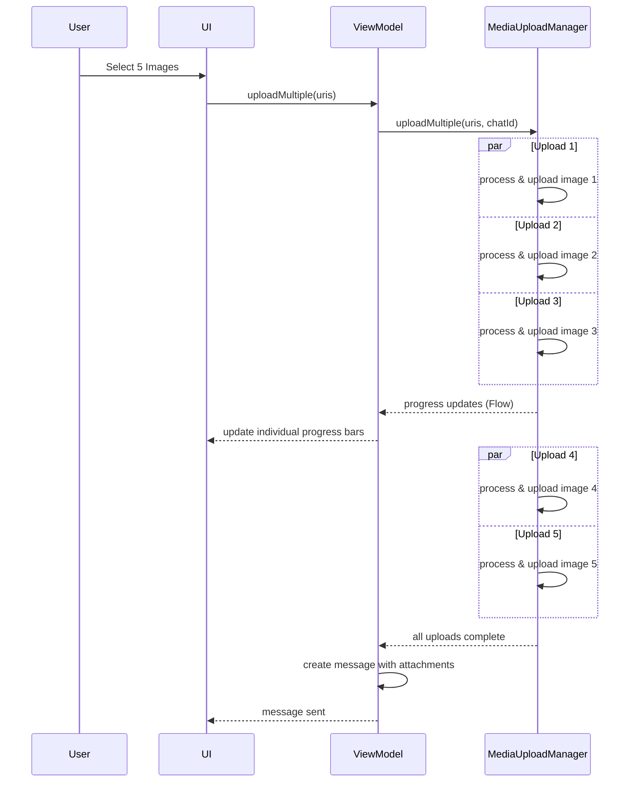

# Design Document: Enhanced Media Attachments

## Overview

This feature implements comprehensive media attachment support for the Synapse chat system, enabling users to send and receive images, videos, audio files, and documents. The design leverages Supabase Storage for secure file hosting, implements efficient upload/download mechanisms with progress tracking, and provides an optimized viewing experience with galleries and inline playback.

## Architecture

### High-Level Architecture



### Component Layers

1. **UI Layer**: Media pickers, preview screens, galleries, and inline players
2. **ViewModel Layer**: Manages upload/download state and coordinates media operations
3. **Service Layer**: Handles Supabase Storage operations and media processing
4. **Cache Layer**: Local media caching for performance optimization
5. **Viewer Layer**: Full-screen media viewing with gestures and controls

## Components and Interfaces

### 1. MediaUploadManager

**Purpose**: Manages file uploads with compression, thumbnails, and progress tracking

**Location**: `app/src/main/java/com/synapse/social/studioasinc/chat/service/MediaUploadManager.kt`

```kotlin
class MediaUploadManager(
    private val storageService: SupabaseStorageService,
    private val imageCompressor: ImageCompressor,
    private val thumbnailGenerator: ThumbnailGenerator,
    private val coroutineScope: CoroutineScope
) {
    private val maxConcurrentUploads = 3
    private val uploadQueue = Channel<UploadTask>(Channel.UNLIMITED)
    
    suspend fun uploadImage(uri: Uri, chatId: String): Result<MediaUploadResult>
    suspend fun uploadVideo(uri: Uri, chatId: String): Result<MediaUploadResult>
    suspend fun uploadAudio(uri: Uri, chatId: String): Result<MediaUploadResult>
    suspend fun uploadDocument(uri: Uri, chatId: String): Result<MediaUploadResult>
    suspend fun uploadMultiple(uris: List<Uri>, chatId: String): Flow<UploadProgress>
    fun cancelUpload(uploadId: String)
}
```

**Key Features**:
- Concurrent uploads (max 3 simultaneous)
- Automatic compression for images
- Thumbnail generation for images and videos
- Progress tracking with Flow
- Upload queue management
- Cancellation support

### 2. MediaDownloadManager

**Purpose**: Handles media downloads with caching and preloading

**Location**: `app/src/main/java/com/synapse/social/studioasinc/chat/service/MediaDownloadManager.kt`

```kotlin
class MediaDownloadManager(
    private val storageService: SupabaseStorageService,
    private val mediaCache: MediaCache,
    private val coroutineScope: CoroutineScope
) {
    private val maxConcurrentDownloads = 5
    
    suspend fun downloadMedia(url: String, mediaType: String): Result<File>
    suspend fun downloadThumbnail(url: String): Result<File>
    suspend fun preloadMedia(urls: List<String>)
    fun getCachedMedia(url: String): File?
    fun clearCache()
}
```

**Key Features**:
- LRU cache with 7-day expiration
- Concurrent downloads (max 5)
- Preloading for galleries
- Progressive image loading
- Cache management

### 3. SupabaseStorageService

**Purpose**: Abstracts Supabase Storage operations

**Location**: `app/src/main/java/com/synapse/social/studioasinc/backend/SupabaseStorageService.kt`

```kotlin
class SupabaseStorageService(private val supabaseClient: SupabaseClient) {
    private val bucketName = "chat-media"
    
    suspend fun uploadFile(
        file: File,
        path: String,
        onProgress: (Float) -> Unit
    ): Result<String>
    
    suspend fun downloadFile(url: String): Result<ByteArray>
    suspend fun deleteFile(path: String): Result<Unit>
    suspend fun getPublicUrl(path: String): String
    fun generateStoragePath(chatId: String, fileName: String): String
}
```

**Key Features**:
- Progress callbacks for uploads
- Organized folder structure (chatId/YYYY/MM/DD/filename)
- Public URL generation
- Authenticated access
- File deletion support

### 4. ImageCompressor

**Purpose**: Compresses images to reduce file size and bandwidth

**Location**: `app/src/main/java/com/synapse/social/studioasinc/util/ImageCompressor.kt`

```kotlin
class ImageCompressor(private val context: Context) {
    private val maxWidth = 1920
    private val maxHeight = 1080
    private val maxFileSizeMB = 2
    private val compressionQuality = 85
    
    suspend fun compress(uri: Uri): Result<File>
    suspend fun compressToSize(uri: Uri, maxSizeBytes: Long): Result<File>
    private fun calculateInSampleSize(options: BitmapFactory.Options, reqWidth: Int, reqHeight: Int): Int
}
```

**Key Features**:
- Maintains aspect ratio
- Target resolution: 1920x1080
- Target file size: 2MB
- Quality: 85%
- EXIF data preservation

### 5. ThumbnailGenerator

**Purpose**: Generates thumbnails for images and videos

**Location**: `app/src/main/java/com/synapse/social/studioasinc/util/ThumbnailGenerator.kt`

```kotlin
class ThumbnailGenerator(private val context: Context) {
    private val thumbnailSize = 200
    
    suspend fun generateImageThumbnail(uri: Uri): Result<File>
    suspend fun generateVideoThumbnail(uri: Uri): Result<File>
    suspend fun extractVideoFrame(uri: Uri, timeMs: Long): Result<Bitmap>
}
```

**Key Features**:
- 200x200 pixel thumbnails
- Center crop scaling
- Video frame extraction
- Efficient memory usage

### 6. MediaCache

**Purpose**: Local file caching with LRU eviction

**Location**: `app/src/main/java/com/synapse/social/studioasinc/util/MediaCache.kt`

```kotlin
class MediaCache(private val context: Context) {
    private val cacheDir = context.cacheDir.resolve("media")
    private val maxCacheSize = 500 * 1024 * 1024 // 500MB
    private val cacheExpirationDays = 7
    
    fun put(key: String, file: File)
    fun get(key: String): File?
    fun remove(key: String)
    fun clear()
    fun evictExpired()
    fun evictLRU()
}
```

**Key Features**:
- 500MB cache size limit
- 7-day expiration
- LRU eviction policy
- Automatic cleanup

### 7. UI Components

#### MediaPickerBottomSheet

**Location**: `app/src/main/java/com/synapse/social/studioasinc/chat/MediaPickerBottomSheet.kt`

```kotlin
class MediaPickerBottomSheet : BottomSheetDialogFragment() {
    interface MediaPickerListener {
        fun onImagesSelected(uris: List<Uri>)
        fun onVideoSelected(uri: Uri)
        fun onAudioSelected(uri: Uri)
        fun onDocumentSelected(uri: Uri)
    }
    
    private fun showImagePicker()
    private fun showVideoPicker()
    private fun showAudioPicker()
    private fun showDocumentPicker()
}
```

#### MediaPreviewScreen

**Location**: `app/src/main/java/com/synapse/social/studioasinc/chat/MediaPreviewScreen.kt`

```kotlin
class MediaPreviewScreen : Fragment() {
    private lateinit var selectedMedia: List<Uri>
    private var captionText: String = ""
    
    private fun setupMediaGrid()
    private fun setupCaptionInput()
    private fun calculateTotalSize()
    private fun estimateUploadTime()
    private fun sendMessage()
}
```

#### ImageGalleryActivity

**Location**: `app/src/main/java/com/synapse/social/studioasinc/chat/ImageGalleryActivity.kt`

```kotlin
class ImageGalleryActivity : AppCompatActivity() {
    private lateinit var viewPager: ViewPager2
    private lateinit var imageUrls: List<String>
    private var currentPosition: Int = 0
    
    private fun setupViewPager()
    private fun setupZoomGestures()
    private fun preloadAdjacentImages()
    private fun downloadImage()
}
```

#### VideoPlayerView

**Location**: `app/src/main/java/com/synapse/social/studioasinc/widget/VideoPlayerView.kt`

```kotlin
class VideoPlayerView @JvmOverloads constructor(
    context: Context,
    attrs: AttributeSet? = null
) : FrameLayout(context, attrs) {
    private val player: ExoPlayer
    private val playerView: PlayerView
    
    fun setVideoUrl(url: String)
    fun play()
    fun pause()
    fun seekTo(positionMs: Long)
    fun release()
}
```

## Data Models

### Enhanced ChatAttachment

```kotlin
data class ChatAttachmentImpl(
    override val id: String,
    override val url: String,
    override val type: String,  // image, video, audio, document
    override val fileName: String?,
    override val fileSize: Long?,
    override val thumbnailUrl: String?,
    val width: Int? = null,      // NEW: for images/videos
    val height: Int? = null,     // NEW: for images/videos
    val duration: Long? = null,  // NEW: for videos/audio (milliseconds)
    val mimeType: String? = null // NEW: MIME type
) : ChatAttachment
```

### UploadProgress

```kotlin
data class UploadProgress(
    val uploadId: String,
    val fileName: String,
    val progress: Float,  // 0.0 to 1.0
    val bytesUploaded: Long,
    val totalBytes: Long,
    val state: UploadState,
    val error: String? = null
)

enum class UploadState {
    QUEUED,
    COMPRESSING,
    UPLOADING,
    COMPLETED,
    FAILED,
    CANCELLED
}
```

### MediaUploadResult

```kotlin
data class MediaUploadResult(
    val url: String,
    val thumbnailUrl: String?,
    val fileName: String,
    val fileSize: Long,
    val mimeType: String,
    val width: Int? = null,
    val height: Int? = null,
    val duration: Long? = null
)
```

### MediaMetadata

```kotlin
data class MediaMetadata(
    val fileName: String,
    val fileSize: Long,
    val mimeType: String,
    val width: Int? = null,
    val height: Int? = null,
    val duration: Long? = null,
    val createdAt: Long = System.currentTimeMillis()
)
```

## Database Schema

### Storage Bucket Structure

```
chat-media/
├── {chat_id}/
│   ├── 2025/
│   │   ├── 01/
│   │   │   ├── 15/
│   │   │   │   ├── {uuid}_original.jpg
│   │   │   │   ├── {uuid}_thumb.jpg
│   │   │   │   └── {uuid}_video.mp4
```

### Messages Table Updates

```sql
-- Attachments stored as JSONB array
ALTER TABLE messages 
ADD COLUMN attachments JSONB;

-- Example attachments structure:
-- [
--   {
--     "id": "uuid",
--     "url": "https://...",
--     "type": "image",
--     "file_name": "photo.jpg",
--     "file_size": 1024000,
--     "thumbnail_url": "https://...",
--     "width": 1920,
--     "height": 1080,
--     "mime_type": "image/jpeg"
--   }
-- ]
```

### Storage Policies (RLS)

```sql
-- Users can upload to their own chat folders
CREATE POLICY "Users can upload to their chats"
ON storage.objects FOR INSERT
WITH CHECK (
    bucket_id = 'chat-media' AND
    (storage.foldername(name))[1] IN (
        SELECT chat_id::text FROM user_chats WHERE user_id = auth.uid()
    )
);

-- Users can read from their chat folders
CREATE POLICY "Users can read from their chats"
ON storage.objects FOR SELECT
USING (
    bucket_id = 'chat-media' AND
    (storage.foldername(name))[1] IN (
        SELECT chat_id::text FROM user_chats WHERE user_id = auth.uid()
    )
);

-- Users can delete from their chat folders
CREATE POLICY "Users can delete from their chats"
ON storage.objects FOR DELETE
USING (
    bucket_id = 'chat-media' AND
    (storage.foldername(name))[1] IN (
        SELECT chat_id::text FROM user_chats WHERE user_id = auth.uid()
    )
);
```

## Upload Flow

### Single Image Upload



### Multiple Image Upload



## State Management

### ChatViewModel Updates

```kotlin
class ChatViewModel : ViewModel() {
    private val _uploadProgress = MutableStateFlow<Map<String, UploadProgress>>(emptyMap())
    val uploadProgress: StateFlow<Map<String, UploadProgress>> = _uploadProgress.asStateFlow()
    
    private val _messages = MutableStateFlow<List<ChatMessage>>(emptyList())
    val messages: StateFlow<List<ChatMessage>> = _messages.asStateFlow()
    
    fun uploadImages(uris: List<Uri>, caption: String = "") {
        viewModelScope.launch {
            mediaUploadManager.uploadMultiple(uris, chatId).collect { progress ->
                updateUploadProgress(progress)
            }
        }
    }
    
    fun uploadVideo(uri: Uri, caption: String = "") {
        viewModelScope.launch {
            val result = mediaUploadManager.uploadVideo(uri, chatId)
            result.onSuccess { uploadResult ->
                sendMessageWithAttachment(uploadResult, caption)
            }
        }
    }
    
    fun cancelUpload(uploadId: String) {
        mediaUploadManager.cancelUpload(uploadId)
    }
    
    private fun sendMessageWithAttachment(uploadResult: MediaUploadResult, caption: String) {
        val attachment = ChatAttachmentImpl(
            id = UUID.randomUUID().toString(),
            url = uploadResult.url,
            type = getAttachmentType(uploadResult.mimeType),
            fileName = uploadResult.fileName,
            fileSize = uploadResult.fileSize,
            thumbnailUrl = uploadResult.thumbnailUrl,
            width = uploadResult.width,
            height = uploadResult.height,
            duration = uploadResult.duration,
            mimeType = uploadResult.mimeType
        )
        
        sendMessage(
            messageText = caption.ifEmpty { null },
            messageType = MessageType.ATTACHMENT,
            attachments = listOf(attachment)
        )
    }
}
```

## Error Handling

### Upload Errors

```kotlin
sealed class UploadError : Exception() {
    data class FileTooLarge(val maxSize: Long) : UploadError()
    data class UnsupportedFormat(val mimeType: String) : UploadError()
    data class CompressionFailed(val reason: String) : UploadError()
    data class NetworkError(val cause: Throwable) : UploadError()
    data class StorageError(val message: String) : UploadError()
    object Cancelled : UploadError()
}
```

### Error Recovery

```kotlin
class UploadRetryManager {
    private val maxRetries = 3
    private val retryDelay = 2000L
    
    suspend fun <T> retryUpload(
        uploadId: String,
        block: suspend () -> Result<T>
    ): Result<T> {
        repeat(maxRetries) { attempt ->
            val result = block()
            if (result.isSuccess) return result
            
            if (attempt < maxRetries - 1) {
                delay(retryDelay * (attempt + 1))
            }
        }
        return Result.failure(Exception("Upload failed after $maxRetries attempts"))
    }
}
```

## Performance Optimizations

### Image Compression Strategy

```kotlin
class ImageCompressor {
    private fun calculateOptimalQuality(fileSize: Long, targetSize: Long): Int {
        val ratio = targetSize.toFloat() / fileSize
        return when {
            ratio >= 1.0 -> 95  // No compression needed
            ratio >= 0.5 -> 85  // Light compression
            ratio >= 0.25 -> 75 // Medium compression
            else -> 65          // Heavy compression
        }
    }
    
    private suspend fun compressIteratively(
        bitmap: Bitmap,
        targetSizeBytes: Long
    ): ByteArray {
        var quality = 85
        var compressed: ByteArray
        
        do {
            compressed = bitmap.compress(quality)
            quality -= 5
        } while (compressed.size > targetSizeBytes && quality > 50)
        
        return compressed
    }
}
```

### Thumbnail Loading Strategy

```kotlin
class ThumbnailLoader {
    fun loadThumbnail(imageView: ImageView, url: String) {
        Glide.with(imageView.context)
            .load(url)
            .thumbnail(0.1f)  // Load 10% quality first
            .transition(DrawableTransitionOptions.withCrossFade(200))
            .diskCacheStrategy(DiskCacheStrategy.ALL)
            .into(imageView)
    }
}
```

### Preloading Strategy

```kotlin
class MediaPreloader {
    fun preloadGalleryImages(urls: List<String>, currentIndex: Int) {
        val preloadRange = currentIndex - 1..currentIndex + 3
        urls.filterIndexed { index, _ -> index in preloadRange }
            .forEach { url ->
                Glide.with(context)
                    .load(url)
                    .preload()
            }
    }
}
```

## Testing Strategy

### Unit Tests

1. **ImageCompressor Tests**
   - Test compression maintains aspect ratio
   - Test file size reduction
   - Test quality preservation
   - Test EXIF data handling

2. **ThumbnailGenerator Tests**
   - Test thumbnail dimensions (200x200)
   - Test video frame extraction
   - Test center crop scaling

3. **MediaCache Tests**
   - Test LRU eviction
   - Test expiration (7 days)
   - Test cache size limits (500MB)

4. **MediaUploadManager Tests**
   - Test concurrent upload limits (3)
   - Test upload cancellation
   - Test progress tracking
   - Test error handling and retries

### Integration Tests

1. **Upload Flow Tests**
   - Test single image upload end-to-end
   - Test multiple image upload
   - Test video upload with thumbnail
   - Test upload cancellation

2. **Download Flow Tests**
   - Test media download and caching
   - Test thumbnail loading
   - Test preloading

3. **Storage Tests**
   - Test file upload to Supabase Storage
   - Test RLS policies
   - Test file deletion

### UI Tests

1. **Media Picker Tests**
   - Test image selection (single and multiple)
   - Test video selection
   - Test file size validation

2. **Gallery Tests**
   - Test image viewing
   - Test zoom gestures
   - Test swipe navigation
   - Test download functionality

3. **Video Player Tests**
   - Test video playback
   - Test controls (play/pause/seek)
   - Test full-screen mode

## Security Considerations

### File Validation

```kotlin
class MediaValidator {
    private val allowedImageTypes = setOf("image/jpeg", "image/png", "image/gif", "image/webp")
    private val allowedVideoTypes = setOf("video/mp4", "video/quicktime", "video/x-msvideo")
    private val allowedAudioTypes = setOf("audio/mpeg", "audio/wav", "audio/mp4", "audio/ogg")
    private val allowedDocumentTypes = setOf(
        "application/pdf",
        "application/msword",
        "application/vnd.openxmlformats-officedocument.wordprocessingml.document",
        "text/plain"
    )
    
    fun validateFile(uri: Uri, expectedType: String): Result<MediaMetadata> {
        val mimeType = getMimeType(uri)
        val fileSize = getFileSize(uri)
        
        // Validate MIME type
        if (!isAllowedType(mimeType, expectedType)) {
            return Result.failure(UploadError.UnsupportedFormat(mimeType))
        }
        
        // Validate file size
        val maxSize = getMaxSizeForType(expectedType)
        if (fileSize > maxSize) {
            return Result.failure(UploadError.FileTooLarge(maxSize))
        }
        
        return Result.success(MediaMetadata(...))
    }
}
```

### Storage Security

- All uploads require authentication
- RLS policies restrict access to chat participants only
- File names use UUIDs to prevent enumeration
- Signed URLs for temporary access (optional)
- Automatic cleanup of orphaned files

## Dependencies

### New Dependencies

```kotlin
// build.gradle.kts (app module)
dependencies {
    // Supabase Storage (already in BOM)
    implementation("io.github.jan-tennert.supabase:storage-kt")
    
    // Image loading and caching (already included)
    implementation("com.github.bumptech.glide:glide:5.0.0-rc01")
    
    // Video playback (already included)
    implementation("androidx.media3:media3-exoplayer:1.3.1")
    implementation("androidx.media3:media3-ui:1.3.1")
    
    // Image compression
    implementation("id.zelory:compressor:3.0.1")
}
```

## Future Enhancements

1. **Image Editing**: Crop, rotate, filters before sending
2. **Video Compression**: Reduce video file sizes
3. **Live Photos**: Support for iOS Live Photos
4. **GIF Support**: Animated GIF playback
5. **Stickers**: Custom sticker packs
6. **Cloud Sync**: Sync media across devices
7. **Auto-Download Settings**: WiFi-only, size limits
8. **Media Gallery**: Browse all media in a chat
