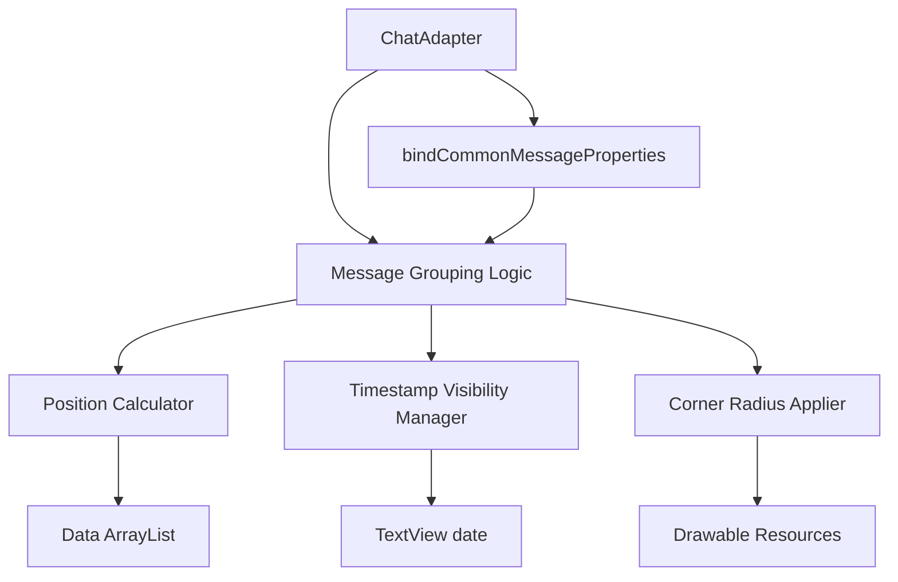
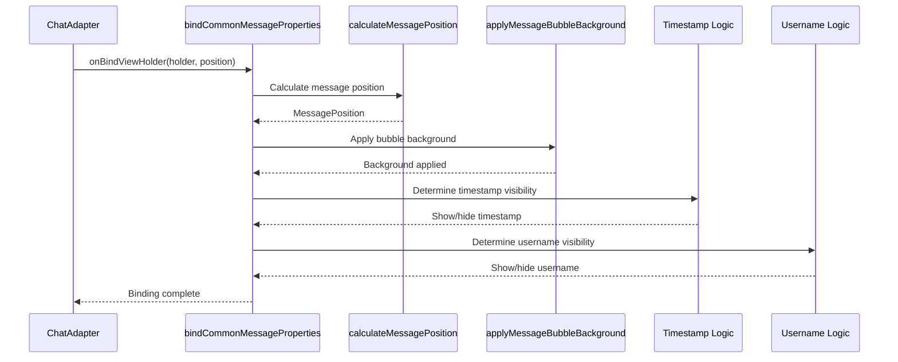

# Design Document: Message Grouping

## Overview

This design document outlines the implementation approach for message grouping in the Synapse chat interface. Message grouping enhances the visual presentation of conversations by intelligently styling consecutive messages from the same sender with adjusted corner radii and consolidated timestamps. The implementation leverages existing drawable resources and integrates seamlessly with the current ChatAdapter architecture.

The design follows the MVVM architecture pattern and maintains compatibility with all existing message types (text, media, video, voice, link preview) while ensuring smooth scrolling performance.

## Architecture

### High-Level Component Interaction



### Key Components

1. **Message Grouping Logic**: Core logic that determines message position within a group
2. **Position Calculator**: Analyzes adjacent messages to determine grouping position
3. **Timestamp Visibility Manager**: Controls timestamp visibility based on time differences
4. **Corner Radius Applier**: Applies appropriate drawable backgrounds based on position
5. **ChatAdapter Integration**: Seamless integration with existing binding methods

## Components and Interfaces

### 1. Message Position Enum

A new enum class to represent message positions within a group:

```kotlin
enum class MessagePosition {
    SINGLE,    // Message not part of a group
    FIRST,     // First message in a group
    MIDDLE,    // Middle message in a group
    LAST       // Last message in a group
}
```

### 2. Message Grouping Calculator

A utility class within ChatAdapter to calculate message grouping:

```kotlin
private fun calculateMessagePosition(position: Int): MessagePosition {
    // Returns the position of the message within its group
    // Considers: sender_id, message type, deleted status, time threshold
}

private fun shouldGroupWithPrevious(currentPosition: Int): Boolean {
    // Determines if current message should group with previous
    // Checks: same sender, valid message types, not deleted
}

private fun shouldGroupWithNext(currentPosition: Int): Boolean {
    // Determines if current message should group with next
    // Checks: same sender, valid message types, not deleted
}

private fun isGroupableMessageType(viewType: Int): Boolean {
    // Returns true for message types that support grouping
    // Excludes: typing, error, loading indicators
}
```

### 3. Timestamp Visibility Logic

Logic to determine timestamp visibility based on time differences:

```kotlin
private fun shouldShowTimestamp(position: Int, messagePosition: MessagePosition): Long {
    // Returns timestamp visibility decision
    // Considers: message position, time difference with next message
    // Time threshold: 60 seconds (60000 milliseconds)
}

private fun getTimeDifference(position1: Int, position2: Int): Long {
    // Calculates time difference between two messages in milliseconds
}
```

### 4. Corner Radius Application

Logic to apply appropriate drawable backgrounds:

```kotlin
private fun applyMessageBubbleBackground(
    holder: BaseMessageViewHolder,
    position: MessagePosition,
    isMyMessage: Boolean
) {
    // Applies appropriate drawable resource based on:
    // - Message position (SINGLE, FIRST, MIDDLE, LAST)
    // - Message direction (outgoing vs incoming)
}
```

### 5. Username Visibility (Group Chats)

Logic to control sender username display in group chats:

```kotlin
private fun shouldShowUsername(
    position: Int,
    messagePosition: MessagePosition,
    isGroupChat: Boolean,
    isMyMessage: Boolean
): Boolean {
    // Returns true if username should be displayed
    // Shows username only for SINGLE or FIRST messages in group chats
}
```

## Data Models

### Message Data Structure

The existing message data structure (HashMap<String, Any?>) contains all necessary fields:

```kotlin
// Existing fields used for grouping:
- sender_id / uid: String - Identifies the message sender
- created_at / push_date: Long - Message timestamp
- is_deleted / delete_for_everyone: Boolean - Deletion status
- TYPE: String - Message type identifier
- delivery_status / message_state: String - Message delivery state
```

### Drawable Resource Mapping

Existing drawable resources mapped to message positions:

| Position | Outgoing Message | Incoming Message |
|----------|-----------------|------------------|
| SINGLE   | shape_outgoing_message_single.xml | shape_incoming_message_single.xml |
| FIRST    | shape_outgoing_message_first.xml | shape_incoming_message_first.xml |
| MIDDLE   | shape_outgoing_message_middle.xml | shape_incoming_message_middle.xml |
| LAST     | shape_outgoing_message_last.xml | shape_incoming_message_last.xml |

### Drawable Specifications

**Outgoing Messages:**
- Single: All corners 16dp radius
- First: Top corners 20dp, bottom-left 20dp, bottom-right 5dp
- Middle: All corners 5dp (appears square)
- Last: Top corners 5dp, bottom corners 20dp (bottom-right 20dp, bottom-left 5dp)

**Incoming Messages:**
- Single: All corners 16dp radius
- First: Top corners 20dp, bottom-right 20dp, bottom-left 5dp
- Middle: All corners 5dp (appears square)
- Last: Top corners 5dp, bottom corners 20dp (bottom-left 20dp, bottom-right 5dp)

## Implementation Flow

### Message Binding Flow



### Grouping Decision Algorithm

```
For each message at position P:

1. Check if message is groupable:
   - Is not deleted (is_deleted == false)
   - Is not error/typing/loading type
   - Has valid sender_id

2. Check previous message (P-1):
   - If exists and groupable
   - If same sender_id
   - Then canGroupWithPrevious = true

3. Check next message (P+1):
   - If exists and groupable
   - If same sender_id
   - Then canGroupWithNext = true

4. Determine position:
   - If !canGroupWithPrevious && !canGroupWithNext → SINGLE
   - If !canGroupWithPrevious && canGroupWithNext → FIRST
   - If canGroupWithPrevious && canGroupWithNext → MIDDLE
   - If canGroupWithPrevious && !canGroupWithNext → LAST

5. Apply styling based on position
```

## Integration Points

### 1. ChatAdapter.bindCommonMessageProperties()

This is the primary integration point where grouping logic will be added:

```kotlin
private fun bindCommonMessageProperties(holder: BaseMessageViewHolder, position: Int) {
    // Existing code for deleted messages, forwarded indicator, etc.
    
    // NEW: Calculate message position for grouping
    val messagePosition = calculateMessagePosition(position)
    
    // NEW: Apply grouped bubble background
    applyMessageBubbleBackground(holder, messagePosition, isMyMessage)
    
    // MODIFIED: Timestamp visibility based on grouping
    holder.messageTime?.let { timeView ->
        val timestamp = messageData["created_at"]?.toString()?.toLongOrNull()
            ?: messageData["push_date"]?.toString()?.toLongOrNull() 
            ?: System.currentTimeMillis()
        
        if (shouldShowTimestamp(position, messagePosition)) {
            timeView.text = formatMessageTime(timestamp)
            timeView.visibility = View.VISIBLE
        } else {
            timeView.visibility = View.GONE
        }
    }
    
    // MODIFIED: Username visibility based on grouping
    holder.senderUsername?.let { usernameView ->
        if (shouldShowUsername(position, messagePosition, isGroupChat, isMyMessage)) {
            usernameView.visibility = View.VISIBLE
            usernameView.text = userNamesMap[msgUid]
        } else {
            usernameView.visibility = View.GONE
        }
    }
    
    // Existing code continues...
}
```

### 2. All Message Type Binding Methods

Each specific binding method (bindTextViewHolder, bindMediaViewHolder, etc.) already calls bindCommonMessageProperties(), so grouping will automatically apply to all message types without modification.

### 3. Message State Updates

The existing `updateMessageState()` and `updateMessageStates()` methods use partial updates with payloads. Grouping logic will not interfere with these updates since it only affects visual styling, not data state.

## Error Handling

### Edge Cases

1. **Empty or Single Message List**
   - If data.size == 0: No rendering occurs
   - If data.size == 1: Message is always SINGLE position

2. **Deleted Messages in Group**
   - Deleted messages are excluded from grouping calculations
   - Adjacent non-deleted messages may form a group across deleted message

3. **Mixed Message Types**
   - All groupable types (text, media, video, voice, link) can group together
   - Non-groupable types (typing, error, loading) break groups

4. **Rapid Message Sending**
   - Messages sent within 60 seconds: Timestamp hidden except on last
   - Messages sent > 60 seconds apart: Timestamps shown on both

5. **Group Chat Username Display**
   - Username shown only on SINGLE or FIRST messages
   - Username hidden on MIDDLE and LAST messages
   - Username always hidden for current user's messages

### Performance Considerations

1. **Index Bounds Checking**
   - Always validate position-1 and position+1 are within bounds
   - Use safe array access with bounds checking

2. **Null Safety**
   - All sender_id and timestamp fields may be null
   - Use null-safe operators (?., ?:) throughout

3. **Calculation Efficiency**
   - Grouping calculation is O(1) - only checks adjacent messages
   - No iteration through entire data list
   - Target: < 5ms per message binding

## Testing Strategy

### Unit Testing

1. **Message Position Calculation Tests**
   - Test single message scenarios
   - Test first/middle/last position detection
   - Test deleted message exclusion
   - Test message type filtering

2. **Timestamp Visibility Tests**
   - Test 60-second threshold
   - Test last message always shows timestamp
   - Test single message always shows timestamp

3. **Username Visibility Tests**
   - Test group chat scenarios
   - Test 1-on-1 chat scenarios
   - Test current user message scenarios

### Integration Testing

1. **Visual Regression Tests**
   - Verify corner radii match design specifications
   - Verify timestamp visibility in various scenarios
   - Verify username display in group chats

2. **Performance Tests**
   - Measure binding time with grouping enabled
   - Test scrolling performance with large message lists (1000+ messages)
   - Verify no memory leaks from drawable resource usage

### Manual Testing Scenarios

1. **Basic Grouping**
   - Send 3 consecutive messages quickly
   - Verify first has top rounded corners
   - Verify middle has square corners
   - Verify last has bottom rounded corners and timestamp

2. **Timestamp Threshold**
   - Send message, wait 30 seconds, send another
   - Verify timestamp hidden on first message
   - Send message, wait 70 seconds, send another
   - Verify timestamps shown on both messages

3. **Group Chat Username**
   - In group chat, send 3 consecutive messages from same user
   - Verify username shown only on first message
   - Switch sender, verify username shown on new sender's first message

4. **Mixed Message Types**
   - Send text, then image, then video from same sender
   - Verify all three messages group together with appropriate styling

5. **Deleted Message Handling**
   - Create group of 3 messages
   - Delete middle message
   - Verify first and last messages still group together

## Visual Design Specifications

### Corner Radius Values

- **Large Radius**: 20dp (outer corners of groups)
- **Small Radius**: 5dp (inner corners of groups)
- **Single Message Radius**: 16dp (all corners)

### Spacing

- **Vertical Spacing (Same Sender)**: 4dp (existing: message_vertical_spacing)
- **Vertical Spacing (Different Sender)**: 16dp (existing: message_vertical_spacing_sender_change)

### Timestamp Display

- **Font Size**: 12sp (existing)
- **Color**: Secondary text color (existing)
- **Position**: Bottom-right of message bubble (existing)
- **Visibility**: Shown on last message of group or when time difference > 60s

### Username Display (Group Chats)

- **Font Size**: 14sp (existing)
- **Color**: Primary text color (existing)
- **Position**: Above message bubble (existing)
- **Visibility**: Shown on first message of group only

## Dependencies

### Existing Components

- ChatAdapter.kt - Main adapter class (modified)
- BaseMessageViewHolder.kt - Base view holder (no changes)
- ChatViewHolders.kt - Specific view holders (no changes)
- Drawable resources - Message bubble shapes (already exist)
- Layout files - Message bubble layouts (no changes)

### New Components

- MessagePosition enum (new, within ChatAdapter)
- Grouping calculation methods (new, within ChatAdapter)
- Timestamp visibility logic (new, within ChatAdapter)
- Username visibility logic (new, within ChatAdapter)

### External Dependencies

None. All functionality uses existing Android SDK and Kotlin standard library features.

## Migration and Rollout

### Implementation Phases

**Phase 1: Core Grouping Logic**
- Implement MessagePosition enum
- Implement position calculation methods
- Implement corner radius application

**Phase 2: Timestamp Management**
- Implement timestamp visibility logic
- Integrate with existing time formatting

**Phase 3: Group Chat Support**
- Implement username visibility logic
- Test with group chat scenarios

**Phase 4: Testing and Refinement**
- Comprehensive testing across all message types
- Performance optimization if needed
- Visual polish and edge case handling

### Backward Compatibility

- No database schema changes required
- No API changes required
- Existing messages will automatically display with grouping
- No migration scripts needed

### Rollout Strategy

1. Implement feature behind feature flag (optional)
2. Test with internal users
3. Gradual rollout to user base
4. Monitor performance metrics
5. Full release

## Performance Metrics

### Target Metrics

- **Message Binding Time**: < 5ms per message (including grouping calculation)
- **Scroll Performance**: 60 FPS with 1000+ messages
- **Memory Usage**: No increase from baseline (reusing existing drawables)
- **CPU Usage**: < 1% increase during scrolling

### Monitoring

- Use Android Profiler to measure binding performance
- Monitor frame drops during scrolling
- Track memory allocation for drawable resources
- Measure time spent in calculateMessagePosition()

## Future Enhancements

### Potential Improvements

1. **Configurable Time Threshold**
   - Allow users to adjust the 60-second timestamp threshold
   - Store preference in SharedPreferences

2. **Date Separators**
   - Add date separator headers between messages from different days
   - Integrate with grouping logic

3. **Sender Avatar Grouping**
   - Show avatar only on last message of incoming message group
   - Hide avatar on first/middle messages

4. **Animation Transitions**
   - Animate corner radius changes when new messages arrive
   - Smooth transition when message position changes

5. **Accessibility Enhancements**
   - Announce message grouping to screen readers
   - Provide audio cues for message group boundaries

## Conclusion

This design provides a comprehensive approach to implementing message grouping in the Synapse chat interface. By leveraging existing drawable resources and integrating seamlessly with the current ChatAdapter architecture, the implementation will be efficient, maintainable, and performant. The design accounts for all message types, edge cases, and performance considerations while maintaining backward compatibility and following Android best practices.
