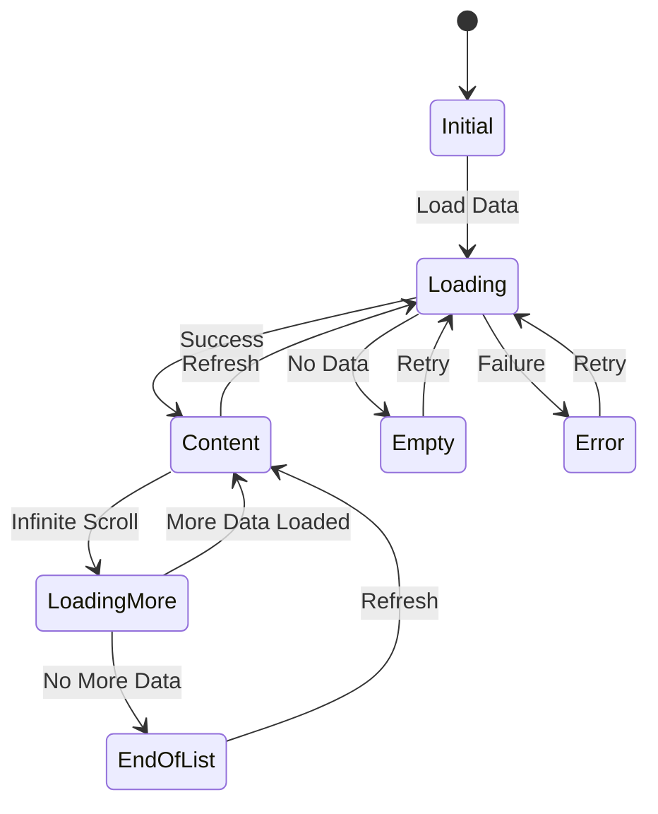

# Design Document

## Overview

This design document outlines the implementation of a comprehensive shimmer loading and empty state system for the Synapse Android application. The system will provide consistent, accessible, and performant loading feedback across all major screens including home feed, chat lists, notifications, and user profiles. The design leverages the existing `ShimmerFrameLayout` component and extends it with standardized placeholder layouts, empty state views, and state management logic.

The implementation follows Material Design 3 guidelines for motion, color, and accessibility, ensuring a polished user experience that respects system settings like "Reduce motion" and provides appropriate feedback for screen reader users.

## Architecture

### Component Structure

```
┌─────────────────────────────────────────────────────────────┐
│                    Fragment/Activity                         │
│  ┌───────────────────────────────────────────────────────┐  │
│  │              LoadingStateManager                       │  │
│  │  - Coordinates state transitions                       │  │
│  │  - Manages visibility of containers                    │  │
│  │  - Handles accessibility announcements                 │  │
│  └───────────────────────────────────────────────────────┘  │
│                           │                                  │
│         ┌─────────────────┼─────────────────┐               │
│         ▼                 ▼                 ▼               │
│  ┌──────────────┐  ┌──────────────┐  ┌──────────────┐     │
│  │   Shimmer    │  │    Empty     │  │   Content    │     │
│  │  Container   │  │    State     │  │  Container   │     │
│  │              │  │   Container  │  │              │     │
│  └──────────────┘  └──────────────┘  └──────────────┘     │
│         │                 │                                  │
│         ▼                 ▼                                  │
│  ┌──────────────┐  ┌──────────────┐                        │
│  │ Placeholder  │  │  Empty State │                        │
│  │   Layouts    │  │     View     │                        │
│  └──────────────┘  └──────────────┘                        │
└─────────────────────────────────────────────────────────────┘
```

### State Flow Diagram



## Components and Interfaces

### 1. LoadingStateManager

A utility class that manages the lifecycle and transitions between loading, empty, and content states.

**Location:** `app/src/main/java/com/synapse/social/studioasinc/util/LoadingStateManager.kt`

**Interface:**
```kotlin
class LoadingStateManager(
    private val shimmerContainer: ViewGroup,
    private val emptyStateContainer: ViewGroup,
    private val contentContainer: ViewGroup,
    private val context: Context
) {
    enum class State {
        LOADING,
        CONTENT,
        EMPTY,
        ERROR
    }
    
    fun setState(
        state: State,
        emptyStateConfig: EmptyStateConfig? = null,
        animate: Boolean = true
    )
    
    fun showLoadingMore(show: Boolean)
    fun showEndOfList(show: Boolean)
    
    private fun shouldReduceMotion(): Boolean
    private fun announceStateChange(state: State, message: String)
}
```

**Responsibilities:**
- Coordinate visibility transitions between shimmer, empty, and content containers
- Apply appropriate animations based on accessibility settings
- Announce state changes to accessibility services
- Handle loading indicators for infinite scroll

### 2. ShimmerPlaceholderFactory

A factory class that creates standardized shimmer placeholder layouts for different content types.

**Location:** `app/src/main/java/com/synapse/social/studioasinc/util/ShimmerPlaceholderFactory.kt`

**Interface:**
```kotlin
object ShimmerPlaceholderFactory {
    enum class PlaceholderType {
        POST,
        CHAT_ITEM,
        NOTIFICATION,
        USER_PROFILE,
        STORY
    }
    
    fun createPlaceholder(
        context: Context,
        type: PlaceholderType,
        count: Int = 5
    ): List<View>
    
    fun inflatePostPlaceholder(context: Context): View
    fun inflateChatItemPlaceholder(context: Context): View
    fun inflateNotificationPlaceholder(context: Context): View
    fun inflateProfilePlaceholder(context: Context): View
}
```

**Responsibilities:**
- Provide consistent placeholder layouts across the app
- Inflate appropriate shimmer layouts based on content type
- Manage placeholder count for different screens

### 3. EmptyStateView

A custom view component that displays empty state illustrations, messages, and action buttons.

**Location:** `app/src/main/java/com/synapse/social/studioasinc/widget/EmptyStateView.kt`

**Interface:**
```kotlin
class EmptyStateView @JvmOverloads constructor(
    context: Context,
    attrs: AttributeSet? = null,
    defStyleAttr: Int = 0
) : FrameLayout(context, attrs, defStyleAttr) {
    
    fun configure(config: EmptyStateConfig)
    fun setActionClickListener(listener: OnClickListener)
    
    private fun updateIllustration(type: EmptyStateType)
    private fun updateText(title: String, description: String)
    private fun updateActionButton(text: String?, visible: Boolean)
}
```

**Responsibilities:**
- Display contextual empty state UI
- Handle different empty state types (empty, error, no results)
- Provide action buttons for user engagement
- Support accessibility features

### 4. EmptyStateConfig

A data class that defines the configuration for empty states.

**Location:** `app/src/main/java/com/synapse/social/studioasinc/model/EmptyStateConfig.kt`

**Interface:**
```kotlin
data class EmptyStateConfig(
    val type: EmptyStateType,
    val title: String,
    val description: String,
    val actionButtonText: String? = null,
    val actionButtonListener: (() -> Unit)? = null,
    val illustrationRes: Int? = null
)

enum class EmptyStateType {
    EMPTY_FEED,
    EMPTY_CHATS,
    EMPTY_NOTIFICATIONS,
    EMPTY_SEARCH,
    EMPTY_FOLLOWERS,
    ERROR_NETWORK,
    ERROR_SERVER,
    NO_RESULTS
}
```

### 5. Enhanced ShimmerFrameLayout

Extend the existing `ShimmerFrameLayout` to support accessibility features.

**Location:** `app/src/main/java/com/synapse/social/studioasinc/animations/Shimmer.kt` (modify existing)

**Enhancements:**
```kotlin
class ShimmerFrameLayout {
    // Existing code...
    
    private fun shouldReduceMotion(): Boolean {
        val resolver = context.contentResolver
        return Settings.Global.getFloat(
            resolver,
            Settings.Global.TRANSITION_ANIMATION_SCALE,
            1f
        ) == 0f
    }
    
    override fun startShimmer() {
        if (shouldReduceMotion()) {
            // Show static placeholder instead
            return
        }
        // Existing shimmer logic...
    }
}
```

## Data Models

### LoadingState

```kotlin
sealed class LoadingState {
    object Initial : LoadingState()
    object Loading : LoadingState()
    data class Content(val itemCount: Int) : LoadingState()
    data class Empty(val config: EmptyStateConfig) : LoadingState()
    data class Error(val message: String, val config: EmptyStateConfig) : LoadingState()
    object LoadingMore : LoadingState()
    object EndOfList : LoadingState()
}
```

### EmptyStateConfig

Already defined in Components section above.

## Layout Structure

### 1. Shimmer Placeholder Layouts

#### Post Placeholder (`post_placeholder_layout.xml`)
Already exists, will be enhanced with proper dimensions and spacing.

#### Chat Item Placeholder (`chat_item_placeholder_layout.xml`)
```xml
<ShimmerFrameLayout>
    <LinearLayout orientation="horizontal">
        <!-- Avatar circle (48dp) -->
        <View circle />
        <LinearLayout orientation="vertical">
            <!-- Username bar (120dp x 16dp) -->
            <View rectangle />
            <!-- Message preview (180dp x 14dp) -->
            <View rectangle />
        </LinearLayout>
        <!-- Timestamp (60dp x 12dp) -->
        <View rectangle />
    </LinearLayout>
</ShimmerFrameLayout>
```

#### Notification Placeholder (`notification_placeholder_layout.xml`)
```xml
<ShimmerFrameLayout>
    <LinearLayout orientation="horizontal">
        <!-- Icon circle (40dp) -->
        <View circle />
        <LinearLayout orientation="vertical">
            <!-- Title bar (140dp x 16dp) -->
            <View rectangle />
            <!-- Description (200dp x 14dp) -->
            <View rectangle />
        </LinearLayout>
    </LinearLayout>
</ShimmerFrameLayout>
```

### 2. Empty State Layout

**Location:** `app/src/main/res/layout/view_empty_state.xml`

```xml
<FrameLayout>
    <LinearLayout
        orientation="vertical"
        gravity="center"
        padding="32dp">
        
        <!-- Illustration -->
        <ImageView
            id="@+id/emptyStateIllustration"
            width="200dp"
            height="200dp" />
        
        <!-- Title -->
        <TextView
            id="@+id/emptyStateTitle"
            textAppearance="?attr/textAppearanceHeadlineSmall"
            marginTop="24dp" />
        
        <!-- Description -->
        <TextView
            id="@+id/emptyStateDescription"
            textAppearance="?attr/textAppearanceBodyMedium"
            textAlignment="center"
            marginTop="8dp" />
        
        <!-- Action Button -->
        <Button
            id="@+id/emptyStateAction"
            style="@style/Widget.Material3.Button"
            marginTop="24dp" />
    </LinearLayout>
</FrameLayout>
```

### 3. Fragment Layout Pattern

All fragments will follow this structure:

```xml
<FrameLayout>
    <!-- Shimmer Container -->
    <LinearLayout
        id="@+id/shimmerContainer"
        orientation="vertical"
        visibility="gone" />
    
    <!-- Empty State Container -->
    <FrameLayout
        id="@+id/emptyStateContainer"
        visibility="gone">
        <include layout="@layout/view_empty_state" />
    </FrameLayout>
    
    <!-- Content Container -->
    <SwipeRefreshLayout
        id="@+id/contentContainer">
        <RecyclerView />
    </SwipeRefreshLayout>
</FrameLayout>
```

## Error Handling

### Network Errors

When network requests fail:
1. Display error empty state with retry button
2. Log error details for debugging
3. Announce error to accessibility services
4. Provide clear error message to user

```kotlin
fun handleNetworkError(error: Exception) {
    val config = EmptyStateConfig(
        type = EmptyStateType.ERROR_NETWORK,
        title = context.getString(R.string.error_network_title),
        description = context.getString(R.string.error_network_description),
        actionButtonText = context.getString(R.string.retry),
        actionButtonListener = { retryLoad() },
        illustrationRes = R.drawable.ic_network_error
    )
    loadingStateManager.setState(LoadingState.Error("Network error", config))
}
```

### Server Errors

When server returns error response:
1. Display server error empty state
2. Log error response for debugging
3. Provide retry option
4. Consider fallback to cached data if available

### Empty Data

When query returns no results:
1. Distinguish between truly empty and error states
2. Provide contextual messaging
3. Offer actionable suggestions
4. Maintain positive, encouraging tone

## Testing Strategy

### Unit Tests

**LoadingStateManagerTest.kt**
- Test state transitions
- Verify visibility changes
- Test accessibility announcements
- Verify animation behavior with reduce motion

**ShimmerPlaceholderFactoryTest.kt**
- Test placeholder creation for each type
- Verify correct layout inflation
- Test placeholder count generation

**EmptyStateViewTest.kt**
- Test configuration updates
- Verify action button behavior
- Test accessibility properties

### UI Tests

**HomeFragmentLoadingTest.kt**
- Test initial loading state displays shimmer
- Test transition to content state
- Test transition to empty state
- Test pull-to-refresh behavior
- Test infinite scroll loading indicator

**EmptyStateInteractionTest.kt**
- Test action button clicks
- Test retry functionality
- Test navigation from empty states

### Accessibility Tests

- Verify content descriptions on all empty state elements
- Test screen reader announcements for state changes
- Verify reduce motion behavior
- Test keyboard navigation for action buttons
- Verify color contrast ratios

### Performance Tests

- Measure shimmer animation frame rate
- Test memory usage with multiple placeholders
- Verify smooth transitions between states
- Test RecyclerView performance with loading indicators

## Accessibility Considerations

### Screen Reader Support

1. **Content Descriptions:** All empty state illustrations and loading indicators have descriptive content descriptions
2. **State Announcements:** Use `View.announceForAccessibility()` when states change
3. **Action Button Labels:** Clear, descriptive labels for all action buttons

### Reduce Motion

1. **Detection:** Check `Settings.Global.TRANSITION_ANIMATION_SCALE`
2. **Behavior:** Disable shimmer animations, use static placeholders
3. **Transitions:** Use instant visibility changes instead of fade animations

### Color Contrast

1. **Shimmer Colors:** Ensure 3:1 contrast ratio minimum
2. **Empty State Text:** Follow Material Design 3 color roles
3. **Action Buttons:** Use high-contrast primary colors

### Focus Management

1. **Action Buttons:** Ensure focusable and keyboard accessible
2. **Focus Order:** Logical tab order through empty state elements
3. **Focus Indicators:** Clear visual focus indicators

## Performance Optimizations

### Shimmer Animation

1. **Hardware Acceleration:** Enable hardware acceleration for shimmer animations
2. **View Recycling:** Reuse shimmer placeholder views when possible
3. **Animation Lifecycle:** Stop animations when views are off-screen

### Layout Inflation

1. **ViewStub:** Use ViewStub for empty state layouts to defer inflation
2. **Async Inflation:** Consider AsyncLayoutInflater for complex placeholders
3. **View Caching:** Cache inflated placeholder views for reuse

### Memory Management

1. **Bitmap Recycling:** Recycle illustration bitmaps when views are destroyed
2. **Animation Cleanup:** Cancel and clear animations in onDetachedFromWindow
3. **Weak References:** Use weak references for listeners to prevent leaks

## Integration Points

### HomeFragment

- Replace existing shimmer container logic with LoadingStateManager
- Add empty state container to layout
- Configure empty state for no posts scenario
- Handle pull-to-refresh with proper state transitions

### InboxChatsFragment

- Add shimmer placeholders for chat items
- Configure empty state for no conversations
- Add "New Message" action button
- Handle realtime updates with loading states

### NotificationsFragment

- Add shimmer placeholders for notifications
- Configure empty state for no notifications
- Handle notification loading errors
- Support pull-to-refresh

### SearchActivity

- Add shimmer placeholders for search results
- Configure empty state for no results
- Handle search errors
- Support different empty states for different search types

## Material Design 3 Compliance

### Color System

- **Shimmer Gradient:** Use `colorSurfaceVariant` with 26% opacity
- **Empty State Background:** Use `colorSurface`
- **Empty State Text:** Use `colorOnSurface` and `colorOnSurfaceVariant`
- **Action Buttons:** Use `colorPrimary` for filled buttons

### Typography

- **Empty State Title:** `textAppearanceHeadlineSmall`
- **Empty State Description:** `textAppearanceBodyMedium`
- **Action Button Text:** `textAppearanceLabelLarge`

### Motion

- **Shimmer Duration:** 1200ms with linear interpolation
- **Fade Transitions:** 200ms fadeout, 300ms fadein with 100ms delay
- **Button Ripple:** Standard Material ripple effect

### Elevation

- **Empty State Container:** 0dp elevation (flat)
- **Action Buttons:** 0dp elevation (filled button style)
- **Shimmer Placeholders:** 0dp elevation

## Dependencies

### Existing Dependencies
- Material Components (already in project)
- AndroidX Core (already in project)
- Kotlin Coroutines (already in project)

### New Dependencies
None required - all functionality can be implemented with existing dependencies.

## Migration Strategy

### Phase 1: Core Components
1. Create LoadingStateManager utility class
2. Create ShimmerPlaceholderFactory
3. Create EmptyStateView custom view
4. Create EmptyStateConfig data class

### Phase 2: Layouts
1. Create empty state layout
2. Create additional shimmer placeholder layouts
3. Update fragment layouts to include state containers

### Phase 3: Fragment Integration
1. Update HomeFragment with LoadingStateManager
2. Update InboxChatsFragment
3. Update NotificationsFragment
4. Update SearchActivity

### Phase 4: Testing & Polish
1. Add unit tests
2. Add UI tests
3. Test accessibility features
4. Performance profiling and optimization

## Future Enhancements

1. **Skeleton Screens:** More sophisticated skeleton screens that match exact content layout
2. **Lottie Animations:** Replace static illustrations with Lottie animations for empty states
3. **Personalized Empty States:** Show personalized suggestions based on user behavior
4. **Progressive Loading:** Show partial content while loading additional data
5. **Offline Support:** Enhanced empty states for offline mode with cached content indicators
