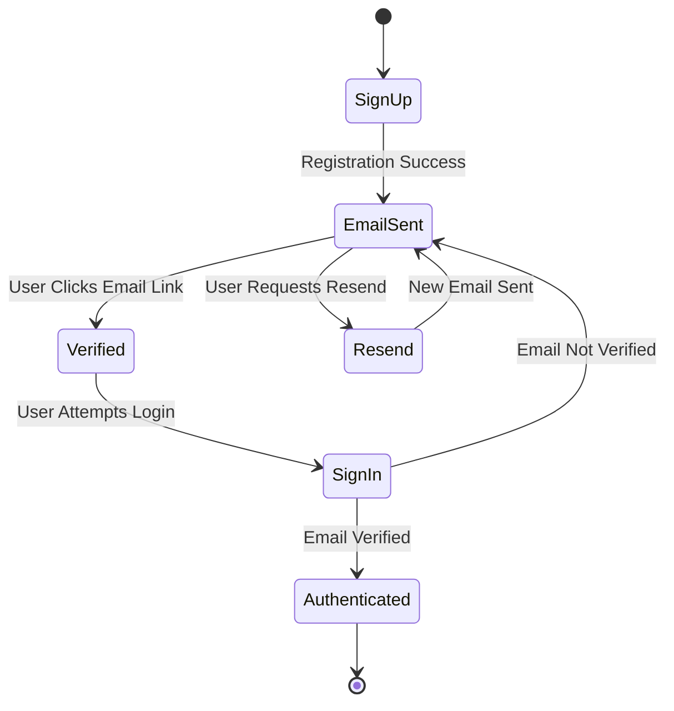

# Supabase Authentication Verification Fix Design

## Overview

This design addresses the authentication failure issue where users are successfully created in Supabase but cannot sign in due to unverified email addresses. The solution implements proper email verification flow handling, clear user feedback, and graceful error management.

## Architecture

### Authentication Flow States



### Component Architecture

1. **Enhanced SupabaseAuthenticationService**
   - Email verification status checking
   - Resend verification email functionality
   - Improved error handling with specific error types

2. **Updated AuthActivity**
   - Verification pending UI state
   - Resend verification button
   - Clear messaging for verification requirements

3. **New EmailVerificationActivity**
   - Dedicated screen for email verification flow
   - Instructions and resend functionality
   - Automatic redirect after verification

## Components and Interfaces

### Enhanced Authentication Service

```kotlin
interface IAuthenticationService {
    suspend fun signUp(email: String, password: String): Result<AuthResult>
    suspend fun signIn(email: String, password: String): Result<AuthResult>
    suspend fun resendVerificationEmail(email: String): Result<Unit>
    suspend fun checkEmailVerified(email: String): Result<Boolean>
    fun getCurrentUser(): User?
    suspend fun signOut(): Result<Unit>
}

data class AuthResult(
    val user: User?,
    val needsEmailVerification: Boolean = false,
    val message: String? = null
)

enum class AuthError {
    EMAIL_NOT_VERIFIED,
    INVALID_CREDENTIALS,
    NETWORK_ERROR,
    SUPABASE_NOT_CONFIGURED,
    UNKNOWN_ERROR
}
```

### UI State Management

```kotlin
sealed class AuthState {
    object Loading : AuthState()
    object SignInForm : AuthState()
    object SignUpForm : AuthState()
    data class EmailVerificationPending(val email: String) : AuthState()
    data class Authenticated(val user: User) : AuthState()
    data class Error(val error: AuthError, val message: String) : AuthState()
}
```

## Data Models

### Enhanced User Model

```kotlin
data class User(
    val id: String,
    val email: String,
    val emailConfirmed: Boolean = false,
    val createdAt: String? = null
)
```

### Authentication Configuration

```kotlin
data class AuthConfig(
    val requireEmailVerification: Boolean = true,
    val resendCooldownSeconds: Int = 60,
    val maxResendAttempts: Int = 5
)
```

## Error Handling

### Error Classification and User Messages

1. **Email Not Verified**
   - User Message: "Please check your email and click the verification link to activate your account."
   - Action: Show resend button and verification pending UI

2. **Invalid Credentials**
   - User Message: "Invalid email or password. Please try again."
   - Action: Clear password field, focus on form

3. **Network Error**
   - User Message: "Connection error. Please check your internet and try again."
   - Action: Show retry button

4. **Supabase Configuration Error**
   - User Message: "Authentication service unavailable. Please try again later."
   - Action: Disable auth buttons, show configuration guidance

### Error Recovery Mechanisms

```kotlin
class AuthErrorHandler {
    fun handleAuthError(error: Throwable): AuthError {
        return when {
            error.message?.contains("email not confirmed", ignoreCase = true) == true -> 
                AuthError.EMAIL_NOT_VERIFIED
            error.message?.contains("invalid", ignoreCase = true) == true -> 
                AuthError.INVALID_CREDENTIALS
            error is NetworkException -> 
                AuthError.NETWORK_ERROR
            else -> 
                AuthError.UNKNOWN_ERROR
        }
    }
    
    fun getErrorMessage(error: AuthError): String {
        return when (error) {
            AuthError.EMAIL_NOT_VERIFIED -> 
                "Please verify your email address to continue"
            AuthError.INVALID_CREDENTIALS -> 
                "Invalid email or password"
            AuthError.NETWORK_ERROR -> 
                "Network connection error"
            AuthError.SUPABASE_NOT_CONFIGURED -> 
                "Authentication service not configured"
            AuthError.UNKNOWN_ERROR -> 
                "An unexpected error occurred"
        }
    }
}
```

## Testing Strategy

### Unit Tests

1. **SupabaseAuthenticationService Tests**
   - Test email verification status checking
   - Test resend verification email functionality
   - Test error handling for different Supabase responses
   - Test authentication flow with verified/unverified users

2. **AuthActivity Tests**
   - Test UI state transitions
   - Test error message display
   - Test resend verification button functionality
   - Test navigation to verification screen

### Integration Tests

1. **End-to-End Authentication Flow**
   - Complete sign up → email verification → sign in flow
   - Test with actual Supabase backend (test environment)
   - Verify email verification link handling

2. **Error Scenario Testing**
   - Test behavior with unverified email sign in attempts
   - Test network error handling
   - Test Supabase configuration errors

### Manual Testing Checklist

1. Sign up with new email → Check verification email sent
2. Attempt sign in before verification → Verify error message
3. Click resend verification → Verify new email sent
4. Complete email verification → Verify successful sign in
5. Test with invalid credentials → Verify appropriate error
6. Test with network disconnected → Verify error handling

## Implementation Phases

### Phase 1: Core Verification Handling
- Enhance SupabaseAuthenticationService with verification checks
- Update error handling to detect email verification issues
- Add resend verification email functionality

### Phase 2: UI Improvements
- Update AuthActivity with verification pending state
- Add clear error messages for verification issues
- Implement resend verification button

### Phase 3: Enhanced User Experience
- Create dedicated EmailVerificationActivity
- Add automatic verification status checking
- Implement verification success handling

### Phase 4: Configuration and Testing
- Add development mode configuration options
- Implement comprehensive error logging
- Add analytics for authentication flow tracking