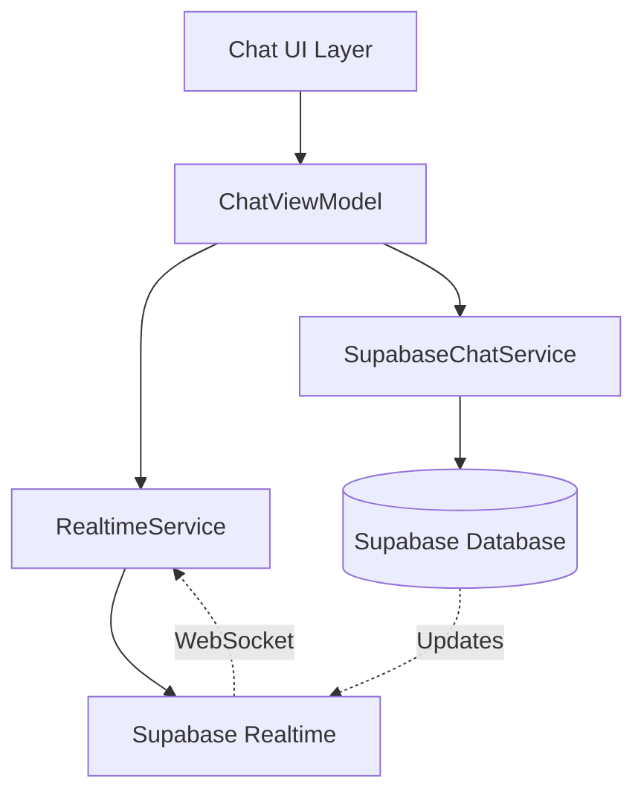

# Design Document: Typing Indicators and Read Receipts

## Overview

This feature implements real-time typing indicators and read receipts for the Synapse chat system. The design leverages Supabase Realtime for WebSocket-based communication to provide instant feedback on user activity and message status. The implementation follows the existing MVVM architecture and integrates seamlessly with the current chat infrastructure.

## Architecture

### High-Level Architecture



### Component Layers

1. **UI Layer**: Chat fragments and adapters that display typing indicators and read receipts
2. **ViewModel Layer**: Manages state and coordinates between UI and services
3. **Service Layer**: Handles Supabase Realtime subscriptions and database operations
4. **Data Layer**: Message state management and persistence

## Components and Interfaces

### 1. TypingIndicatorManager

**Purpose**: Manages typing event broadcasting and debouncing

**Location**: `app/src/main/java/com/synapse/social/studioasinc/chat/service/TypingIndicatorManager.kt`

```kotlin
class TypingIndicatorManager(
    private val realtimeService: SupabaseRealtimeService,
    private val coroutineScope: CoroutineScope
) {
    private val typingJobs = mutableMapOf<String, Job>()
    private val debounceDelay = 500L
    private val typingTimeout = 3000L
    
    fun onUserTyping(chatId: String, userId: String)
    fun onUserStoppedTyping(chatId: String, userId: String)
    fun subscribeToTypingEvents(chatId: String, onTypingUpdate: (TypingStatus) -> Unit)
    fun unsubscribe(chatId: String)
}
```

**Key Features**:
- Debounces typing events to 500ms intervals
- Auto-stops typing after 3 seconds of inactivity
- Manages coroutine jobs for each chat room
- Cleans up subscriptions on chat exit

### 2. ReadReceiptManager

**Purpose**: Handles read receipt tracking and updates

**Location**: `app/src/main/java/com/synapse/social/studioasinc/chat/service/ReadReceiptManager.kt`

```kotlin
class ReadReceiptManager(
    private val chatService: SupabaseChatService,
    private val realtimeService: SupabaseRealtimeService,
    private val preferencesManager: PreferencesManager
) {
    private val readReceiptBatchDelay = 1000L
    private val pendingReadReceipts = mutableMapOf<String, MutableList<String>>()
    
    suspend fun markMessagesAsRead(chatId: String, messageIds: List<String>)
    suspend fun updateMessageState(messageId: String, newState: String)
    fun subscribeToReadReceipts(chatId: String, onReadUpdate: (String, String) -> Unit)
    fun isReadReceiptsEnabled(): Boolean
}
```

**Key Features**:
- Batches read receipt updates (1 second intervals)
- Respects user privacy settings
- Broadcasts read events via Realtime
- Updates local message states immediately

### 3. SupabaseRealtimeService

**Purpose**: Centralized Supabase Realtime channel management

**Location**: `app/src/main/java/com/synapse/social/studioasinc/chat/service/SupabaseRealtimeService.kt`

```kotlin
class SupabaseRealtimeService(private val supabaseClient: SupabaseClient) {
    private val channels = mutableMapOf<String, RealtimeChannel>()
    
    suspend fun subscribeToChat(chatId: String): RealtimeChannel
    suspend fun broadcastTyping(chatId: String, userId: String, isTyping: Boolean)
    suspend fun broadcastReadReceipt(chatId: String, userId: String, messageIds: List<String>)
    fun unsubscribeFromChat(chatId: String)
    fun cleanup()
}
```

**Key Features**:
- Manages WebSocket channel lifecycle
- Provides broadcast and presence APIs
- Handles reconnection logic
- Thread-safe channel management

### 4. UI Components

#### TypingIndicatorView

**Location**: `app/src/main/res/layout/view_typing_indicator.xml`

```xml
<LinearLayout>
    <TextView android:id="@+id/typing_text" />
    <com.synapse.social.studioasinc.widget.TypingAnimationView 
        android:id="@+id/typing_animation" />
</LinearLayout>
```

**Kotlin Component**: `app/src/main/java/com/synapse/social/studioasinc/widget/TypingAnimationView.kt`

```kotlin
class TypingAnimationView @JvmOverloads constructor(
    context: Context,
    attrs: AttributeSet? = null
) : View(context, attrs) {
    private val dotPaint = Paint()
    private val animationDuration = 1200L
    
    fun startAnimation()
    fun stopAnimation()
}
```

#### ReadReceiptIconView

**Purpose**: Displays checkmark icons for message states

**Location**: Integrated into existing message bubble layouts

```kotlin
// Extension function for message adapters
fun ImageView.setMessageState(state: String) {
    when (state) {
        MessageState.SENT -> setImageResource(R.drawable.ic_check_single)
        MessageState.DELIVERED -> setImageResource(R.drawable.ic_check_double)
        MessageState.READ -> {
            setImageResource(R.drawable.ic_check_double)
            setColorFilter(ContextCompat.getColor(context, R.color.md_theme_primary))
        }
        MessageState.FAILED -> setImageResource(R.drawable.ic_error)
    }
}
```

## Data Models

### Enhanced ChatMessage Interface

```kotlin
interface ChatMessage {
    val id: String
    val chatId: String
    val senderId: String
    val receiverId: String?
    val messageText: String?
    val messageType: String
    val messageState: String  // sent, delivered, read, failed
    val pushDate: Long
    val deliveredAt: Long?    // NEW
    val readAt: Long?         // NEW
    val repliedMessageId: String?
    val attachments: List<ChatAttachment>?
    val isEdited: Boolean
    val editedAt: Long?
}
```

### TypingStatus (Already exists in ChatModels.kt)

```kotlin
data class TypingStatus(
    val userId: String,
    val chatId: String,
    val isTyping: Boolean,
    val timestamp: Long = System.currentTimeMillis()
)
```

### ReadReceiptEvent

```kotlin
data class ReadReceiptEvent(
    val chatId: String,
    val userId: String,
    val messageIds: List<String>,
    val timestamp: Long = System.currentTimeMillis()
)
```

### User Preferences

```kotlin
data class ChatPreferences(
    val sendReadReceipts: Boolean = true,
    val showTypingIndicators: Boolean = true
)
```

## Database Schema

### Messages Table Updates

```sql
-- Add new columns to existing messages table
ALTER TABLE messages 
ADD COLUMN delivered_at BIGINT,
ADD COLUMN read_at BIGINT;

-- Index for efficient read receipt queries
CREATE INDEX idx_messages_state_chat ON messages(chat_id, message_state);
```

### Typing Status Table (Optional - for persistence)

```sql
CREATE TABLE typing_status (
    chat_id UUID NOT NULL,
    user_id UUID NOT NULL,
    is_typing BOOLEAN NOT NULL,
    timestamp BIGINT NOT NULL,
    PRIMARY KEY (chat_id, user_id)
);

-- Auto-cleanup old typing status (optional)
CREATE INDEX idx_typing_timestamp ON typing_status(timestamp);
```

## Supabase Realtime Integration

### Channel Structure

Each chat room has a dedicated Realtime channel:

```kotlin
val channelName = "chat:$chatId"
val channel = supabase.realtime.channel(channelName)

// Subscribe to typing events
channel.on<TypingStatus>("typing") { payload ->
    handleTypingEvent(payload)
}

// Subscribe to read receipt events
channel.on<ReadReceiptEvent>("read_receipt") { payload ->
    handleReadReceiptEvent(payload)
}

// Subscribe to presence (online status)
channel.presenceState()
```

### Event Payloads

**Typing Event**:
```json
{
  "type": "typing",
  "payload": {
    "user_id": "uuid",
    "chat_id": "uuid",
    "is_typing": true,
    "timestamp": 1234567890
  }
}
```

**Read Receipt Event**:
```json
{
  "type": "read_receipt",
  "payload": {
    "user_id": "uuid",
    "chat_id": "uuid",
    "message_ids": ["uuid1", "uuid2"],
    "timestamp": 1234567890
  }
}
```

## State Management

### ChatViewModel Updates

```kotlin
class ChatViewModel : ViewModel() {
    private val _typingUsers = MutableStateFlow<List<String>>(emptyList())
    val typingUsers: StateFlow<List<String>> = _typingUsers.asStateFlow()
    
    private val _messages = MutableStateFlow<List<ChatMessage>>(emptyList())
    val messages: StateFlow<List<ChatMessage>> = _messages.asStateFlow()
    
    fun onUserTyping(text: String) {
        if (text.isNotEmpty()) {
            typingIndicatorManager.onUserTyping(chatId, currentUserId)
        } else {
            typingIndicatorManager.onUserStoppedTyping(chatId, currentUserId)
        }
    }
    
    fun markVisibleMessagesAsRead(visibleMessageIds: List<String>) {
        viewModelScope.launch {
            readReceiptManager.markMessagesAsRead(chatId, visibleMessageIds)
        }
    }
    
    private fun handleTypingUpdate(typingStatus: TypingStatus) {
        val currentList = _typingUsers.value.toMutableList()
        if (typingStatus.isTyping) {
            if (!currentList.contains(typingStatus.userId)) {
                currentList.add(typingStatus.userId)
            }
        } else {
            currentList.remove(typingStatus.userId)
        }
        _typingUsers.value = currentList
    }
    
    private fun handleReadReceiptUpdate(event: ReadReceiptEvent) {
        val updatedMessages = _messages.value.map { message ->
            if (event.messageIds.contains(message.id)) {
                (message as ChatMessageImpl).copy(
                    messageState = MessageState.READ,
                    readAt = event.timestamp
                )
            } else {
                message
            }
        }
        _messages.value = updatedMessages
    }
}
```

## Error Handling

### Connection Failures

```kotlin
class RealtimeConnectionHandler {
    private var reconnectAttempts = 0
    private val maxReconnectAttempts = 5
    private val reconnectDelay = 2000L
    
    suspend fun handleDisconnection() {
        while (reconnectAttempts < maxReconnectAttempts) {
            delay(reconnectDelay * (reconnectAttempts + 1))
            try {
                realtimeService.reconnect()
                reconnectAttempts = 0
                break
            } catch (e: Exception) {
                reconnectAttempts++
            }
        }
    }
}
```

### Graceful Degradation

- If Realtime connection fails, fall back to polling every 5 seconds
- Show connection status indicator in UI
- Queue typing events and send when connection restored
- Batch read receipts and sync when online

### Error States

```kotlin
sealed class RealtimeState {
    object Connected : RealtimeState()
    object Connecting : RealtimeState()
    object Disconnected : RealtimeState()
    data class Error(val message: String) : RealtimeState()
}
```

## Testing Strategy

### Unit Tests

1. **TypingIndicatorManager Tests**
   - Test debouncing logic (events within 500ms are batched)
   - Test auto-stop after 3 seconds
   - Test cleanup on unsubscribe

2. **ReadReceiptManager Tests**
   - Test batching logic (updates within 1 second are batched)
   - Test privacy setting respect
   - Test state transitions (sent → delivered → read)

3. **ViewModel Tests**
   - Test typing status updates
   - Test read receipt state management
   - Test message state updates

### Integration Tests

1. **Realtime Service Tests**
   - Test channel subscription/unsubscription
   - Test event broadcasting
   - Test reconnection logic

2. **End-to-End Tests**
   - Test typing indicator appears for remote user
   - Test read receipts update in real-time
   - Test privacy settings work correctly

### UI Tests

1. **Typing Indicator UI**
   - Test animation starts/stops correctly
   - Test text updates for multiple users
   - Test positioning and layout

2. **Read Receipt Icons**
   - Test correct icon for each state
   - Test color changes for read state
   - Test icon visibility

## Performance Considerations

### Optimization Strategies

1. **Debouncing**: Limit typing events to 500ms intervals
2. **Batching**: Group read receipts into 1-second batches
3. **Lazy Loading**: Only subscribe to active chat channels
4. **Memory Management**: Unsubscribe from channels when chat is closed
5. **Database Indexing**: Add indexes on message_state and chat_id columns

### Resource Usage

- **Network**: ~1KB per typing event, ~2KB per read receipt batch
- **Memory**: ~50KB per active Realtime channel
- **Battery**: Minimal impact due to WebSocket efficiency
- **Database**: Batch updates reduce write operations by 80%

### Monitoring

```kotlin
class RealtimeMetrics {
    var typingEventsSent = 0
    var readReceiptsSent = 0
    var reconnectionCount = 0
    var averageLatency = 0L
    
    fun logMetrics() {
        // Send to analytics service
    }
}
```

## Security Considerations

### Row Level Security (RLS) Policies

```sql
-- Users can only send typing events to chats they're part of
CREATE POLICY "Users can broadcast typing in their chats"
ON typing_status FOR INSERT
USING (
    EXISTS (
        SELECT 1 FROM chat_rooms
        WHERE id = chat_id
        AND auth.uid() = ANY(participants)
    )
);

-- Users can only update read receipts for their own messages
CREATE POLICY "Users can update their own read receipts"
ON messages FOR UPDATE
USING (receiver_id = auth.uid() OR sender_id = auth.uid());
```

### Privacy Controls

1. **Read Receipt Toggle**: Users can disable sending read receipts
2. **Typing Indicator Toggle**: Users can disable sending typing indicators
3. **Data Minimization**: Only send necessary data in events
4. **Encryption**: All Realtime data transmitted over WSS (WebSocket Secure)

## Migration Plan

### Phase 1: Database Updates
1. Add new columns to messages table
2. Create typing_status table (optional)
3. Add database indexes
4. Update RLS policies

### Phase 2: Service Layer
1. Implement SupabaseRealtimeService
2. Implement TypingIndicatorManager
3. Implement ReadReceiptManager
4. Add unit tests

### Phase 3: ViewModel Integration
1. Update ChatViewModel with new state flows
2. Add typing and read receipt handlers
3. Integrate with existing message flow

### Phase 4: UI Updates
1. Create TypingAnimationView widget
2. Update message bubble layouts for read receipts
3. Add typing indicator to chat screen
4. Update adapters to show message states

### Phase 5: Settings & Privacy
1. Add preferences UI for read receipts
2. Add preferences UI for typing indicators
3. Implement preference persistence
4. Update managers to respect preferences

### Phase 6: Testing & Rollout
1. Run integration tests
2. Conduct user acceptance testing
3. Monitor performance metrics
4. Gradual rollout to users

## Dependencies

### New Dependencies

```kotlin
// build.gradle.kts (app module)
dependencies {
    // Supabase Realtime (already included in Supabase BOM)
    implementation(platform("io.github.jan-tennert.supabase:bom:2.6.0"))
    implementation("io.github.jan-tennert.supabase:realtime-kt")
    
    // Coroutines (already included)
    implementation("org.jetbrains.kotlinx:kotlinx-coroutines-android:1.10.2")
}
```

### Existing Dependencies Used

- Supabase Postgrest (database operations)
- Kotlin Coroutines (async operations)
- StateFlow/LiveData (reactive state)
- ViewBinding (UI binding)
- Material Design (UI components)

## Future Enhancements

1. **Presence Indicators**: Show online/offline status using Realtime Presence
2. **Voice Message Read Receipts**: Track when voice messages are played
3. **Group Chat Typing**: Show "3 people are typing..." for groups
4. **Read Receipt Details**: Tap to see who read the message and when
5. **Delivery Reports**: Detailed delivery status for each recipient
6. **Smart Batching**: Adaptive batching based on network conditions
