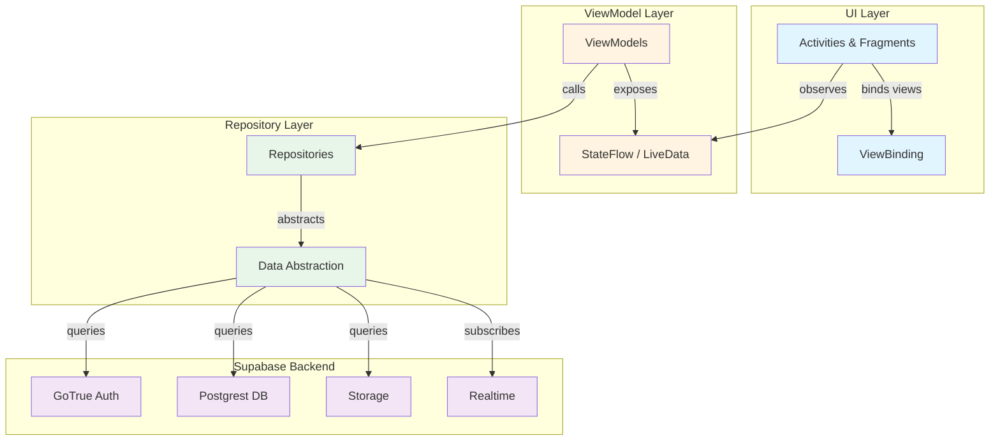

# Architecture

**Architecture**: MVVM with Repository pattern, leveraging Kotlin coroutines for async operations and StateFlow for reactive UI updates.

```mermaid
graph TB
    subgraph "UI Layer"
        A[Activities & Fragments]
        B[ViewBinding]
    end

    subgraph "ViewModel Layer"
        C[ViewModels]
        D[StateFlow / LiveData]
    end

    subgraph "Repository Layer"
        E[Repositories]
        F[Data Abstraction]
    end

    subgraph "Supabase Backend"
        G[GoTrue Auth]
        H[Postgrest DB]
        I[Storage]
        J[Realtime]
    end

    A -->|binds views| B
    A -->|observes| D
    C -->|exposes| D
    C -->|calls| E
    E -->|abstracts| F
    F -->|queries| G
    F -->|queries| H
    F -->|queries| I
    F -->|subscribes| J

    style A fill:#e1f5ff
    style B fill:#e1f5ff
    style C fill:#fff4e1
    style D fill:#fff4e1
    style E fill:#e8f5e9
    style F fill:#e8f5e9
    style G fill:#f3e5f5
    style H fill:#f3e5f5
    style I fill:#f3e5f5
    style J fill:#f3e5f5
```
