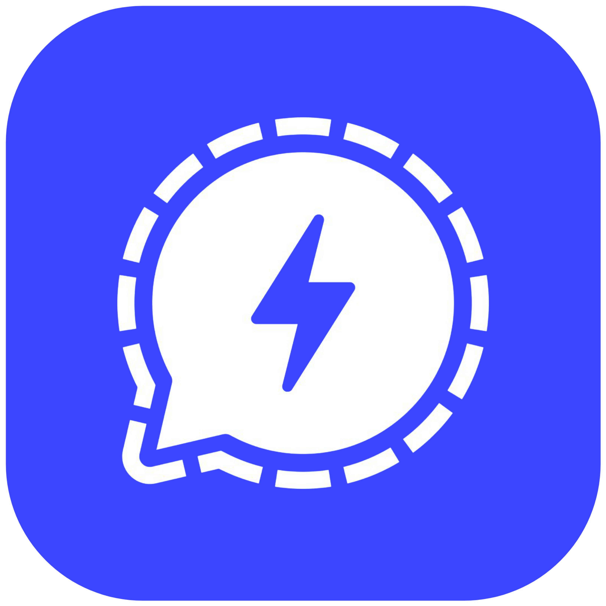
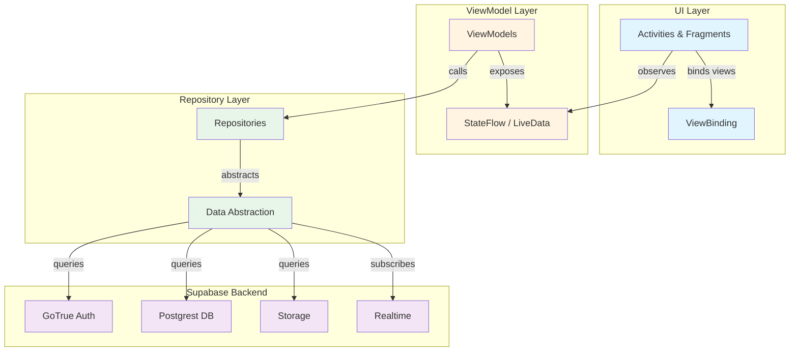

  

  # **Synapse**
  
  **Express yourself in a better way ✨**

  
  
  
  
  
  
  
  

---

## 📚 Table of Contents
- [🚀 Introduction](#-introduction)
- [✨ Features](#-features)
- [🛠️ Tech Stack](#-tech-stack)
- [🏁 Getting Started](#-getting-started)

- [📚 Documentation](#-documentation)
- [🤝 Contributing](#-contributing)
- [🗺️ Roadmap](#-roadmap)
- [📜 License](#-license)
- [💬 Community & Support](#-community--support)
- [🙏 Acknowledgments](#-acknowledgments)
- [❓ FAQ](#-faq)

---

## 🚀 Introduction  
**Synapse** is an open-source social media platform built with Kotlin for Android, using Supabase as the backend. Designed with privacy, real-time communication, and a lightweight user experience at its core, Synapse provides a secure, ad-free environment where users can connect and express themselves freely.

**Architecture**: MVVM with Repository pattern, leveraging Kotlin coroutines for async operations and StateFlow for reactive UI updates.

> [!NOTE]
> The project has successfully completed two major modernization efforts: a comprehensive Java to Kotlin migration (27 core files with improved null safety, coroutines, and Kotlin idioms) and a complete Firebase to Supabase backend migration with all security policies in place.

[Back to index](#-table-of-contents)

## 🛠️ Tech Stack

### Android App
- **Language**: Kotlin with Android KTX
- **Architecture**: MVVM + Repository pattern
- **UI**: ViewBinding, Material Design 3, Navigation Component
- **Async**: Kotlin Coroutines + Flow
- **Image Loading**: Glide
- **Markdown**: Markwon
- **Media**: Media3

### Backend (Supabase)
- **Database**: PostgreSQL via Postgrest
- **Authentication**: GoTrue (email, OAuth)
- **Storage**: Supabase Storage for media
- **Real-time**: Supabase Realtime for live updates

### Build Configuration
- Target SDK: 32
- Min SDK: 26
- Compile SDK: 36
- Build System: Gradle with Kotlin DSL

### Key Libraries

#### Backend & Networking
- **Supabase BOM**: Backend-as-a-service platform providing database, auth, storage, and realtime
- **Ktor**: HTTP client for Supabase communication
- **Kotlinx Serialization**: JSON serialization for API data

#### UI & Design
- **Material Design**: Modern Material Design 3 components
- **AndroidX Core KTX**: Kotlin extensions for Android framework
- **Glide**: Efficient image loading and caching
- **Lottie**: Animated vector graphics and illustrations
- **CircleImageView**: Circular image views for avatars

#### Architecture & Lifecycle
- **Lifecycle**: Lifecycle-aware components and ViewModels
- **Navigation**: Fragment navigation and deep linking
- **Work Manager**: Background task scheduling
- **Paging**: Efficient data pagination for large lists

#### Media & Content
- **Media3**: Modern media playback (replaces ExoPlayer)
- **Markwon**: Markdown rendering with GitHub Flavored Markdown support
- **PhotoView**: Pinch-to-zoom image viewing

#### Utilities
- **OkHttp**: HTTP client for networking
- **Gson**: JSON parsing and serialization
- **OneSignal**: Push notifications

---

[Back to index](#-table-of-contents)

## 📚 Documentation

- **[Contributing Guide](Docs/CONTRIBUTING.md)** - Guidelines for contributing to the Synapse project.
- **[Roadmap](Docs/ROADMAP.md)** - The future of the Synapse project.

---

[Back to index](#-table-of-contents)

## 🤝 Contributing

We welcome contributions from everyone! Please see our **[Contributing Guide](Docs/CONTRIBUTING.md)** for detailed information on:

- Code style requirements and conventions
- Development workflow
- Pull request requirements
- Code review process

---

[Back to index](#-table-of-contents)

## 🗺️ Roadmap

See our **[Roadmap](Docs/ROADMAP.md)** for detailed information on:

- Current focus areas (Q1 2025)
- Near-term plans (Q2 2025)
- Future features and enhancements

---

[Back to index](#-table-of-contents)

## 📜 License  
Synapse is distributed under the [GNU General Public License v3.0](LICENSE). See `LICENSE` for more information.

---

[Back to index](#-table-of-contents)

## 💬 Community & Support  
| Channel | Purpose |
|---------|---------|
| [GitHub Issues](https://github.com/StudioAsInc/android-synapse/issues) | Report bugs & request features |
| [Discussions](https://github.com/StudioAsInc/android-synapse/discussions) | Q&A and community talks |
| [Wiki](https://github.com/StudioAsInc/android-synapse/wiki) | Setup guides & documentation |

---

[Back to index](#-table-of-contents)

## 🙏 Acknowledgments  
- Our **core team** at StudioAs Inc.  
- **Open-source contributors** worldwide  
- **Early testers** shaping Synapse's future  

---

[Back to index](#-table-of-contents)

## ❓ FAQ

<strong>Is Synapse completely free to use?</strong>

 
Yes, Synapse is free and operates on a non-profit model. We do not have ads or premium features that require payment.

<strong>What makes Synapse different from other social platforms?</strong>

 
Synapse prioritizes user privacy and experience. We offer an ad-free environment, end-to-end encrypted chats, generous free storage (35GB+), and our platform is fully open-source.

<strong>What platforms is Synapse currently available on?</strong>

 
Synapse is available for Android and has a web version. You can find links to both on our official <a href="https://dl-synapse.pages.dev">website</a>.

<strong>How is my privacy protected on Synapse?</strong>

 
We use end-to-end encryption for all private chats, meaning only you and the recipient can read the messages. We are committed to minimizing data collection.

<strong>Is the project stable?</strong>

 
Yes! The project has successfully completed two major modernization efforts: the Firebase to Supabase backend migration and the Java to Kotlin migration. Core features like authentication, chat, posts, and profiles are stable and production-ready. Real-time features and group chats are currently in development. See the <a href="#project-status">Project Status</a> section for detailed feature stability.

<strong>Can I contribute to the project?</strong>

 
Absolutely! We welcome contributions from everyone. Please check out the <a href="#-contributing">Contributing</a> section to get started.

<strong>What technology does Synapse use?</strong>

 
The Android app is built with Kotlin using MVVM architecture, Kotlin Coroutines, ViewBinding, and Material Design 3. Key libraries include Supabase BOM, Glide, Markwon, and Media3. The backend is powered by Supabase (PostgreSQL via Postgrest, GoTrue Auth, Storage, and Realtime). Build targets: Min SDK 26, Target SDK 32, Compile SDK 36, JDK 17.

<strong>Can I host my own instance of Synapse?</strong>

 
While self-hosting is a goal for the future, it is not officially supported at this time. The project's open-source nature, however, allows for community experimentation.

<strong>What was the Java to Kotlin migration?</strong>

 
In late 2024, Synapse underwent a comprehensive migration from Java to Kotlin, converting 27 core files. This modernization brought improved null safety, coroutines for async operations, Kotlin idioms (data classes, sealed classes, extensions), and better code maintainability. The migration is complete and documented in <a href="Docs/JAVA_TO_KOTLIN_MIGRATION.md">JAVA_TO_KOTLIN_MIGRATION.md</a>.

<strong>Do I need a Supabase account to contribute?</strong>

 
Yes, to build and test the app locally, you'll need a free Supabase account to configure the backend. However, you can contribute to documentation, UI improvements, or code refactoring without running the app. For backend work, Supabase's free tier provides everything needed for development. See the <a href="#installation">Getting Started</a> section for setup instructions.

<strong>How do I test the app locally?</strong>

 
After setting up your Supabase credentials in <code>gradle.properties</code>, open the project in Android Studio, sync Gradle, and run the app on an emulator or physical device. For automated testing, run <code>./gradlew test</code> for unit tests or <code>./gradlew connectedAndroidTest</code> for instrumented tests. See <a href="Docs/CHAT_TESTING_GUIDE.md">CHAT_TESTING_GUIDE.md</a> for feature-specific testing guidance.

<strong>What are the Supabase backend requirements?</strong>

 
Synapse requires a Supabase project with the following services enabled: GoTrue (authentication), Postgrest (database), Storage (media files), and Realtime (live updates). You'll need to configure your Supabase URL, anon key, and S3 storage credentials in <code>gradle.properties</code> or environment variables. The free tier provides 500MB database storage, 1GB file storage, and 2GB bandwidth—sufficient for development and testing.

<strong>Who is behind Synapse?</strong>

 
Synapse is a project developed and maintained by StudioAs Inc. and a dedicated community of open-source contributors.

<strong>Where can I report a bug or suggest a feature?</strong>

 
You can report bugs or request new features by creating an issue on our <a href="https://github.com/StudioAsInc/android-synapse/issues">GitHub repository</a>.

---

[Back to index](#-table-of-contents)

  
  **A Project by StudioAs Inc.**  
  *"Empowering connections through transparency"*

  [⭐ Star on GitHub](https://github.com/StudioAsInc/android-synapse) • [Join Our Community](https://web-synapse.pages.dev) • [Contact](mailto:mashikahamed0@gmail.com)

