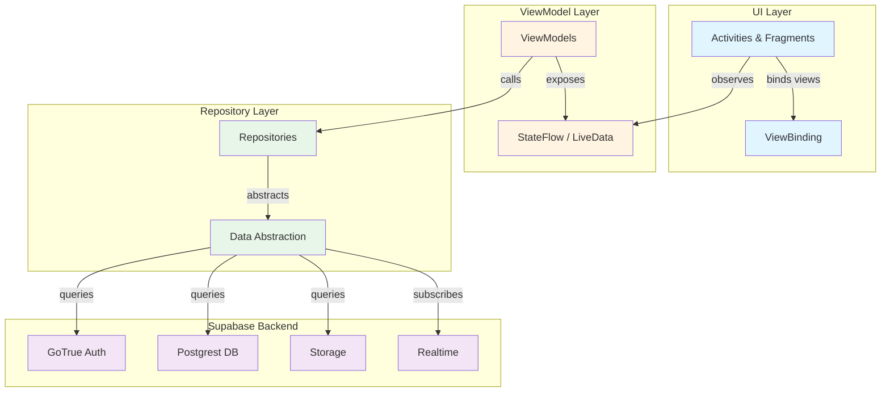

<div align="center">
  

  # **Synapse**
  
  **Express yourself in a better way ✨**

  [](https://dl-synapse.pages.dev)
  [](https://dl-synapse.pages.dev/docs)
  [](https://github.com/StudioAsInc/android-synapse/issues/new?template=bug_report.md)
  [](https://github.com/StudioAsInc/android-synapse/issues/new?template=feature_request.md)
  [](https://github.com/StudioAsInc/android-synapse/graphs/contributors)
  [](https://github.com/StudioAsInc/android-synapse/commits/)
  [](https://github.com/StudioAsInc/android-synapse/releases)
  [](https://github.com/StudioAsInc/android-synapse)

</div>

---

## 📚 Table of Contents
- [🚀 Introduction](#-introduction)
- [✨ Features](#-features)
- [🛠️ Tech Stack](#️-tech-stack)
- [🏁 Getting Started](#-getting-started)

- [📚 Documentation](#-documentation)
- [🤝 Contributing](#-contributing)
- [🗺️ Roadmap](#️-roadmap)
- [📜 License](#-license)
- [💬 Community & Support](#-community--support)
- [🙏 Acknowledgments](#-acknowledgments)
- [❓ FAQ](#-faq)

---

## 🚀 Introduction  
**Synapse** is an open-source social media platform built with Kotlin for Android, using Supabase as the backend. Designed with privacy, real-time communication, and a lightweight user experience at its core, Synapse provides a secure, ad-free environment where users can connect and express themselves freely.

**Architecture**: MVVM with Repository pattern, leveraging Kotlin coroutines for async operations and StateFlow for reactive UI updates.



> [!NOTE]
> The project has successfully completed two major modernization efforts: a comprehensive Java to Kotlin migration (27 core files with improved null safety, coroutines, and Kotlin idioms) and a complete Firebase to Supabase backend migration with all security policies in place.

### Project Status

| Feature Area | Status | Notes |
|-------------|--------|-------|
| 🔐 Authentication | ✅ Stable | Email/OAuth login via Supabase GoTrue |
| 💬 Chat System | ✅ Stable | Direct messaging with RLS security |
| 📝 Posts & Feed | ✅ Stable | Create, view, like, and comment on posts |
| 👤 User Profiles | ✅ Stable | View profiles, follow/unfollow users |
| 📦 Media Storage | ✅ Stable | 35GB+ free storage via Supabase |
| 🔄 Real-time Updates | 🚧 In Development | Message sync and live notifications |
| 👥 Group Chats | 📋 Planned | Multi-user conversations |
| 📞 Video Calls | 📋 Planned | Voice and video communication |

---

## ✨ Features

### Available Now ✅
- **Real-time Chat**: Direct messaging with secure RLS policies ([Quick Reference](Docs/CHAT_QUICK_REFERENCE.md))
- **Social Feed**: Create, view, like, and comment on posts with full user attribution
- **User Profiles**: View profiles, follow/unfollow users, and manage your social graph
- **Authentication**: Secure email and OAuth login via Supabase GoTrue
- **35GB+ Free Storage**: Ample space for your media, posts, and communities
- **Lightweight & Optimized**: Runs smoothly on any device without compromising performance
- **Zero Ads, Non-Profit Model**: We prioritize our users' experience over profits
- **Secure Encryption**: End-to-end encryption for private chats, encryption at rest for storage
- **Modular Architecture**: MVVM + Repository pattern with Kotlin coroutines

### In Development 🚧
- **Real-time Message Updates**: Live message sync using Supabase Realtime
- **Enhanced Media Handling**: Image/video attachments in chats
- **Typing Indicators**: See when others are composing messages
- **Read Receipts**: Know when your messages are seen

### Planned 📋
- **Group Chats**: Multi-user conversations with admin controls
- **Video Calls**: Voice and video communication
- **Push Notifications**: Real-time alerts for messages and interactions
- **Self-Hosting**: Deploy your own Synapse instance
- **Federation**: Connect with other Synapse instances

---

## 🛠️ Tech Stack

### Android App
- **Language**: Kotlin 2.2.0 with Android KTX
- **Architecture**: MVVM + Repository pattern
- **UI**: ViewBinding, Material Design 3, Navigation Component
- **Async**: Kotlin Coroutines + Flow
- **Image Loading**: Glide 5.0.0-rc01
- **Markdown**: Markwon 4.6.2
- **Media**: Media3 1.3.1

### Backend (Supabase)
- **Database**: PostgreSQL via Postgrest
- **Authentication**: GoTrue (email, OAuth)
- **Storage**: Supabase Storage for media
- **Real-time**: Supabase Realtime for live updates

### Build Configuration
- Target SDK: 32
- Min SDK: 26
- Compile SDK: 36
- Build System: Gradle with Kotlin DSL

### Key Libraries

#### Backend & Networking
- **Supabase BOM 2.6.0**: Backend-as-a-service platform providing database, auth, storage, and realtime
- **Ktor 2.3.12**: HTTP client for Supabase communication
- **Kotlinx Serialization 1.6.3**: JSON serialization for API data

#### UI & Design
- **Material Design 1.14.0-alpha06**: Modern Material Design 3 components
- **AndroidX Core KTX 1.17.0-rc01**: Kotlin extensions for Android framework
- **Glide 5.0.0-rc01**: Efficient image loading and caching
- **Lottie 6.6.0**: Animated vector graphics and illustrations
- **CircleImageView 3.1.0**: Circular image views for avatars

#### Architecture & Lifecycle
- **Lifecycle 2.9.2**: Lifecycle-aware components and ViewModels
- **Navigation 2.9.3**: Fragment navigation and deep linking
- **Work Manager 2.10.3**: Background task scheduling
- **Paging 3.3.6**: Efficient data pagination for large lists

#### Media & Content
- **Media3 1.3.1**: Modern media playback (replaces ExoPlayer)
- **Markwon 4.6.2**: Markdown rendering with GitHub Flavored Markdown support
- **PhotoView 2.3.0**: Pinch-to-zoom image viewing

#### Utilities
- **OkHttp 5.1.0**: HTTP client for networking
- **Gson 2.13.1**: JSON parsing and serialization
- **OneSignal 5.1.x**: Push notifications

---

## 🏁 Getting Started

### Prerequisites
- **Android Studio** (latest stable version recommended)
- **JDK 17** or higher
- **Git**
- **Supabase Account** (for backend configuration)

### Installation

1. **Clone the repository**
   
   ```bash
   git clone https://github.com/StudioAsInc/android-synapse.git
   cd android-synapse
   ```

2. **Configure Supabase**
   
   Synapse requires Supabase credentials for backend connectivity. You can configure these in two ways:

   **Option 1: gradle.properties (Recommended for local development)**
   
   Create or edit `gradle.properties` in the project root:
   
   ```properties
   SUPABASE_URL=your_supabase_project_url
   SUPABASE_ANON_KEY=your_supabase_anon_key
   SUPABASE_SYNAPSE_S3_ENDPOINT_URL=your_s3_endpoint
   SUPABASE_SYNAPSE_S3_ENDPOINT_REGION=your_s3_region
   SUPABASE_SYNAPSE_S3_ACCESS_KEY_ID=your_s3_access_key_id
   SUPABASE_SYNAPSE_S3_ACCESS_KEY=your_s3_access_key
   ```

   **Option 2: Environment Variables (Recommended for CI/CD)**
   
   Set the same variables as environment variables in your system.

   > **Security Note**: Never commit credentials to version control. Both `gradle.properties` and `local.properties` are in `.gitignore`.

   **Getting Supabase Credentials**:
   1. Create a free account at [supabase.com](https://supabase.com)
   2. Create a new project
   3. Go to Project Settings → API
   4. Copy your Project URL and anon/public key
   5. For S3 storage, configure in Project Settings → Storage

3. **Open in Android Studio**
   - Open Android Studio
   - Select "Open an Existing Project"
   - Navigate to the cloned directory

4. **Sync and Build**
   - Let Gradle sync the project
   - Build the project: `Build > Make Project`
   - Run on emulator or device

### Project Structure

```plaintext
app/src/main/
├── java/com/synapse/social/studioasinc/
│   ├── adapter/           # RecyclerView adapters
│   ├── backend/           # Supabase service layer
│   ├── chat/              # Chat feature components
│   ├── data/              # Repositories & data sources
│   ├── domain/            # Business logic
│   ├── fragments/         # Fragment components
│   ├── home/              # Home feed features
│   ├── model/models/      # Data models
│   ├── presentation/      # ViewModels
│   ├── util/              # Utilities & extensions
│   ├── widget/            # Custom views
│   ├── *Activity.kt       # Activity classes
│   └── SynapseApp.kt      # Application class
└── res/                   # Resources (layouts, drawables, etc.)
```

### Running Tests

```bash
./gradlew test           # Unit tests
./gradlew connectedAndroidTest  # Instrumented tests
```

---

## 📚 Documentation

### For Developers
- **[Agent Guidelines](Docs/Agent.md)** - Development guidelines and best practices for working with Synapse
- **[Java to Kotlin Migration](Docs/JAVA_TO_KOTLIN_MIGRATION.md)** - Complete migration summary with improvements to null safety, coroutines, and Kotlin idioms

### Feature Documentation
- **[Chat Feature Overview](Docs/CHAT_FEATURE_READY.md)** - Complete chat implementation with direct messaging and security
- **[Chat Quick Reference](Docs/CHAT_QUICK_REFERENCE.md)** - Quick start guide for understanding and using chat functionality
- **[Chat Testing Guide](Docs/CHAT_TESTING_GUIDE.md)** - Comprehensive guide for testing chat features
- **[Chat RLS Fix](Docs/CHAT_RLS_FIX.md)** - Row Level Security implementation details for chat privacy
- **[Home Feed Fix](Docs/HOME_FEED_FIX.md)** - Feed implementation details and recent improvements

### Technical Documentation
- **[RLS Fixes Complete](Docs/ALL_RLS_FIXES_COMPLETE.md)** - Complete Row Level Security implementation across all features
- **[Quick Fix Summary](Docs/QUICK_FIX_SUMMARY.md)** - Recent fixes and improvements to the codebase

---

## 🤝 Contributing
Contributions are what make the open-source community such an amazing place to learn, inspire, and create. Any contributions you make are **greatly appreciated**.

### Code Style Requirements

To maintain code quality and consistency, please follow these guidelines:

- **Kotlin Style Guide**: Follow the [official Kotlin coding conventions](https://kotlinlang.org/docs/coding-conventions.html)
  - Use meaningful variable and function names
  - Prefer `val` over `var` when possible
  - Use data classes for models
  - Leverage Kotlin extensions and Android KTX
  
- **ViewBinding**: All UI code must use ViewBinding (no `findViewById` or synthetic imports)

- **Coroutines for Async Operations**: Use Kotlin coroutines instead of callbacks

- **MVVM Architecture Pattern**: Follow the established architecture
  - ViewModels manage UI state using StateFlow/LiveData
  - Repositories abstract data layer (Supabase, local storage)
  - Separate UI logic from business logic
  - Use lifecycle-aware components

### Development Workflow

1. **Fork the Project** from the main repository
2. **Create your Feature Branch**
   
   ```bash
   git checkout -b feature/AmazingFeature
   ```
3. **Make your Changes**
   - Write clean, well-documented code
   - Follow the code style requirements above
   - Test your changes thoroughly
   
4. **Commit your Changes**
   
   ```bash
   git commit -m 'Add some AmazingFeature'
   ```
   
   - Use clear, descriptive commit messages
   - Reference issue numbers when applicable (e.g., "Fix #123: Resolve chat crash")

5. **Push to the Branch**
   
   ```bash
   git push origin feature/AmazingFeature
   ```

6. **Open a Pull Request**

### Pull Request Requirements

Before submitting a PR, ensure you have:

- [ ] **Clear Description**: Explain what changes you made and why
- [ ] **Issue Reference**: Link to related issues (e.g., "Closes #123")
- [ ] **Testing**: Describe how you tested your changes
- [ ] **Screenshots**: Include screenshots for UI changes
- [ ] **Code Quality**: Ensure code follows style guidelines
- [ ] **Build Success**: Verify the project builds without errors
- [ ] **No Breaking Changes**: Or clearly document them if necessary

### Code Review Process

1. A maintainer will review your PR within a few days
2. Address any feedback or requested changes
3. Once approved, a maintainer will merge your PR
4. Your contribution will be included in the next release

Thank you for contributing to Synapse! 🎉

---

## 🗺️ Roadmap

### Current Focus (Q1 2025)
- ✅ Complete Supabase migration
- ✅ Java to Kotlin migration
- 🚧 Stabilize chat features
- 🚧 Improve RLS security policies
- 🚧 Real-time message updates

### Near Term (Q2 2025)
- 📋 Group chat support with admin controls
- 📋 Enhanced media handling (image/video attachments in chats)
- 📋 Typing indicators and read receipts
- 📋 Push notifications for messages and interactions
- 📋 Performance optimizations and caching improvements

### Future
- 📋 Video calling capabilities
- 📋 Self-hosting support with deployment guides
- 📋 Federation capabilities to connect Synapse instances
- 📋 iOS application
- 📋 Progressive Web App (PWA) enhancements

---

## 📜 License  
Synapse is distributed under the [GNU General Public License v3.0](LICENSE). See `LICENSE` for more information.

---

## 💬 Community & Support  
| Channel | Purpose |
|---------|---------|
| [GitHub Issues](https://github.com/StudioAsInc/android-synapse/issues) | Report bugs & request features |
| [Discussions](https://github.com/StudioAsInc/android-synapse/discussions) | Q&A and community talks |
| [Wiki](https://github.com/StudioAsInc/android-synapse/wiki) | Setup guides & documentation |

---

## 🙏 Acknowledgments  
- Our **core team** at StudioAs Inc.  
- **Open-source contributors** worldwide  
- **Early testers** shaping Synapse's future  

---

## ❓ FAQ

<details>
<summary><strong>Is Synapse completely free to use?</strong></summary>
<br>
Yes, Synapse is free and operates on a non-profit model. We do not have ads or premium features that require payment.
</details>

<details>
<summary><strong>What makes Synapse different from other social platforms?</strong></summary>
<br>
Synapse prioritizes user privacy and experience. We offer an ad-free environment, end-to-end encrypted chats, generous free storage (35GB+), and our platform is fully open-source.
</details>

<details>
<summary><strong>What platforms is Synapse currently available on?</strong></summary>
<br>
Synapse is available for Android and has a web version. You can find links to both on our official <a href="https://dl-synapse.pages.dev">website</a>.
</details>

<details>
<summary><strong>How is my privacy protected on Synapse?</strong></summary>
<br>
We use end-to-end encryption for all private chats, meaning only you and the recipient can read the messages. We are committed to minimizing data collection.
</details>

<details>
<summary><strong>Is the project stable?</strong></summary>
<br>
Yes! The project has successfully completed two major modernization efforts: the Firebase to Supabase backend migration and the Java to Kotlin migration. Core features like authentication, chat, posts, and profiles are stable and production-ready. Real-time features and group chats are currently in development. See the <a href="#project-status">Project Status</a> section for detailed feature stability.
</details>

<details>
<summary><strong>Can I contribute to the project?</strong></summary>
<br>
Absolutely! We welcome contributions from everyone. Please check out the <a href="#-contributing">Contributing</a> section to get started.
</details>

<details>
<summary><strong>What technology does Synapse use?</strong></summary>
<br>
The Android app is built with Kotlin 2.2.0 using MVVM architecture, Kotlin Coroutines, ViewBinding, and Material Design 3 (1.14.0-alpha06). Key libraries include Supabase BOM 2.6.0, Glide 5.0.0-rc01, Markwon 4.6.2, and Media3 1.3.1. The backend is powered by Supabase (PostgreSQL via Postgrest, GoTrue Auth, Storage, and Realtime). Build targets: Min SDK 26, Target SDK 32, Compile SDK 36, JDK 17.
</details>

<details>
<summary><strong>Can I host my own instance of Synapse?</strong></summary>
<br>
While self-hosting is a goal for the future, it is not officially supported at this time. The project's open-source nature, however, allows for community experimentation.
</details>

<details>
<summary><strong>What was the Java to Kotlin migration?</strong></summary>
<br>
In late 2024, Synapse underwent a comprehensive migration from Java to Kotlin, converting 27 core files. This modernization brought improved null safety, coroutines for async operations, Kotlin idioms (data classes, sealed classes, extensions), and better code maintainability. The migration is complete and documented in <a href="Docs/JAVA_TO_KOTLIN_MIGRATION.md">JAVA_TO_KOTLIN_MIGRATION.md</a>.
</details>

<details>
<summary><strong>Do I need a Supabase account to contribute?</strong></summary>
<br>
Yes, to build and test the app locally, you'll need a free Supabase account to configure the backend. However, you can contribute to documentation, UI improvements, or code refactoring without running the app. For backend work, Supabase's free tier provides everything needed for development. See the <a href="#installation">Getting Started</a> section for setup instructions.
</details>

<details>
<summary><strong>How do I test the app locally?</strong></summary>
<br>
After setting up your Supabase credentials in <code>gradle.properties</code>, open the project in Android Studio, sync Gradle, and run the app on an emulator or physical device. For automated testing, run <code>./gradlew test</code> for unit tests or <code>./gradlew connectedAndroidTest</code> for instrumented tests. See <a href="Docs/CHAT_TESTING_GUIDE.md">CHAT_TESTING_GUIDE.md</a> for feature-specific testing guidance.
</details>

<details>
<summary><strong>What are the Supabase backend requirements?</strong></summary>
<br>
Synapse requires a Supabase project with the following services enabled: GoTrue (authentication), Postgrest (database), Storage (media files), and Realtime (live updates). You'll need to configure your Supabase URL, anon key, and S3 storage credentials in <code>gradle.properties</code> or environment variables. The free tier provides 500MB database storage, 1GB file storage, and 2GB bandwidth—sufficient for development and testing.
</details>

<details>
<summary><strong>Who is behind Synapse?</strong></summary>
<br>
Synapse is a project developed and maintained by StudioAs Inc. and a dedicated community of open-source contributors.
</details>

<details>
<summary><strong>Where can I report a bug or suggest a feature?</strong></summary>
<br>
You can report bugs or request new features by creating an issue on our <a href="https://github.com/StudioAsInc/android-synapse/issues">GitHub repository</a>.
</details>

---

<div align="center">
  
  **A Project by StudioAs Inc.**  
  *"Empowering connections through transparency"*

  [⭐ Star on GitHub](https://github.com/StudioAsInc/android-synapse) • [Join Our Community](https://web-synapse.pages.dev) • [Contact](mailto:mashikahamed0@gmail.com)

</div>
